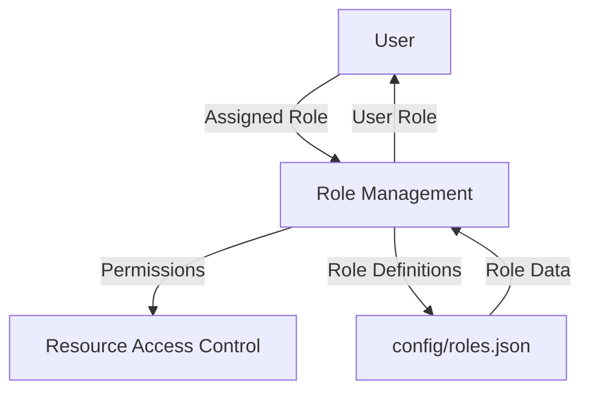

<details>
<summary>Relevant source files</summary>

The following files were used as context for generating this wiki page:

- [config/roles.json](https://github.com/agattani123/access-control-service/blob/main/config/roles.json)
- [src/models.js](https://github.com/agattani123/access-control-service/blob/main/src/models.js)
</details>

# Role Management

## Introduction

The Role Management system is a crucial component of the access control service, responsible for defining and managing user roles and their associated permissions within the application. It serves as a centralized mechanism for controlling access to various features and functionalities based on a user's assigned role.

Sources: [config/roles.json](), [src/models.js]()

## Role Definition

Roles are defined in the `config/roles.json` file, where each role is represented as a key-value pair. The key represents the role name, and the value is an array of permission strings.

```json
{
  "admin": ["view_users", "create_role", "view_permissions"],
  "engineer": ["view_users", "view_permissions"],
  "analyst": ["view_users"]
}
```

This configuration defines three roles: `admin`, `engineer`, and `analyst`. Each role has a set of associated permissions that determine the actions and resources a user with that role can access.

Sources: [config/roles.json]()

## Role and User Data Models

The `src/models.js` file defines the data models for `User` and `Role` objects.

### User Model

```javascript
export const User = {
  email: 'string',
  role: 'string',
  phone: 'string'
};
```

The `User` model represents a user entity within the system. It consists of the following properties:

- `email`: A string representing the user's email address.
- `role`: A string representing the user's assigned role.
- `phone`: A string representing the user's phone number.

Sources: [src/models.js:1-5]()

### Role Model

```javascript
export const Role = {
  name: 'string',
  email: 'string',
  permissions: ['string']
};
```

The `Role` model represents a role entity within the system. It consists of the following properties:

- `name`: A string representing the name of the role.
- `email`: A string representing the email associated with the role (potentially for administrative purposes).
- `permissions`: An array of strings representing the permissions granted to users with this role.

Sources: [src/models.js:7-11]()

## Role Assignment and Permission Checking

The Role Management system likely includes functionality to assign roles to users and check if a user has the necessary permissions to perform certain actions or access specific resources. However, the provided source files do not contain implementation details for these functionalities.

Sources: N/A

## Data Flow Diagram



This diagram illustrates the high-level data flow within the Role Management system:

1. A `User` is assigned a specific `Role` by the `Role Management` component.
2. The `Role Management` component determines the permissions associated with the user's role based on the role definitions in the `config/roles.json` file.
3. The `Role Management` component provides the user's permissions to the `Resource Access Control` component, which governs access to various resources and functionalities within the application.
4. The `Role Management` component also updates the user's role information in the `User` data model.

Sources: [config/roles.json](), [src/models.js]()

## Role Management Features

| Feature | Description |
| --- | --- |
| Role Definition | Roles and their associated permissions are defined in the `config/roles.json` file. |
| User Role Assignment | Users are assigned a specific role, which determines their access permissions. |
| Permission Checking | The system likely includes functionality to check if a user has the necessary permissions to perform certain actions or access specific resources based on their assigned role. |

Sources: [config/roles.json](), [src/models.js]()

## Conclusion

The Role Management system is a critical component of the access control service, enabling the definition and management of user roles and their associated permissions. By assigning roles to users and defining the permissions for each role, the system can effectively control access to various features and resources within the application.

While the provided source files do not include implementation details for role assignment and permission checking, they provide the necessary data models and role definitions to support the Role Management system.

Sources: [config/roles.json](), [src/models.js]()