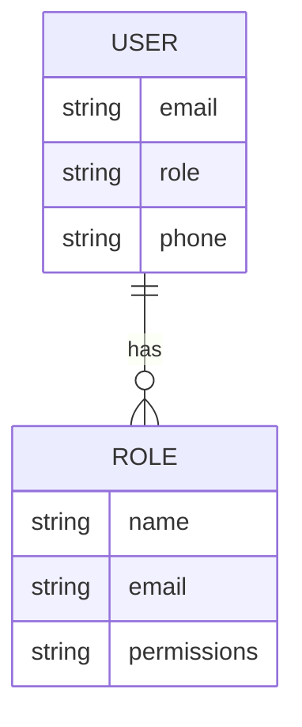
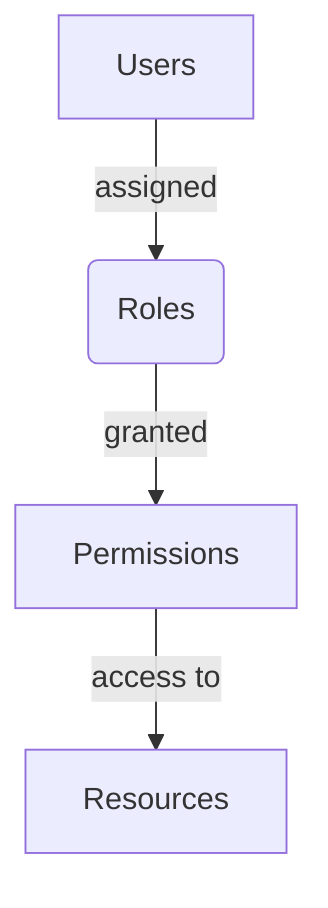

<details>
<summary>Relevant source files</summary>

The following files were used as context for generating this wiki page:

- [config/roles.json](https://github.com/agattani123/access-control-service/blob/main/config/roles.json)
- [src/models.js](https://github.com/agattani123/access-control-service/blob/main/src/models.js)
</details>

# Role Management

## Introduction

The Role Management system within this project provides a way to define and manage user roles and their associated permissions. It allows for the creation of roles with specific sets of permissions, and the assignment of these roles to individual users. This system is crucial for implementing access control and ensuring that users have the appropriate level of access to various features or resources within the application.

Sources: [config/roles.json](), [src/models.js]()

## Role Definition

### Role Configuration

Roles and their associated permissions are defined in the `config/roles.json` file. This file contains a JSON object where the keys represent the role names, and the values are arrays of permission strings.

```json
{
  "admin": ["view_users", "create_role", "view_permissions"],
  "engineer": ["view_users", "view_permissions"],
  "analyst": ["view_users"]
}
```

This configuration defines three roles: `admin`, `engineer`, and `analyst`. The `admin` role has permissions to view users, create roles, and view permissions. The `engineer` role can view users and permissions, while the `analyst` role can only view users.

Sources: [config/roles.json]()

### Role Data Model

The `Role` data model is defined in the `src/models.js` file. It represents the structure of a role object and includes the following properties:

```javascript
export const Role = {
  name: 'string',
  email: 'string',
  permissions: ['string']
};
```

- `name`: A string representing the name of the role.
- `email`: A string representing the email associated with the role (potentially for notification purposes).
- `permissions`: An array of strings representing the permissions granted to the role.

Sources: [src/models.js]()

## User Management

### User Data Model

The `User` data model is also defined in the `src/models.js` file. It represents the structure of a user object and includes the following properties:

```javascript
export const User = {
  email: 'string',
  role: 'string',
  phone: 'string'
};
```

- `email`: A string representing the user's email address.
- `role`: A string representing the name of the role assigned to the user.
- `phone`: A string representing the user's phone number.

Sources: [src/models.js]()



The diagram above illustrates the relationship between the `User` and `Role` data models. A user has a single role assigned, while a role can be assigned to multiple users. The role defines the set of permissions granted to the associated users.

Sources: [src/models.js]()

## Role-Based Access Control (RBAC)

The Role Management system in this project follows the Role-Based Access Control (RBAC) approach. RBAC is a widely used access control model that simplifies the management of permissions by grouping them into roles and assigning those roles to users.



In this RBAC model:

1. Users are assigned one or more roles.
2. Roles are granted specific permissions.
3. Permissions define the access levels to various resources or features within the application.

By assigning roles to users, the system can effectively manage and control the access levels of each user based on their assigned role(s) and the associated permissions.

Sources: [config/roles.json](), [src/models.js]()

## Role Assignment and Permission Checking

While the provided source files do not include implementation details for role assignment and permission checking, these are typically essential components of an RBAC system.

### Role Assignment

Role assignment involves associating a user with one or more roles. This can be done during user creation, user profile updates, or through a dedicated role assignment process. The `role` property in the `User` data model likely serves this purpose.

### Permission Checking

Permission checking is the process of verifying whether a user has the necessary permissions to perform a specific action or access a particular resource. This typically involves retrieving the user's assigned role(s), fetching the associated permissions from the role definitions, and checking if the required permission is present.

These processes are not explicitly defined in the provided source files but are crucial components of a fully functional Role Management system.

## Conclusion

The Role Management system in this project provides a structured way to define roles, associate permissions with those roles, and assign roles to users. By leveraging the Role-Based Access Control (RBAC) approach, the system simplifies the management of user access levels and ensures that users have the appropriate permissions to perform specific actions or access resources within the application.