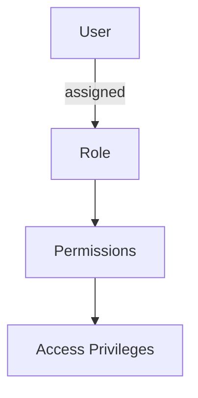
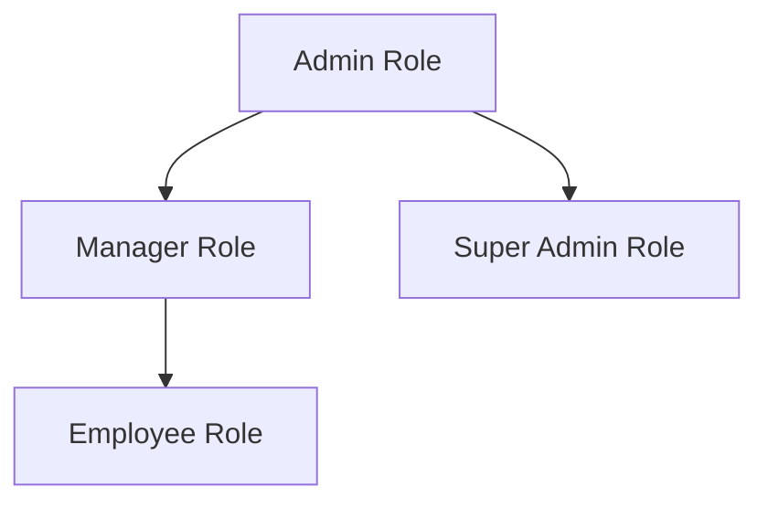

<details>
<summary>Relevant source files</summary>

The following files were used as context for generating this wiki page:

- [src/models.js](https://github.com/agattani123/access-control-service/blob/main/src/models.js)

</details>

# Role Management

## Introduction

The Role Management functionality within this project defines the data models and schemas for representing users and their associated roles. It establishes a role-based access control (RBAC) system, where permissions are granted to users based on the roles they are assigned. This allows for efficient management of access privileges across the application.

## Data Models

### User Model

The `User` model represents an individual user within the system. It consists of the following fields:

```javascript
export const User = {
  email: 'string', // User's email address
  role: 'string', // Role assigned to the user
  phone: 'string' // User's phone number
};
```

Sources: [src/models.js:1-4]()

### Role Model

The `Role` model defines the roles that can be assigned to users. It includes the following fields:

```javascript
export const Role = {
  name: 'string', // Name of the role
  email: 'string', // Email associated with the role (optional)
  permissions: ['string'] // Array of permission strings granted to the role
};
```

Sources: [src/models.js:6-9]()

## Role-Based Access Control (RBAC)

The Role Management functionality implements a role-based access control (RBAC) system. Users are assigned specific roles, and each role is granted a set of permissions. This allows for granular control over access privileges within the application.



Sources: [src/models.js]()

## Role Hierarchy (Optional)

Depending on the project's requirements, a role hierarchy could be implemented, where certain roles inherit permissions from other roles. This would allow for more efficient management of permissions across different levels of roles.



Note: The provided source files do not explicitly define a role hierarchy. This section is included as a potential extension or future consideration for the Role Management functionality.

## Conclusion

The Role Management functionality in this project establishes a solid foundation for implementing role-based access control. By defining the `User` and `Role` data models, it enables the assignment of roles to users and the association of permissions with those roles. This architecture allows for flexible and granular control over access privileges within the application.