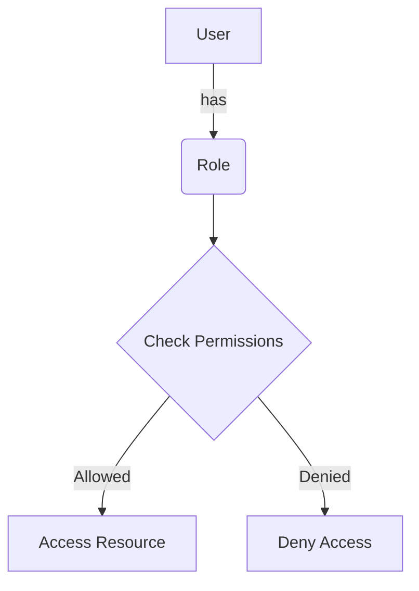
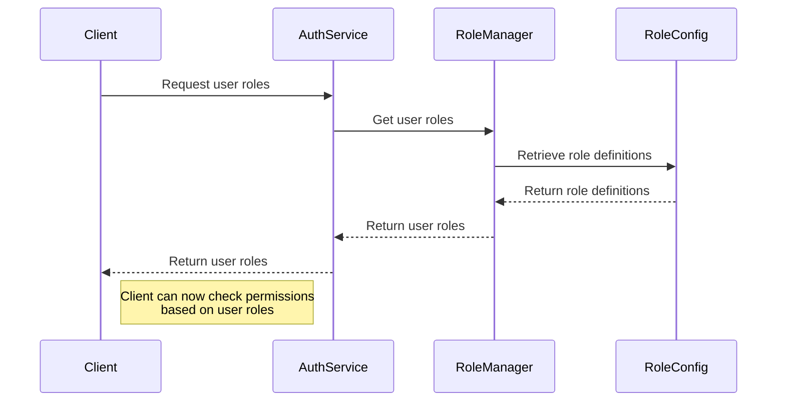

<details>
<summary>Relevant source files</summary>

The following files were used as context for generating this wiki page:

- [src/models.js](https://github.com/agattani123/access-control-service/blob/main/src/models.js)
- [config/roles.json](https://github.com/agattani123/access-control-service/blob/main/config/roles.json)

</details>

# Role Management

## Introduction

The Role Management feature within this project provides a way to define and manage user roles and their associated permissions. It allows for the creation of roles with specific sets of permissions, which can then be assigned to users to control their access to various parts of the system.

This feature is likely a part of a larger access control system or authorization module within the project. It could potentially be used in conjunction with other components for user authentication, permission checking, and resource access control.

## Role Definition

The `Role` model is defined in the `src/models.js` file. It consists of the following properties:

```javascript
export const Role = {
  name: 'string',
  email: 'string',
  permissions: ['string']
};
```

- `name`: A string representing the name of the role.
- `email`: A string representing an email associated with the role (purpose unclear from the provided files).
- `permissions`: An array of strings, where each string represents a specific permission granted to the role.

Sources: [src/models.js:5-9]()

## Role Configuration

The `config/roles.json` file contains a JSON object that defines the permissions associated with different roles. The structure of this configuration is as follows:

```json
{
  "admin": ["view_users", "create_role", "view_permissions"],
  "engineer": ["view_users", "view_permissions"],
  "analyst": ["view_users"]
}
```

Each key in the JSON object represents a role name, and the corresponding value is an array of strings representing the permissions granted to that role.

Sources: [config/roles.json]()

## Role-Based Access Control (RBAC) Flow

The Role Management feature likely follows a Role-Based Access Control (RBAC) approach, where user permissions are determined by the roles assigned to them. The high-level flow could be represented as follows:



1. A user is assigned one or more roles.
2. When the user attempts to access a resource or perform an action, the system checks the permissions associated with the user's roles.
3. If the user's roles have the required permissions, access is granted.
4. If the user's roles do not have the required permissions, access is denied.

Sources: [src/models.js](), [config/roles.json]()

## Role Management Sequence

The sequence of operations related to Role Management could involve the following steps:



1. The client (e.g., a frontend application or API) requests the roles associated with a user from an Authentication Service.
2. The Authentication Service interacts with a Role Manager component to retrieve the user's roles.
3. The Role Manager retrieves the role definitions (permissions, etc.) from a Role Configuration source (e.g., `config/roles.json`).
4. The Role Manager returns the user's roles to the Authentication Service.
5. The Authentication Service sends the user's roles back to the client.
6. The client can now check the user's permissions based on their assigned roles and the role definitions.

Sources: [src/models.js](), [config/roles.json]()

## Role Management Components

Based on the provided source files, the following components or modules related to Role Management can be identified:

| Component     | Description                                                  |
| ------------- | ------------------------------------------------------------ |
| `Role` Model  | Defines the structure of a role, including its name, email, and associated permissions. |
| Role Config   | A configuration file (e.g., `config/roles.json`) that defines the permissions associated with different roles. |
| Role Manager  | A module or service responsible for managing roles, retrieving role definitions, and determining user permissions based on their assigned roles. |
| Auth Service  | A service or module that handles user authentication and likely interacts with the Role Manager to retrieve user roles and permissions. |

Sources: [src/models.js](), [config/roles.json]()

## Conclusion

The Role Management feature in this project provides a way to define and manage user roles and their associated permissions. It follows a Role-Based Access Control (RBAC) approach, where user permissions are determined by the roles assigned to them. The feature involves components such as the `Role` model, a role configuration file, a Role Manager module, and an Authentication Service that interacts with the Role Manager to retrieve user roles and permissions.

While the provided source files give a basic understanding of the Role Management feature, more information would be needed to fully understand its implementation details, integration with other components, and usage within the overall project.