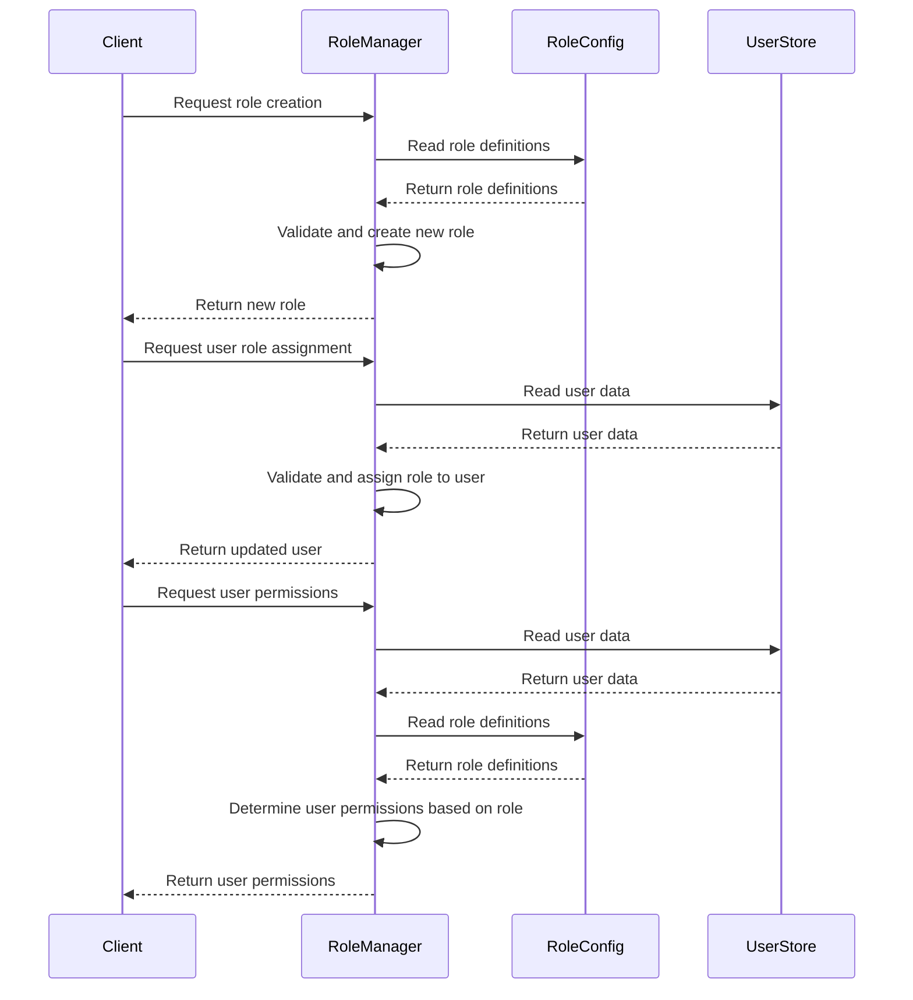
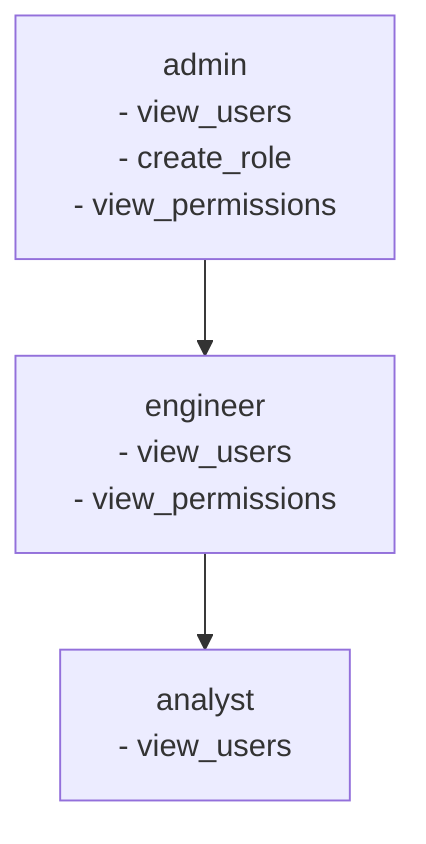

<details>
<summary>Relevant source files</summary>

The following files were used as context for generating this wiki page:

- [config/roles.json](https://github.com/agattani123/access-control-service/blob/main/config/roles.json)
- [src/models.js](https://github.com/agattani123/access-control-service/blob/main/src/models.js)
</details>

# Role Management

## Introduction

The Role Management feature within this project provides a way to define and manage user roles and their associated permissions. It allows for the creation of roles with specific sets of permissions, and the assignment of these roles to individual users. This feature is crucial for implementing access control and ensuring that users have the appropriate level of access to various parts of the system based on their roles and responsibilities.

Sources: [config/roles.json](), [src/models.js]()

## Role Definition

Roles are defined in the `config/roles.json` file, where each role is represented as a key-value pair. The key represents the role name, and the value is an array of strings representing the permissions associated with that role.

```json
{
  "admin": ["view_users", "create_role", "view_permissions"],
  "engineer": ["view_users", "view_permissions"],
  "analyst": ["view_users"]
}
```

This configuration defines three roles: `admin`, `engineer`, and `analyst`. The `admin` role has permissions to view users, create roles, and view permissions. The `engineer` role can view users and permissions, while the `analyst` role can only view users.

Sources: [config/roles.json]()

## Data Models

The data models for `User` and `Role` are defined in the `src/models.js` file.

```javascript
export const User = {
  email: 'string',
  role: 'string'
};

export const Role = {
  name: 'string',
  permissions: ['string']
};
```

The `User` model has two properties:

| Property | Type     | Description                    |
|----------|----------|--------------------------------|
| `email`  | `string` | The user's email address       |
| `role`   | `string` | The name of the user's role    |

The `Role` model has two properties:

| Property     | Type       | Description                                |
|--------------|------------|----------------------------------------------|
| `name`       | `string`   | The name of the role                         |
| `permissions`| `string[]` | An array of permission strings for the role |

Sources: [src/models.js]()

## Role Management Flow

The overall flow for role management can be represented by the following sequence diagram:



1. The client requests the creation of a new role.
2. The `RoleManager` reads the existing role definitions from the `RoleConfig`.
3. The `RoleManager` validates the new role and creates it.
4. The client requests the assignment of a role to a user.
5. The `RoleManager` reads the user data from the `UserStore`.
6. The `RoleManager` validates and assigns the role to the user.
7. The client requests the permissions for a user.
8. The `RoleManager` reads the user data from the `UserStore`.
9. The `RoleManager` reads the role definitions from the `RoleConfig`.
10. The `RoleManager` determines the user's permissions based on their assigned role.
11. The `RoleManager` returns the user's permissions to the client.

Sources: [config/roles.json](), [src/models.js]()

## Role Hierarchy

Based on the provided role definitions, a role hierarchy can be inferred, where the `admin` role has the highest level of permissions, followed by the `engineer` role, and then the `analyst` role. This hierarchy can be represented using the following graph:



The `admin` role inherits all the permissions of the `engineer` role, and the `engineer` role inherits the permissions of the `analyst` role.

Sources: [config/roles.json]()

## Conclusion

The Role Management feature in this project provides a way to define and manage user roles and their associated permissions. It allows for the creation of new roles, the assignment of roles to users, and the determination of a user's permissions based on their assigned role. This feature is essential for implementing access control and ensuring that users have the appropriate level of access to various parts of the system based on their roles and responsibilities.