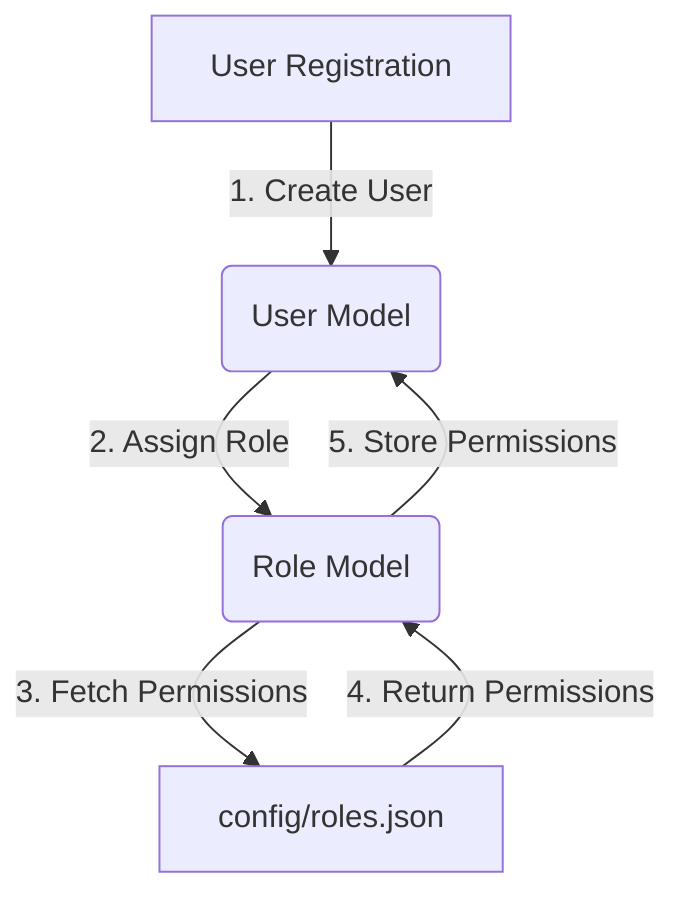
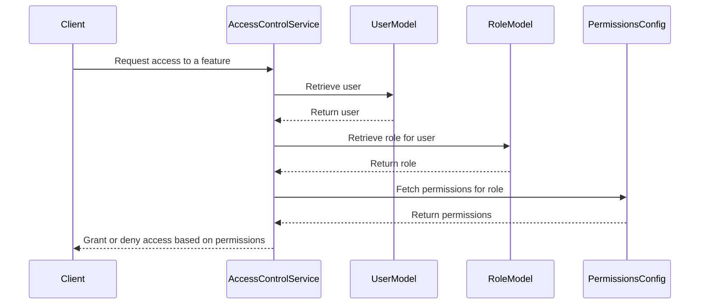
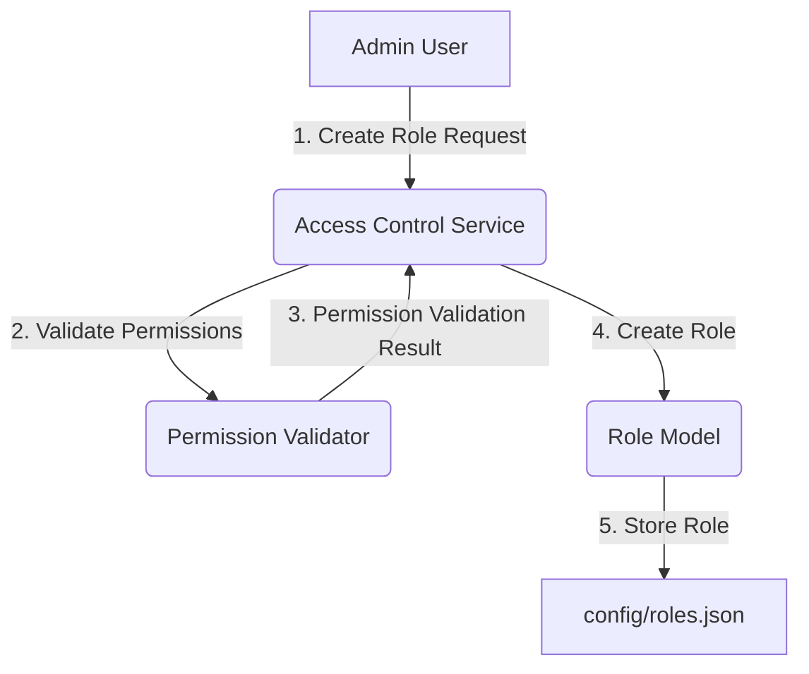
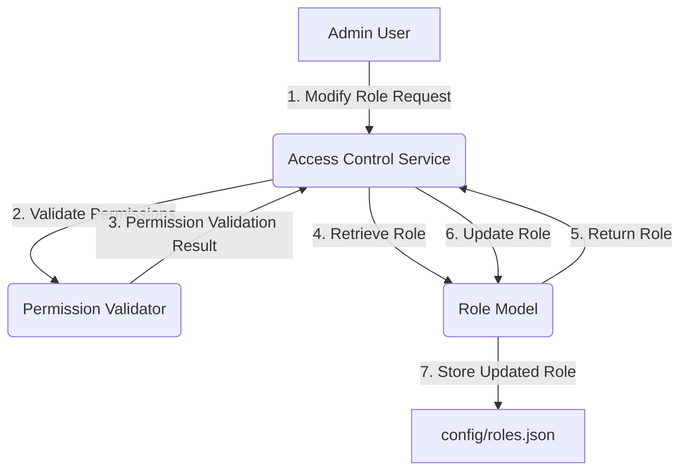

<details>
<summary>Relevant source files</summary>

The following files were used as context for generating this wiki page:

- [config/roles.json](https://github.com/agattani123/access-control-service/blob/main/config/roles.json)
- [src/models.js](https://github.com/agattani123/access-control-service/blob/main/src/models.js)
</details>

# Role Management

## Introduction

The Role Management system is a crucial component of the access control service, responsible for defining and managing user roles and their associated permissions within the application. It provides a structured approach to granting and restricting access to various features and functionalities based on a user's assigned role.

Sources: [config/roles.json](), [src/models.js]()

## Role Definition

Roles are defined in the `config/roles.json` file, where each role is associated with a list of permissions. The available roles and their corresponding permissions are as follows:

```json
{
  "admin": ["view_users", "create_role", "view_permissions"],
  "engineer": ["view_users", "view_permissions"],
  "analyst": ["view_users"]
}
```

Sources: [config/roles.json]()

### Role Data Model

The `Role` data model is defined in `src/models.js` and consists of the following fields:

| Field       | Type     | Description                                     |
|-------------|----------|--------------------------------------------------|
| `name`      | `string` | The unique identifier for the role.             |
| `email`     | `string` | The email associated with the role (optional).  |
| `permissions` | `string[]` | An array of permission strings for the role. |

Sources: [src/models.js:5-8]()

## User Data Model

The `User` data model, also defined in `src/models.js`, represents a user in the system and includes the following fields:

| Field   | Type     | Description                                 |
|---------|----------|---------------------------------------------|
| `email` | `string` | The user's email address.                   |
| `role`  | `string` | The role assigned to the user.              |
| `phone` | `string` | The user's phone number (optional).        |

Sources: [src/models.js:1-4]()

## Role Assignment



The role assignment process follows these steps:

1. During user registration, a new `User` instance is created.
2. The user is assigned a role, which is stored in the `role` field of the `User` model.
3. The `Role` model fetches the corresponding permissions for the assigned role from the `config/roles.json` file.
4. The permissions are returned to the `Role` model.
5. The permissions are stored in the `permissions` field of the `Role` model, associated with the user.

Sources: [src/models.js](), [config/roles.json]()

## Permission Checking



When a user attempts to access a feature or functionality, the following permission checking process occurs:

1. The client (e.g., a web application or API) sends a request to the Access Control Service to access a specific feature.
2. The Access Control Service retrieves the user's information from the `User` model.
3. The user's role is retrieved from the `Role` model.
4. The Access Control Service fetches the permissions associated with the user's role from the `config/roles.json` file.
5. Based on the user's permissions, the Access Control Service grants or denies access to the requested feature.

Sources: [src/models.js](), [config/roles.json]()

## Role Management (Hypothetical)

While the provided source files do not contain information about role management functionality, it is a common requirement in access control systems. If such functionality were to be implemented, it could involve the following components and workflows:

### Role Creation



1. An admin user initiates a request to create a new role through the Access Control Service.
2. The Access Control Service validates the admin user's permissions to create a new role.
3. If the permissions are valid, the Access Control Service creates a new `Role` instance.
4. The new role is stored in the `config/roles.json` file, along with its associated permissions.

Sources: (Hypothetical, based on common practices)

### Role Modification



1. An admin user initiates a request to modify an existing role through the Access Control Service.
2. The Access Control Service validates the admin user's permissions to modify roles.
3. If the permissions are valid, the Access Control Service retrieves the role to be modified from the `Role` model.
4. The role is updated with the new permissions or other changes.
5. The updated role is stored in the `config/roles.json` file.

Sources: (Hypothetical, based on common practices)

## Conclusion

The Role Management system is a fundamental component of the access control service, enabling the definition and assignment of roles with specific permissions. By associating users with roles, the system can effectively control access to various features and functionalities based on the user's assigned permissions. The provided source files demonstrate the basic structure and implementation of role management, including role definitions, user and role data models, and the process of role assignment and permission checking.

Sources: [config/roles.json](), [src/models.js]()