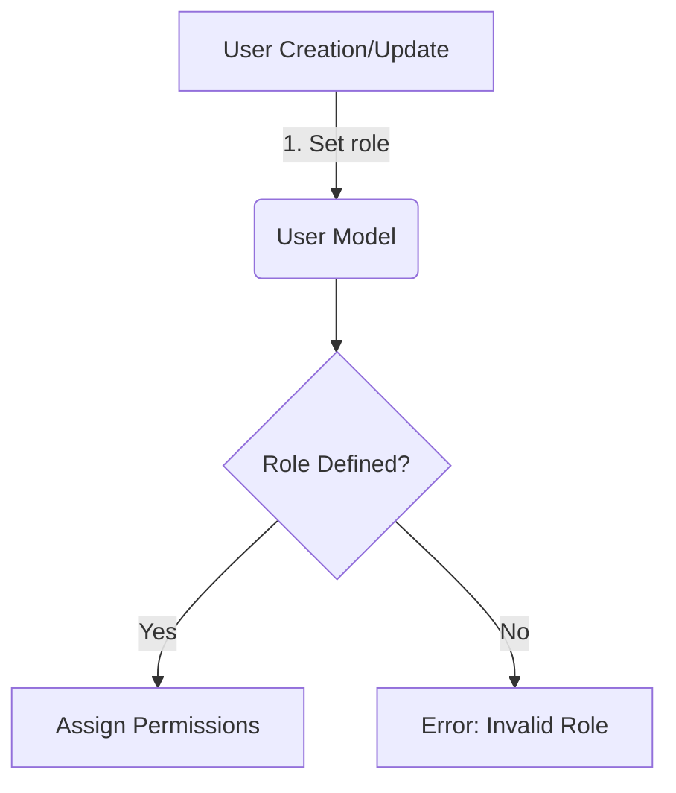
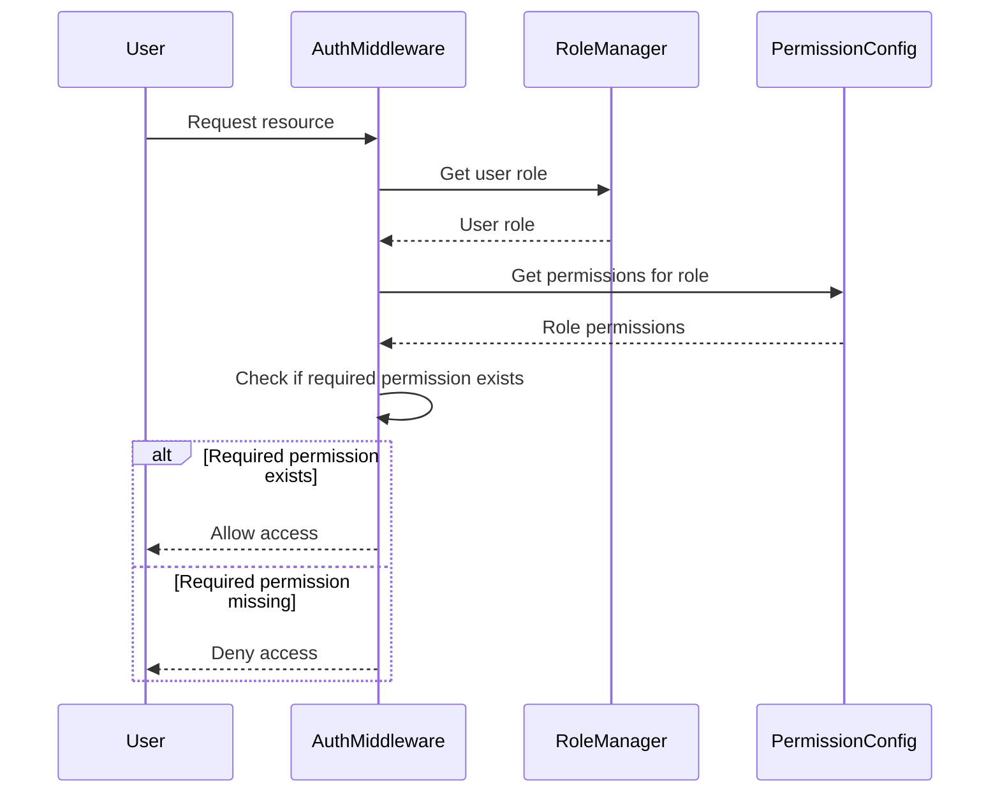
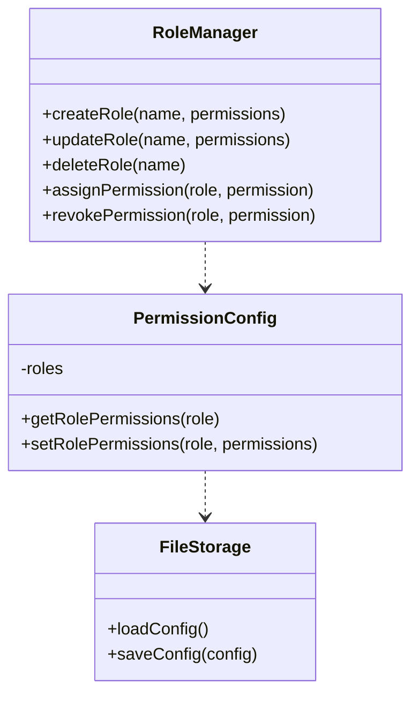

<details>
<summary>Relevant source files</summary>

The following files were used as context for generating this wiki page:

- [config/roles.json](https://github.com/agattani123/access-control-service/blob/main/config/roles.json)
- [src/models.js](https://github.com/agattani123/access-control-service/blob/main/src/models.js)
</details>

# Role Management

## Introduction

The Role Management system is a crucial component of the access control service, responsible for defining and managing user roles and their associated permissions within the application. It provides a structured way to control access to various features and resources based on a user's assigned role.

Sources: [config/roles.json](), [src/models.js]()

## Role Definition

Roles are defined in the `config/roles.json` file, where each role is associated with a list of permissions. The structure of the roles configuration is as follows:

```json
{
  "role_name": ["permission1", "permission2", ...],
  "another_role": ["permission3", "permission4", ...]
}
```

This configuration file defines three roles: `admin`, `engineer`, and `analyst`, each with a specific set of permissions.

Sources: [config/roles.json]()

## Data Models

The application uses two main data models related to role management: `User` and `Role`.

### User Model

The `User` model represents a user in the system and has the following fields:

| Field  | Type    | Description |
|--------|---------|-------------|
| email  | string  | User's email address |
| role   | string  | User's assigned role |
| phone  | string  | User's phone number |

Sources: [src/models.js:1-4]()

### Role Model

The `Role` model defines a role and its associated permissions:

| Field       | Type     | Description |
|-------------|----------|-------------|
| name        | string   | Role name |
| email       | string   | Role-specific email (if applicable) |
| permissions | string[] | List of permissions granted to the role |

Sources: [src/models.js:6-9]()

## Role Assignment

Users are assigned roles during the user creation or update process. The `role` field in the `User` model is set to one of the defined role names from the `config/roles.json` file.



When a user is assigned a role, the system checks if the role is defined in the `config/roles.json` file. If the role is valid, the user is granted the associated permissions. If the role is not defined, an error is raised.

Sources: [src/models.js:2](), [config/roles.json]()

## Permission Checking

When a user attempts to perform an action or access a resource, the system checks if the user's assigned role has the required permission. This permission check is typically performed in the application's authorization middleware or within the respective feature's logic.



The authorization middleware retrieves the user's role, fetches the associated permissions from the `config/roles.json` file, and checks if the required permission is present. Based on the result, access to the requested resource is granted or denied.

Sources: [config/roles.json](), [src/models.js:2,8]()

## Role Management Operations

The application may provide functionality to manage roles and their associated permissions. This could include creating new roles, modifying existing roles, or assigning/revoking permissions for a role.



The `RoleManager` class could provide methods to perform various role management operations, such as creating, updating, and deleting roles, as well as assigning and revoking permissions for a role. The `PermissionConfig` class would handle the loading and saving of the role configurations, potentially using a `FileStorage` class to interact with the `config/roles.json` file.

Sources: [config/roles.json]()

## Conclusion

The Role Management system is a fundamental component of the access control service, enabling the definition and management of user roles and their associated permissions. By assigning roles to users and defining role-based permissions, the application can effectively control access to various features and resources based on the user's role. This system provides a structured and scalable approach to authorization, ensuring that users have the appropriate level of access based on their responsibilities within the application.

Sources: [config/roles.json](), [src/models.js]()