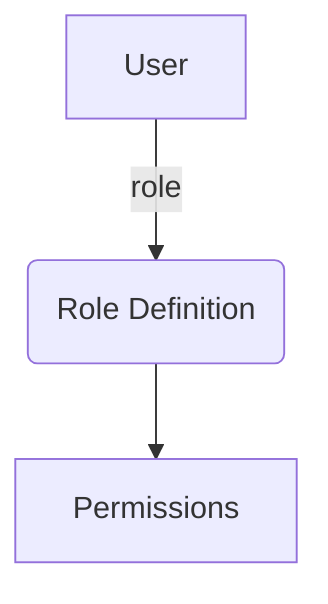
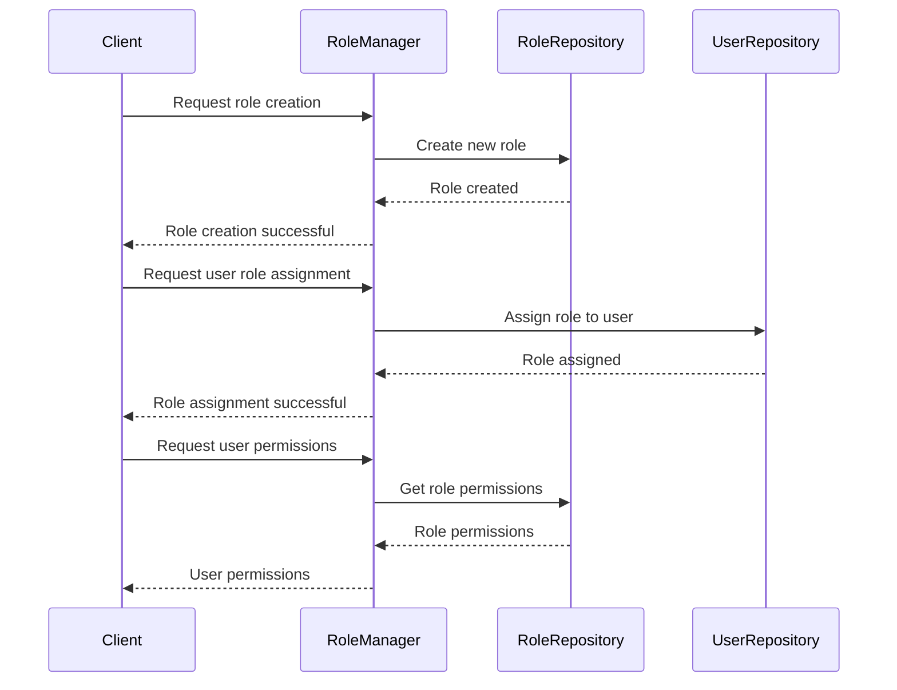

<details>
<summary>Relevant source files</summary>

The following files were used as context for generating this wiki page:

- [config/roles.json](https://github.com/agattani123/access-control-service/blob/main/config/roles.json)
- [src/models.js](https://github.com/agattani123/access-control-service/blob/main/src/models.js)
</details>

# Role Management

## Introduction

The Role Management system is a crucial component of the access control service, responsible for defining and managing user roles and their associated permissions within the application. It provides a structured approach to granting or restricting access to various features and functionalities based on a user's assigned role.

Sources: [config/roles.json](), [src/models.js]()

## Role Definition

Roles are defined in the `config/roles.json` file, where each role is associated with a list of permissions. The structure of the roles configuration is as follows:

```json
{
  "role_name": ["permission1", "permission2", ...],
  ...
}
```

The following roles are currently defined:

| Role     | Permissions                                |
|----------|---------------------------------------------|
| admin    | view_users, create_role, view_permissions |
| engineer | view_users, view_permissions              |
| analyst  | view_users                                 |

Sources: [config/roles.json]()

## Data Models

The application utilizes two main data models: `User` and `Role`. These models are defined in the `src/models.js` file.

### User Model

```javascript
export const User = {
  email: 'string',
  role: 'string',
  phone: 'string'
};
```

The `User` model represents a user in the system and consists of the following fields:

| Field | Type     | Description                        |
|-------|----------|--------------------------------------|
| email | string   | The user's email address           |
| role  | string   | The user's assigned role           |
| phone | string   | The user's phone number (optional) |

Sources: [src/models.js:1-4]()

### Role Model

```javascript
export const Role = {
  name: 'string',
  email: 'string',
  permissions: ['string']
};
```

The `Role` model defines the structure of a role and includes the following fields:

| Field       | Type     | Description                                  |
|-------------|----------|----------------------------------------------|
| name        | string   | The name of the role                         |
| email       | string   | The email associated with the role (optional)|
| permissions | string[] | An array of permissions granted to the role |

Sources: [src/models.js:7-10]()

## Role Assignment

The `role` field in the `User` model is used to assign a specific role to a user. This role determines the set of permissions granted to the user based on the role's definition in the `config/roles.json` file.



When a user attempts to access a feature or functionality within the application, their assigned role is checked against the required permissions. If the user's role has the necessary permission, access is granted; otherwise, access is denied.

Sources: [src/models.js:2](), [config/roles.json]()

## Role Management Flow

The following sequence diagram illustrates the typical flow for role management operations:



1. The client (e.g., an admin user) requests the creation of a new role.
2. The `RoleManager` interacts with the `RoleRepository` to create the new role.
3. The client requests the assignment of a role to a specific user.
4. The `RoleManager` interacts with the `UserRepository` to update the user's role.
5. The client requests the permissions associated with a user's role.
6. The `RoleManager` retrieves the role permissions from the `RoleRepository` and returns them to the client.

Note: The actual implementation details of the `RoleManager`, `RoleRepository`, and `UserRepository` components are not provided in the given source files.

Sources: [config/roles.json](), [src/models.js]()

## Conclusion

The Role Management system plays a vital role in the access control service by defining roles, associating permissions with those roles, and assigning roles to users. This structured approach allows for granular control over user access to various features and functionalities within the application. By leveraging the `User` and `Role` data models, along with the role definitions in the `config/roles.json` file, the system can effectively manage and enforce access control based on a user's assigned role and its associated permissions.