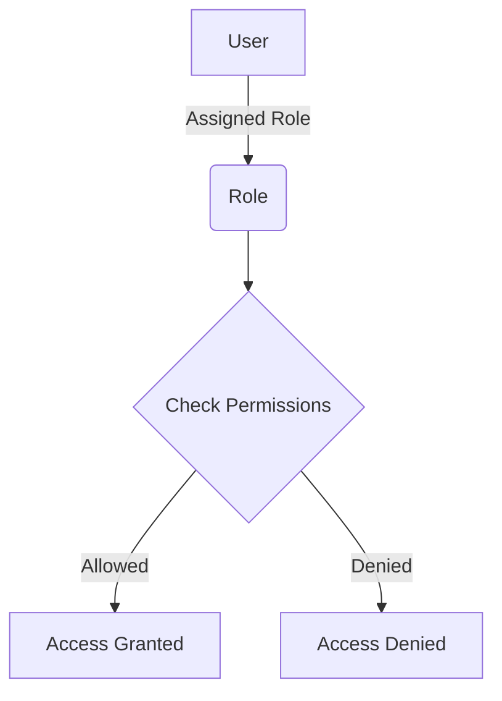

<details>
<summary>Relevant source files</summary>

The following files were used as context for generating this wiki page:

- [config/roles.json](https://github.com/agattani123/access-control-service/blob/main/config/roles.json)
- [src/models.js](https://github.com/agattani123/access-control-service/blob/main/src/models.js)
</details>

# Role Management

## Introduction

Role Management is a crucial component of the access control system in this project. It defines and manages the various roles that users can have, along with their associated permissions. This system ensures that users have appropriate access levels based on their roles, enabling proper segregation of duties and maintaining data integrity and security within the application.

Sources: [config/roles.json](), [src/models.js]()

## Role Definition

Roles are defined in the `config/roles.json` file, where each role is mapped to a list of permissions. The available roles and their corresponding permissions are as follows:

```json
{
  "admin": ["view_users", "create_role", "view_permissions"],
  "engineer": ["view_users", "view_permissions"],
  "analyst": ["view_users"]
}
```

This configuration file serves as the central source of truth for role definitions and their associated permissions within the application.

Sources: [config/roles.json]()

## Role Data Model

The `Role` data model is defined in the `src/models.js` file. It represents the structure of a role object and includes the following fields:

```javascript
export const Role = {
  name: 'string',
  email: 'string',
  permissions: ['string']
};
```

- `name`: A string representing the name of the role (e.g., "admin", "engineer", "analyst").
- `email`: A string representing the email associated with the role (potentially used for role assignment or notifications).
- `permissions`: An array of strings representing the permissions granted to the role.

Sources: [src/models.js]()

## User Data Model

The `User` data model is also defined in the `src/models.js` file. It represents the structure of a user object and includes the following fields:

```javascript
export const User = {
  email: 'string',
  role: 'string',
  phone: 'string'
};
```

- `email`: A string representing the user's email address.
- `role`: A string representing the user's assigned role (e.g., "admin", "engineer", "analyst").
- `phone`: A string representing the user's phone number.

The `role` field in the `User` model corresponds to the roles defined in the `config/roles.json` file, establishing the relationship between users and their assigned roles.

Sources: [src/models.js]()

## Role Management Flow

The overall flow of role management within the application can be represented by the following diagram:



1. A user is assigned a specific role (e.g., "admin", "engineer", "analyst") based on their responsibilities and access requirements.
2. The assigned role is associated with a set of permissions defined in the `config/roles.json` file.
3. When the user attempts to perform an action within the application, the system checks the user's assigned role and its corresponding permissions.
4. If the user's role has the required permission, access is granted, and the user can perform the requested action.
5. If the user's role does not have the required permission, access is denied, and the user cannot perform the requested action.

This role-based access control (RBAC) mechanism ensures that users can only perform actions they are authorized to based on their assigned roles and associated permissions.

Sources: [config/roles.json](), [src/models.js]()

## Role Assignment and Management

While the provided source files do not contain implementation details for role assignment and management, it is expected that the application would have mechanisms in place to:

1. Assign roles to users during user creation or role changes.
2. Update the `config/roles.json` file to add, modify, or remove roles and their associated permissions.
3. Implement role-based access control checks throughout the application's codebase to enforce the defined permissions.

Sources: [config/roles.json](), [src/models.js]()

## Conclusion

The Role Management system in this project provides a structured approach to defining and managing user roles and their associated permissions. By leveraging the `config/roles.json` file and the `Role` and `User` data models, the application can effectively control access to various features and functionalities based on a user's assigned role. This role-based access control mechanism enhances security, data integrity, and segregation of duties within the application.