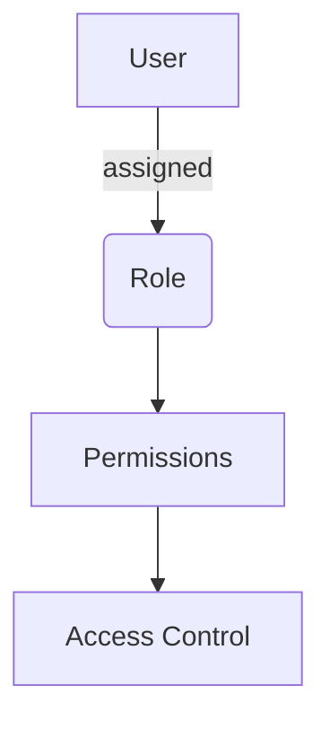
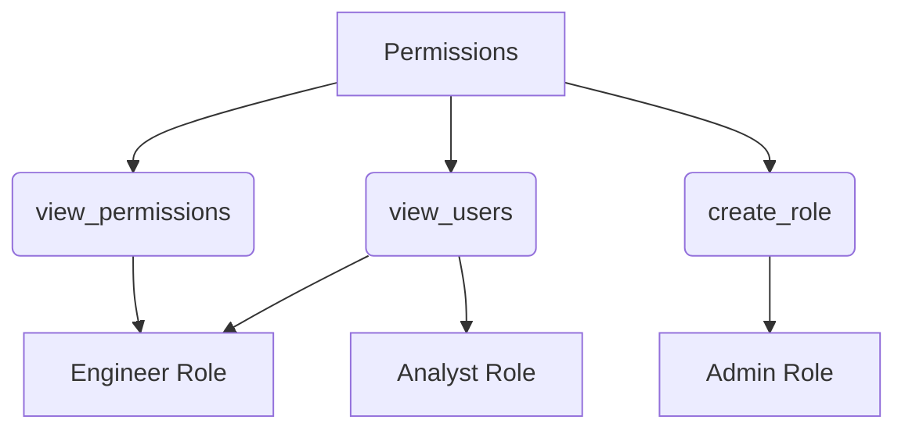
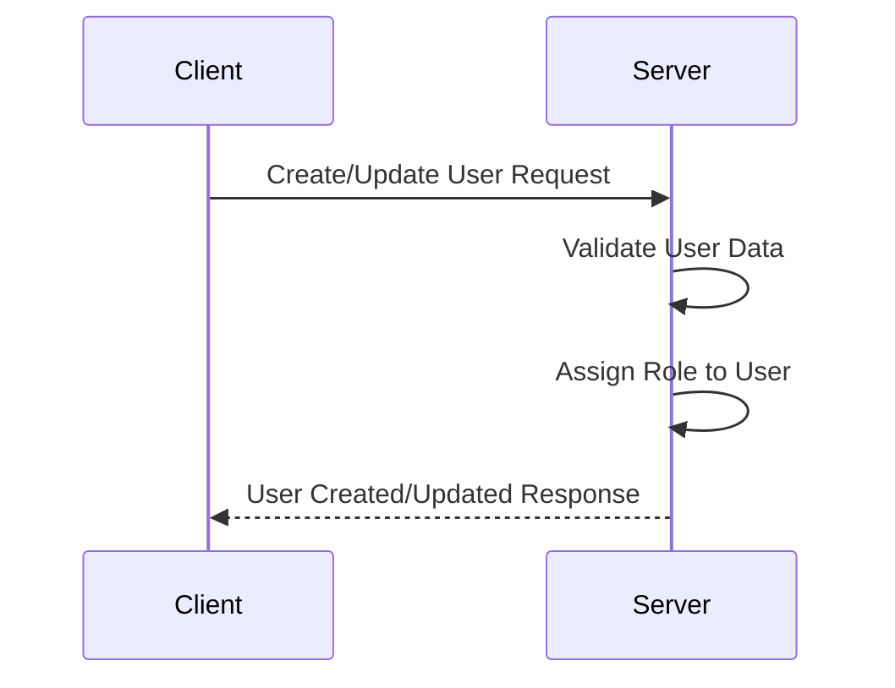
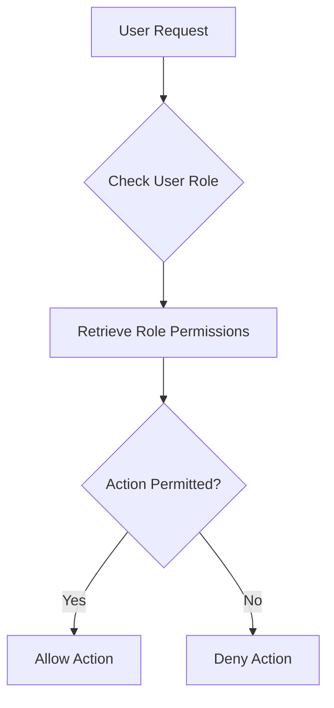

<details>
<summary>Relevant source files</summary>

The following files were used as context for generating this wiki page:

- [config/roles.json](https://github.com/agattani123/access-control-service/blob/main/config/roles.json)
- [src/models.js](https://github.com/agattani123/access-control-service/blob/main/src/models.js)
</details>

# Role Management

## Introduction

The Role Management feature within this project provides a mechanism for defining and assigning roles to users, where each role is associated with a set of permissions. This feature enables access control and authorization within the application, ensuring that users can only perform actions they are authorized for based on their assigned roles.

Sources: [config/roles.json](), [src/models.js]()

## Data Models

### User Model

The `User` model represents a user entity within the system. It consists of the following fields:

| Field | Type    | Description                      |
|-------|---------|----------------------------------|
| email | string  | The email address of the user    |
| role  | string  | The name of the role assigned to the user |

Sources: [src/models.js:1-4]()

### Role Model

The `Role` model defines a role within the system, which is associated with a set of permissions. It has the following fields:

| Field       | Type     | Description                      |
|-------------|----------|----------------------------------|
| name        | string   | The name of the role             |
| permissions | string[] | An array of permission names granted to this role |

Sources: [src/models.js:6-9]()

## Role Configuration

The roles and their associated permissions are defined in the `config/roles.json` file. This configuration file maps role names to an array of permission names.

```json
{
  "admin": ["view_users", "create_role", "view_permissions"],
  "engineer": ["view_users", "view_permissions"],
  "analyst": ["view_users"]
}
```

Sources: [config/roles.json]()

## Role-based Access Control (RBAC)

The Role Management feature implements a Role-based Access Control (RBAC) mechanism. Users are assigned roles, and each role is associated with a set of permissions that define the actions the user can perform within the application.



Sources: [config/roles.json](), [src/models.js]()

## Permission Hierarchy

The permissions defined in the `config/roles.json` file can be organized into a hierarchy based on their scope and level of access. For example, the `view_users` permission might be a lower-level permission, while `create_role` could be a higher-level permission reserved for administrative roles.



Sources: [config/roles.json]()

## Role Assignment

Users are assigned roles during the user creation or update process. The `role` field in the `User` model stores the name of the assigned role for each user.



Sources: [src/models.js:1-4]()

## Role-based Authorization

When a user attempts to perform an action within the application, the system checks the user's assigned role and the associated permissions to determine if the user is authorized to perform the requested action.



Sources: [config/roles.json](), [src/models.js]()

## Conclusion

The Role Management feature provides a flexible and scalable way to manage user access and permissions within the application. By defining roles and associating them with specific permissions, the system can ensure that users can only perform actions they are authorized for, enhancing security and maintaining data integrity.