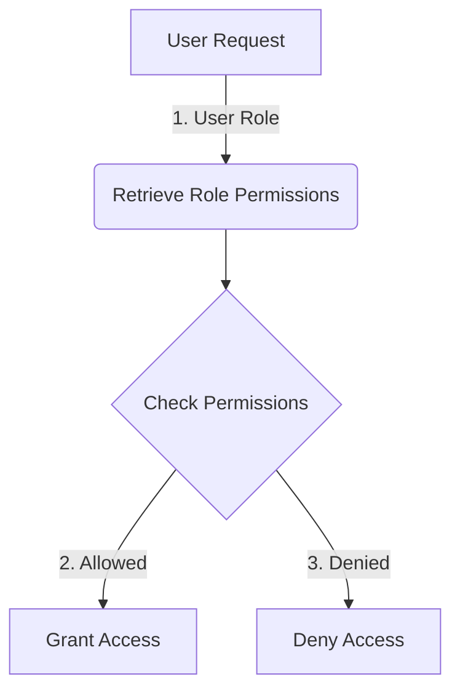
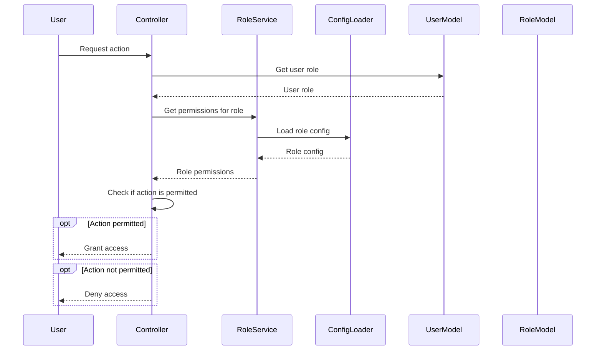
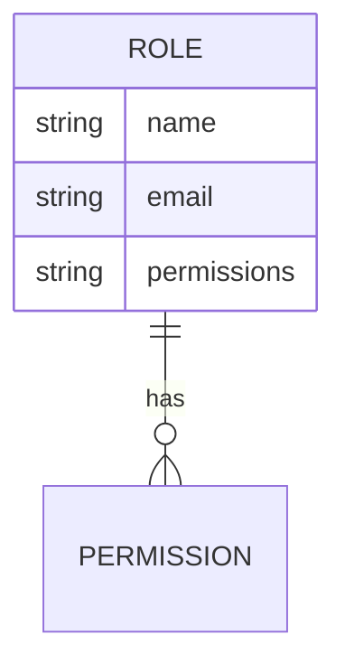

<details>
<summary>Relevant source files</summary>

The following files were used as context for generating this wiki page:

- [config/roles.json](https://github.com/agattani123/access-control-service/blob/main/config/roles.json)
- [src/models.js](https://github.com/agattani123/access-control-service/blob/main/src/models.js)
</details>

# Role and Permission Management

## Introduction

The Role and Permission Management system is a crucial component of the project, responsible for controlling access to various features and functionalities based on user roles and associated permissions. It defines the roles available within the application and specifies the permissions granted to each role. This system ensures that users can only perform actions they are authorized for, enhancing security and maintaining data integrity.

Sources: [config/roles.json](), [src/models.js]()

## Data Models

### User Model

The `User` model represents a user within the system. It consists of the following fields:

| Field  | Type    | Description                      |
|--------|---------|----------------------------------|
| email  | string  | The user's email address         |
| role   | string  | The role assigned to the user    |
| phone  | string  | The user's phone number          |

Sources: [src/models.js:1-5]()

### Role Model

The `Role` model defines a role within the system and its associated permissions. It has the following fields:

| Field       | Type     | Description                                  |
|-------------|----------|----------------------------------------------|
| name        | string   | The name of the role                         |
| email       | string   | The email associated with the role           |
| permissions | string[] | An array of permissions granted to the role  |

Sources: [src/models.js:8-11]()

## Role Configuration

The roles and their corresponding permissions are defined in the `config/roles.json` file. This configuration file maps role names to an array of permission strings.

```json
{
  "admin": ["view_users", "create_role", "view_permissions"],
  "engineer": ["view_users", "view_permissions"],
  "analyst": ["view_users"]
}
```

Sources: [config/roles.json]()

## Role and Permission Management Flow

The Role and Permission Management system follows a specific flow to determine a user's access rights based on their assigned role:



1. When a user makes a request, the system retrieves the user's role from the `User` model.
2. Based on the user's role, the system looks up the associated permissions in the `config/roles.json` configuration file.
3. The system checks if the requested action is permitted for the user's role by verifying if the required permission is present in the role's permissions array.
4. If the permission is granted, the user is allowed to perform the requested action.
5. If the permission is not granted, the user is denied access to the requested action.

Sources: [config/roles.json](), [src/models.js]()

## Role and Permission Management Sequence

The following sequence diagram illustrates the interaction between the components involved in the Role and Permission Management system:



1. The user sends a request to perform an action to the Controller.
2. The Controller retrieves the user's role from the UserModel.
3. The Controller requests the permissions associated with the user's role from the RoleService.
4. The RoleService loads the role configuration from the ConfigLoader.
5. The RoleService returns the permissions for the user's role to the Controller.
6. The Controller checks if the requested action is permitted based on the user's role permissions.
7. If the action is permitted, the Controller grants access to the user.
8. If the action is not permitted, the Controller denies access to the user.

Sources: [config/roles.json](), [src/models.js]()

## Role Management

The Role and Permission Management system allows for the creation and management of roles. The `admin` role has the `create_role` permission, which enables administrators to define new roles and their associated permissions.



To create a new role, an administrator would provide the role name, email (optional), and a list of permissions to be granted to the role. The new role would then be added to the `config/roles.json` configuration file, making it available for assignment to users.

Sources: [config/roles.json](), [src/models.js:8-11]()

## Conclusion

The Role and Permission Management system is a vital component of the project, ensuring that users can only access and perform actions they are authorized for based on their assigned roles and permissions. By defining roles and their associated permissions in a centralized configuration file, the system provides a flexible and scalable approach to access control. The system follows a well-defined flow and sequence of interactions to determine a user's access rights, enhancing security and maintaining data integrity within the application.