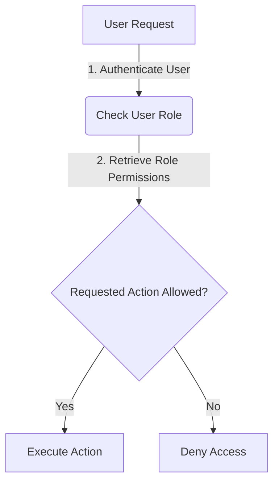
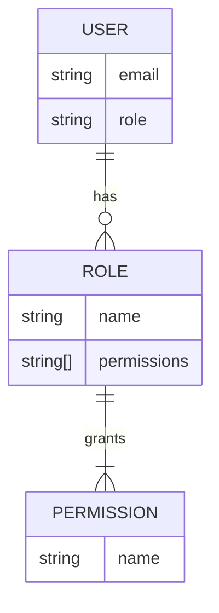

<details>
<summary>Relevant source files</summary>

The following files were used as context for generating this wiki page:

- [config/roles.json](https://github.com/agattani123/access-control-service/blob/main/config/roles.json)
- [src/models.js](https://github.com/agattani123/access-control-service/blob/main/src/models.js)

</details>

# Role and Permission Management

## Introduction

The Role and Permission Management system is a crucial component of the project, responsible for managing user roles and their associated permissions. It defines the access control rules that govern what actions users can perform within the application based on their assigned roles.

This system ensures proper segregation of duties and adheres to the principle of least privilege, granting users only the necessary permissions required to fulfill their responsibilities. By implementing a role-based access control (RBAC) model, the project simplifies the management of user permissions and enhances overall security.

Sources: [config/roles.json](), [src/models.js]()

## Data Models

### User Model

The `User` model represents an individual user within the system. It consists of the following fields:

| Field | Type    | Description                                  |
|-------|---------|----------------------------------------------|
| email | string  | The unique email address of the user.        |
| role  | string  | The role assigned to the user.               |

Sources: [src/models.js:1-4]()

### Role Model

The `Role` model defines the roles available in the system and their associated permissions. It has the following fields:

| Field       | Type     | Description                                                  |
|-------------|----------|--------------------------------------------------------------|
| name        | string   | The unique name of the role.                                 |
| permissions | string[] | An array of permission strings granted to users with this role. |

Sources: [src/models.js:6-9]()

## Role and Permission Configuration

The roles and their corresponding permissions are defined in the `config/roles.json` file. This configuration file maps role names to an array of permission strings.

```json
{
  "admin": ["view_users", "create_role", "view_permissions"],
  "engineer": ["view_users", "view_permissions"],
  "analyst": ["view_users"]
}
```

In the example above, the `admin` role has permissions to view users, create roles, and view permissions. The `engineer` role can view users and permissions, while the `analyst` role can only view users.

Sources: [config/roles.json]()

## Role and Permission Management Flow

The Role and Permission Management system follows a typical flow when determining a user's access rights:



1. When a user makes a request, the system first authenticates the user's identity.
2. Based on the authenticated user's role, the system retrieves the associated permissions from the role configuration.
3. The system checks if the requested action is included in the user's role permissions.
4. If the action is allowed, the system executes the requested action.
5. If the action is not permitted for the user's role, the system denies access.

Sources: [config/roles.json](), [src/models.js]()

## Role and Permission Management Architecture

The Role and Permission Management system follows a typical RBAC (Role-Based Access Control) architecture, where users are assigned roles, and roles are granted specific permissions.



- Users are associated with a single role.
- Roles are granted a set of permissions.
- Permissions define the actions or resources that can be accessed.

This architecture simplifies the management of user permissions by grouping them into roles. Instead of assigning individual permissions to each user, administrators can assign roles to users, and manage the permissions associated with each role.

Sources: [config/roles.json](), [src/models.js]()

## Role and Permission Management Implementation

The implementation of the Role and Permission Management system likely involves the following components:

1. **Authentication Module**: Responsible for authenticating users and verifying their identities.
2. **Role Retrieval**: A component that retrieves the user's role from the user model or a separate role management system.
3. **Permission Lookup**: A component that looks up the permissions associated with the user's role from the role configuration.
4. **Access Control Logic**: The core logic that checks if the requested action is included in the user's role permissions and grants or denies access accordingly.
5. **Role and Permission Management Interface**: An interface or set of APIs for administrators to manage roles, permissions, and user-role assignments.

While the provided source files do not include the implementation details, they provide the data models and configuration necessary for the Role and Permission Management system to function.

Sources: [config/roles.json](), [src/models.js]()

## Conclusion

The Role and Permission Management system is a fundamental component of the project, ensuring proper access control and adherence to the principle of least privilege. By defining roles and their associated permissions, the system simplifies the management of user access rights and enhances overall security. The provided source files establish the data models and configuration necessary for implementing this system, laying the foundation for a robust and scalable access control solution.