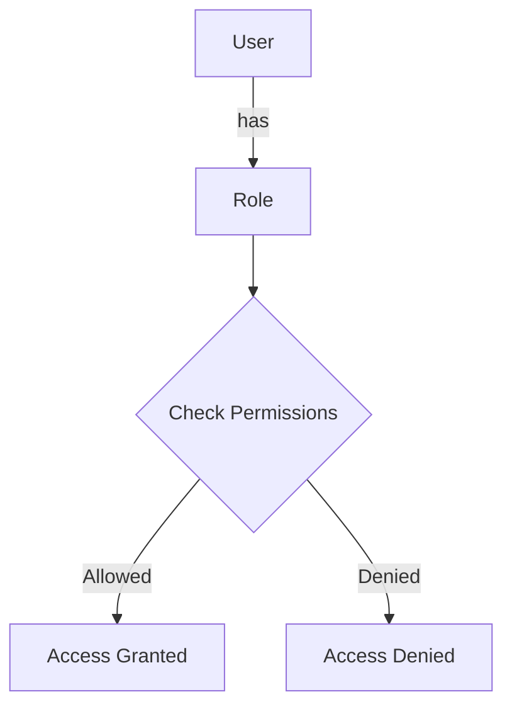
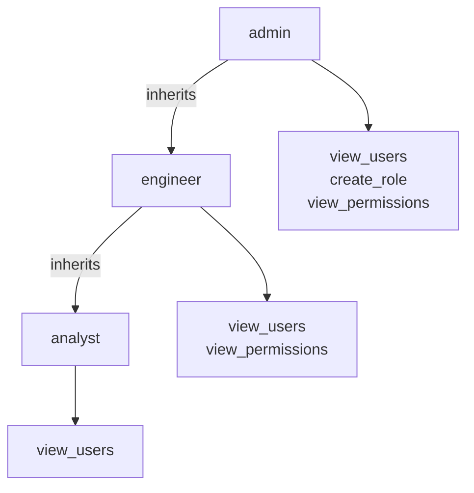

<details>
<summary>Relevant source files</summary>

The following files were used as context for generating this wiki page:

- [config/roles.json](https://github.com/agattani123/access-control-service/blob/main/config/roles.json)
- [src/models.js](https://github.com/agattani123/access-control-service/blob/main/src/models.js)

</details>

# Role and Permission Management

## Introduction

The Role and Permission Management system is a crucial component of the project, responsible for defining and enforcing access control based on user roles and associated permissions. It provides a structured approach to granting or restricting access to various features, resources, or functionalities within the application.

The system consists of two primary data models: `User` and `Role`. The `User` model represents individual users and includes fields such as `email` and `role`. The `Role` model defines named roles (e.g., "admin", "engineer", "analyst") and their corresponding sets of permissions.

Sources: [src/models.js](https://github.com/agattani123/access-control-service/blob/main/src/models.js)

## Data Models

### User Model

The `User` model represents an individual user within the system. It consists of the following fields:

| Field | Type     | Description                                |
|-------|----------|------------------------------------------|
| email | `string` | The email address associated with the user |
| role  | `string` | The name of the role assigned to the user  |

Sources: [src/models.js:1-4](https://github.com/agattani123/access-control-service/blob/main/src/models.js#L1-L4)

### Role Model

The `Role` model defines named roles and their associated permissions. It has the following structure:

| Field       | Type      | Description                                                  |
|-------------|-----------|--------------------------------------------------------------|
| name        | `string`  | The unique name of the role                                  |
| permissions | `string[]`| An array of permission strings granted to users with this role|

Sources: [src/models.js:6-9](https://github.com/agattani123/access-control-service/blob/main/src/models.js#L6-L9)

## Role and Permission Configuration

The roles and their associated permissions are defined in the `config/roles.json` file. This configuration file maps role names to arrays of permission strings.

```json
{
  "admin": ["view_users", "create_role", "view_permissions"],
  "engineer": ["view_users", "view_permissions"],
  "analyst": ["view_users"]
}
```

Sources: [config/roles.json](https://github.com/agattani123/access-control-service/blob/main/config/roles.json)

## Role and Permission Management Flow

The following diagram illustrates the high-level flow of role and permission management within the system:



1. A `User` is associated with a specific `Role`.
2. When the user attempts to perform an action, the system checks the permissions associated with the user's `Role`.
3. If the required permission is present in the `Role`'s permissions array, access is granted.
4. If the required permission is not found, access is denied.

Sources: [config/roles.json](https://github.com/agattani123/access-control-service/blob/main/config/roles.json), [src/models.js](https://github.com/agattani123/access-control-service/blob/main/src/models.js)

## Role Hierarchy and Inheritance

Based on the provided configuration, the roles exhibit a hierarchical structure with inherited permissions:



- The `admin` role has the highest level of access, with permissions to `view_users`, `create_role`, and `view_permissions`.
- The `engineer` role inherits the `view_users` and `view_permissions` permissions from the `admin` role.
- The `analyst` role inherits only the `view_users` permission from the `engineer` role.

Sources: [config/roles.json](https://github.com/agattani123/access-control-service/blob/main/config/roles.json)

## Conclusion

The Role and Permission Management system provides a structured and flexible approach to controlling access within the application. By defining roles and their associated permissions, it allows for granular control over user access to various features or resources. The hierarchical nature of roles and inherited permissions further simplifies the management of access levels across different user groups.