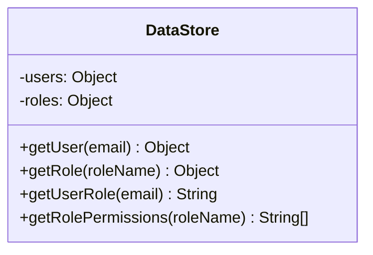

<details>
<summary>Relevant source files</summary>

The following files were used as context for generating this wiki page:

- [src/db.js](https://github.com/agattani123/access-control-service/blob/main/src/db.js)
- [src/models.js](https://github.com/agattani123/access-control-service/blob/main/src/models.js)
</details>

# Data Storage and Access

## Introduction

The "Data Storage and Access" component within this project handles the management and retrieval of user data, roles, and associated permissions. It serves as a centralized data layer, providing a structured approach to storing and accessing critical information related to user authentication and authorization.

Sources: [src/db.js](), [src/models.js]()

## Data Models

### User Model

The `User` model represents the structure of user data within the system. It consists of the following fields:

| Field | Type    | Description                                  |
|-------|---------|----------------------------------------------|
| email | string  | The email address associated with the user. |
| role  | string  | The role assigned to the user.              |
| phone | string  | The phone number of the user.               |

```javascript
export const User = {
  email: 'string',
  role: 'string',
  phone: 'string'
};
```

Sources: [src/models.js:1-5]()

### Role Model

The `Role` model defines the structure of roles within the system. It includes the following fields:

| Field       | Type     | Description                                                  |
|-------------|----------|--------------------------------------------------------------|
| name        | string   | The name of the role.                                        |
| email       | string   | The email associated with the role (potentially for notifications). |
| permissions | string[] | An array of strings representing the permissions granted to the role. |

```javascript
export const Role = {
  name: 'string',
  email: 'string',
  permissions: ['string']
};
```

Sources: [src/models.js:8-12]()

## Data Storage

The project currently uses an in-memory data store represented by the `db` object. This object contains two properties:

- `users`: An object that maps user emails to their respective roles.
- `roles`: An object that maps role names to their corresponding details, including permissions.

```javascript
import roles from '../config/roles.json' assert { type: 'json' };

const db = {
  users: {
    'admin@internal.company': 'admin',
    'analyst@internal.company': 'analyst',
  },
  roles: roles
};

export default db;
```

The `roles` object is imported from a JSON file located at `../config/roles.json`. This file likely contains the definitions of various roles and their associated permissions.

Sources: [src/db.js:1-12]()

## Data Access

Based on the provided source files, there are no explicit functions or methods for accessing or modifying the data stored in the `db` object. However, it is likely that other parts of the codebase interact with this data store through direct object access or helper functions.



The `DataStore` class (or a similar construct) could potentially provide methods for retrieving user data, role information, and associated permissions based on the email or role name. These methods would interact with the `users` and `roles` objects within the `db` object.

Sources: [src/db.js](), [src/models.js]()

## Potential Improvements

While the current implementation provides a basic data storage and access mechanism, it may benefit from the following potential improvements:

1. **Persistent Storage**: Instead of relying on an in-memory data store, consider integrating a persistent storage solution like a database or file-based storage for improved data durability and scalability.

2. **Data Access Layer**: Introduce a dedicated data access layer to encapsulate and abstract the data storage and retrieval logic, promoting better separation of concerns and maintainability.

3. **Data Validation**: Implement input validation and sanitization mechanisms to ensure the integrity and security of the data being stored and accessed.

4. **Role Management**: Develop functionality for creating, updating, and deleting roles dynamically, rather than relying solely on a static configuration file.

5. **User Management**: Implement user registration, authentication, and authorization mechanisms to securely manage user accounts and their associated roles and permissions.

6. **Caching**: Explore caching strategies to improve performance for frequently accessed data, such as user roles and permissions.

7. **Error Handling**: Enhance error handling and logging mechanisms to improve the system's robustness and facilitate debugging.

8. **Documentation**: Provide comprehensive documentation for the data storage and access components, including API references, usage examples, and best practices.

These improvements would enhance the scalability, maintainability, and security of the data storage and access components, aligning them with industry best practices and preparing the system for future growth and complexity.

Sources: [src/db.js](), [src/models.js]()