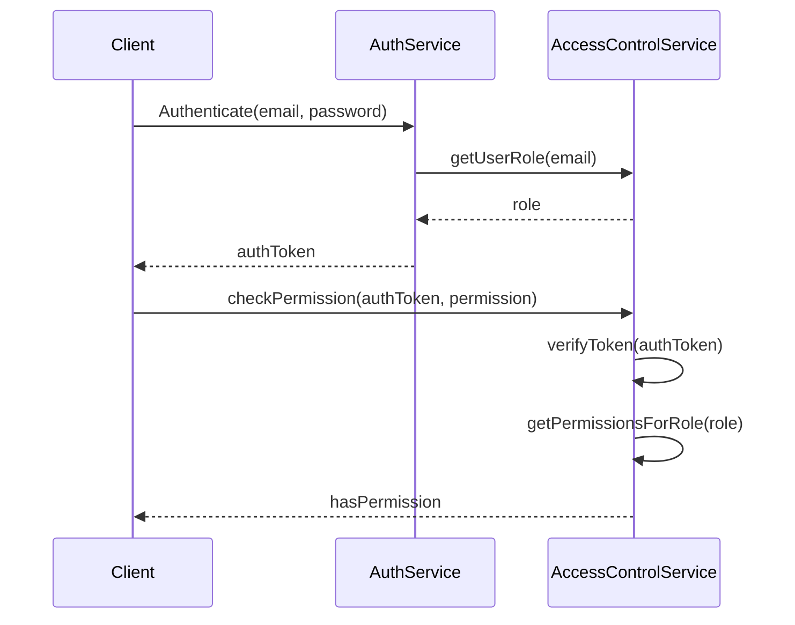

<details>
<summary>Relevant source files</summary>

The following files were used as context for generating this wiki page:

- [src/db.js](https://github.com/agattani123/access-control-service/blob/main/src/db.js)
- [src/models.js](https://github.com/agattani123/access-control-service/blob/main/src/models.js)

</details>

# Data Storage and Access

## Introduction

The "Data Storage and Access" component within this project handles the management and retrieval of user and role information. It serves as a centralized data layer, providing a simple in-memory data store for user accounts and their associated roles, along with the permissions granted to each role.

This component is crucial for implementing access control mechanisms within the application, ensuring that users are authenticated and authorized to perform specific actions based on their assigned roles and permissions.

Sources: [src/db.js](), [src/models.js]()

## Data Models

### User Model

The `User` model represents a user account within the system. It consists of the following fields:

| Field | Type    | Description                    |
|-------|---------|--------------------------------|
| email | string  | The user's email address       |
| role  | string  | The name of the user's role    |

The user's email serves as a unique identifier, and the role field associates the user with a specific set of permissions defined by the corresponding `Role` model.

Sources: [src/models.js:1-4]()

### Role Model

The `Role` model defines the permissions and access levels granted to a particular role within the application. It has the following structure:

| Field       | Type     | Description                                  |
|-------------|----------|----------------------------------------------|
| name        | string   | The name or identifier of the role           |
| permissions | string[] | An array of permission strings for this role |

Each role has a unique name and a list of permissions that determine the actions and resources a user with that role can access.

Sources: [src/models.js:6-9]()

## Data Storage

The application uses an in-memory data store implemented in the `db.js` file. This data store contains two main collections:

1. `users`: An object that maps user email addresses to their respective roles.
2. `roles`: An object that maps role names to their corresponding `Role` model instances, including the associated permissions.

```javascript
const db = {
  users: {
    'admin@internal.company': 'admin',
    'analyst@internal.company': 'analyst',
  },
  roles: roles
};
```

The `roles` object is imported from a separate configuration file (`roles.json`), allowing for easy management and modification of role definitions.

Sources: [src/db.js:1-10]()

## Data Access

The `db.js` file exports the `db` object, which can be imported and used throughout the application to access and manipulate user and role data. This centralized data store simplifies the management of access control information and ensures consistency across different components of the application.

To retrieve user or role information, you can directly access the corresponding properties of the `db` object. For example:

```javascript
import db from './db.js';

// Get a user's role
const userRole = db.users['admin@internal.company'];

// Get the permissions for a specific role
const adminPermissions = db.roles.admin.permissions;
```

While this implementation uses a simple in-memory data store, it can be easily extended or replaced with a more robust and persistent storage solution, such as a database, if needed.

Sources: [src/db.js](), [src/models.js]()

## Sequence Diagram: User Authentication and Authorization

The following sequence diagram illustrates a potential flow for authenticating a user and checking their permissions based on the provided data models and storage:



1. The client initiates the authentication process by providing the user's email and password to the `AuthService`.
2. The `AuthService` calls the `AccessControlService` to retrieve the user's role based on their email.
3. The `AccessControlService` looks up the user's role in the `db.users` object and returns it to the `AuthService`.
4. The `AuthService` generates an authentication token and sends it back to the client.
5. When the client needs to perform an action, it calls the `AccessControlService` with the authentication token and the required permission.
6. The `AccessControlService` verifies the token, retrieves the user's role, and checks if the requested permission is included in the role's permissions list.
7. The `AccessControlService` returns a boolean indicating whether the user has the required permission or not.

This diagram illustrates how the "Data Storage and Access" component interacts with other services to facilitate user authentication and authorization based on roles and permissions.

Sources: [src/db.js](), [src/models.js]()

## Limitations and Future Improvements

While the current implementation provides a basic data storage and access mechanism for user and role information, it has several limitations:

1. **In-Memory Storage**: The data is stored in-memory, which means it will be lost when the application restarts or the server is restarted. This is not suitable for production environments where data persistence is required.

2. **Lack of Data Manipulation**: The current implementation does not provide any functionality for creating, updating, or deleting user or role data. It only allows read access to the existing data.

3. **Static Configuration**: The role definitions are loaded from a static configuration file (`roles.json`). Any changes to roles or permissions require modifying this file and restarting the application.

4. **No User Management**: There is no mechanism for managing user accounts, such as creating new users, updating passwords, or deactivating accounts.

To address these limitations and improve the "Data Storage and Access" component, the following enhancements could be considered:

1. **Persistent Storage**: Integrate a persistent storage solution, such as a database (e.g., MongoDB, PostgreSQL), to store user and role data. This would ensure data persistence and allow for more robust data management.

2. **CRUD Operations**: Implement create, read, update, and delete (CRUD) operations for user and role data, enabling dynamic management of access control information.

3. **Dynamic Role Management**: Develop a user interface or API for administrators to manage roles and permissions dynamically, without the need to modify configuration files and restart the application.

4. **User Management System**: Implement a user management system that allows creating, updating, and deactivating user accounts, as well as resetting passwords and managing other user-related operations.

5. **Authentication and Authorization Mechanisms**: Integrate with industry-standard authentication and authorization mechanisms, such as JSON Web Tokens (JWT) or OAuth, to enhance security and interoperability with other systems.

6. **Auditing and Logging**: Implement auditing and logging mechanisms to track user activities, role changes, and access control events for security and compliance purposes.

By addressing these limitations and implementing the suggested improvements, the "Data Storage and Access" component can evolve into a more robust, secure, and scalable solution for managing user and role information within the application.

Sources: [src/db.js](), [src/models.js]()