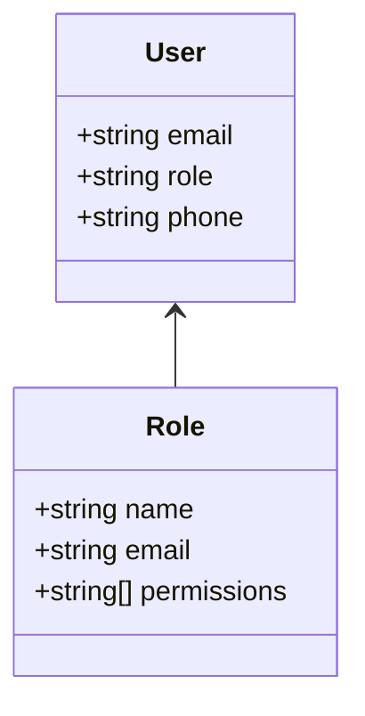
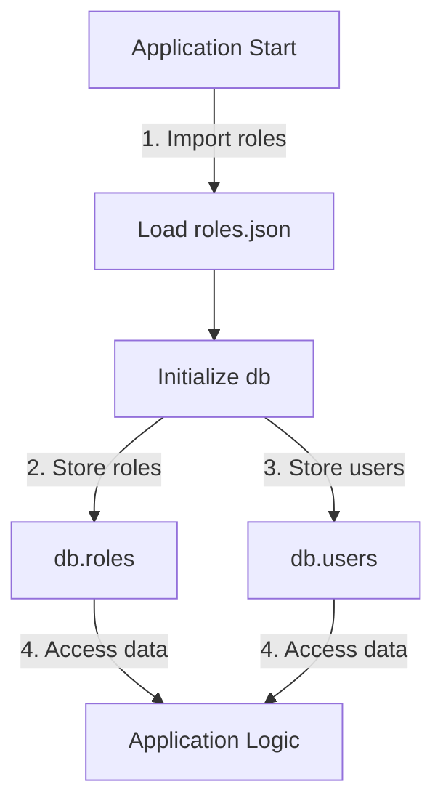

<details>
<summary>Relevant source files</summary>

The following files were used as context for generating this wiki page:

- [src/db.js](https://github.com/agattani123/access-control-service/blob/main/src/db.js)
- [src/models.js](https://github.com/agattani123/access-control-service/blob/main/src/models.js)
</details>

# Data Storage and Access

## Introduction

The "Data Storage and Access" component within this project is responsible for managing user data, roles, and permissions. It provides a centralized data store and defines the data models for users and roles. This component serves as the foundation for implementing access control and authorization mechanisms within the application.

## Data Models

### User Model

The `User` model represents a user entity within the system. It consists of the following properties:

```javascript
export const User = {
  email: 'string', // User's email address
  role: 'string', // User's assigned role
  phone: 'string' // User's phone number
};
```

Sources: [src/models.js:1-4](https://github.com/agattani123/access-control-service/blob/main/src/models.js#L1-L4)

### Role Model

The `Role` model defines the structure of a role within the system. It includes the following properties:

```javascript
export const Role = {
  name: 'string', // Name of the role
  email: 'string', // Email associated with the role (optional)
  permissions: ['string'] // Array of permissions granted to the role
};
```

Sources: [src/models.js:6-10](https://github.com/agattani123/access-control-service/blob/main/src/models.js#L6-L10)

## Data Storage

The application uses an in-memory data store to persist user and role information. The `db` object serves as the central data store, containing two properties:

```javascript
const db = {
  users: {
    'admin@internal.company': 'admin',
    'analyst@internal.company': 'analyst',
  },
  roles: roles
};
```

- `users`: An object that maps user emails to their assigned roles.
- `roles`: An object containing the defined roles and their associated permissions (imported from `config/roles.json`).

Sources: [src/db.js:3-9](https://github.com/agattani123/access-control-service/blob/main/src/db.js#L3-L9)

## Role-based Access Control (RBAC)

The application appears to implement a role-based access control (RBAC) mechanism. Users are assigned roles, and each role is associated with a set of permissions. By mapping users to roles and defining role permissions, the application can control access to various features or resources based on the user's assigned role.



Sources: [src/models.js](https://github.com/agattani123/access-control-service/blob/main/src/models.js)

## Data Flow

The data flow for managing users and roles within the application can be represented as follows:



1. During the application startup, the `roles.json` file is imported, which contains the defined roles and their associated permissions.
2. The `db` object is initialized, storing the roles data in `db.roles`.
3. The `db.users` object is populated with predefined user email-role mappings.
4. The application logic can then access and utilize the user and role data stored in the `db` object for implementing access control and authorization mechanisms.

Sources: [src/db.js](https://github.com/agattani123/access-control-service/blob/main/src/db.js)

## Potential Improvements

While the current implementation provides a basic data storage and access mechanism for users and roles, there are several potential improvements that could be considered:

- **Persistent Storage**: Instead of using an in-memory data store, consider integrating with a persistent database (e.g., SQL or NoSQL) to ensure data durability and scalability.
- **User Authentication**: Implement user authentication mechanisms (e.g., password-based, token-based) to secure access to the application and user data.
- **Role Management**: Introduce functionality to dynamically manage roles, permissions, and user-role assignments, rather than relying on predefined data.
- **Data Validation**: Implement input validation and data sanitization to ensure the integrity and security of user and role data.
- **Error Handling**: Enhance error handling mechanisms to provide meaningful error messages and improve the overall robustness of the application.

Sources: [src/db.js](https://github.com/agattani123/access-control-service/blob/main/src/db.js), [src/models.js](https://github.com/agattani123/access-control-service/blob/main/src/models.js)

## Conclusion

The "Data Storage and Access" component in this project provides a foundation for managing user data, roles, and permissions. It defines the data models for users and roles, and utilizes an in-memory data store to persist this information. The implementation follows a role-based access control (RBAC) approach, where users are assigned roles, and roles are associated with specific permissions. While functional, there are opportunities for improvement, such as integrating with a persistent database, enhancing user authentication, introducing dynamic role management, and implementing data validation and error handling mechanisms.