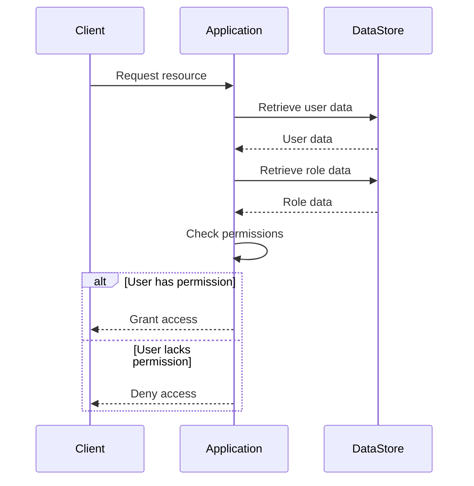

<details>
<summary>Relevant source files</summary>

The following files were used as context for generating this wiki page:

- [src/db.js](https://github.com/agattani123/access-control-service/blob/main/src/db.js)
- [src/models.js](https://github.com/agattani123/access-control-service/blob/main/src/models.js)
</details>

# Data Storage and Access

## Introduction

The "Data Storage and Access" component within this project is responsible for managing user data, roles, and permissions. It defines the data models and provides a centralized data store for the application. This component plays a crucial role in enforcing access control and ensuring that users have the appropriate permissions to perform various actions within the system.

## Data Models

The project defines two main data models: `User` and `Role`. These models are defined in the `src/models.js` file.

### User Model

The `User` model represents a user in the system and has the following properties:

```javascript
export const User = {
  email: 'string',
  role: 'string',
  phone: 'string'
};
```

- `email`: A string representing the user's email address, which serves as a unique identifier.
- `role`: A string representing the user's role within the system.
- `phone`: A string representing the user's phone number.

Sources: [src/models.js:1-4]()

### Role Model

The `Role` model represents a role within the system and has the following properties:

```javascript
export const Role = {
  name: 'string',
  email: 'string',
  permissions: ['string']
};
```

- `name`: A string representing the name of the role.
- `email`: A string representing the email associated with the role.
- `permissions`: An array of strings representing the permissions granted to the role.

Sources: [src/models.js:6-9]()

## Data Storage

The project uses an in-memory data store to persist user and role information. The data store is defined in the `src/db.js` file.

```javascript
import roles from '../config/roles.json' assert { type: 'json' };

// const db = {
//   users: {
//     'admin@internal.company': 'admin',
//     'analyst@internal.company': 'analyst',
//   },
//   roles: roles
// };

export default db;
```

The data store is an object that contains two properties:

- `users`: An object that maps user emails to their respective roles.
- `roles`: An object imported from a JSON file (`roles.json`) that defines the available roles and their associated permissions.

The `users` object is currently commented out, but it provides an example of how user data could be stored in the data store.

Sources: [src/db.js:1-11]()

## Access Control Flow

Based on the provided source files, the following sequence diagram illustrates a potential access control flow within the application:



1. The client (e.g., a user interface or API client) sends a request to access a resource within the application.
2. The application retrieves the user's data from the data store.
3. The application retrieves the user's role data from the data store.
4. The application checks if the user's role has the necessary permissions to access the requested resource.
5. If the user has the required permissions, the application grants access to the resource.
6. If the user lacks the required permissions, the application denies access to the resource.

Sources: [src/db.js](), [src/models.js]()

## Role-Based Access Control (RBAC)

The project appears to implement a Role-Based Access Control (RBAC) model, where permissions are assigned to roles, and users are assigned specific roles. This approach simplifies the management of permissions by grouping them into roles and assigning roles to users, rather than managing permissions individually for each user.

The `Role` model defines the permissions associated with each role, and the `User` model associates a user with a specific role. By retrieving the user's role and its associated permissions, the application can determine whether the user has the necessary permissions to perform a particular action or access a specific resource.

Sources: [src/models.js]()

## Conclusion

The "Data Storage and Access" component in this project provides a centralized data store for managing user data, roles, and permissions. It defines the data models for users and roles, and implements a Role-Based Access Control (RBAC) model for managing access to resources within the application. By leveraging the defined data models and the data store, the application can enforce access control and ensure that users have the appropriate permissions to perform various actions within the system.