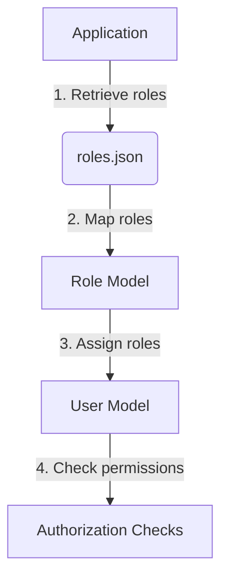
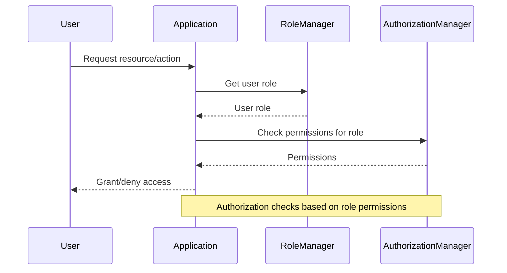

<details>
<summary>Relevant source files</summary>

The following files were used as context for generating this wiki page:

- [src/models.js](https://github.com/agattani123/access-control-service/blob/main/src/models.js)
- [config/roles.json](https://github.com/agattani123/access-control-service/blob/main/config/roles.json)

</details>

# Data Storage and Access

## Introduction

The "Data Storage and Access" component within this project defines the data models and structures used for managing user roles and permissions. It provides a centralized way to represent user information, roles, and their associated permissions. This component serves as the foundation for implementing access control and authorization mechanisms throughout the application.

## Data Models

### User Model

The `User` model represents the basic information about a user in the system. It consists of the following fields:

```javascript
export const User = {
  email: 'string',
  role: 'string',
  phone: 'string'
};
```

- `email`: A string representing the user's email address.
- `role`: A string representing the user's assigned role.
- `phone`: A string representing the user's phone number.

Sources: [src/models.js:3-7]()

### Role Model

The `Role` model defines the structure of a role within the system, including its name, associated email, and a list of permissions.

```javascript
export const Role = {
  name: 'string',
  email: 'string',
  permissions: ['string']
};
```

- `name`: A string representing the name of the role.
- `email`: A string representing the email associated with the role.
- `permissions`: An array of strings representing the permissions granted to the role.

Sources: [src/models.js:9-13]()

## Role Configuration

The project includes a `roles.json` file in the `config` directory, which defines the available roles and their corresponding permissions.

```json
{
  "admin": ["read", "write", "delete"],
  "editor": ["read", "write"],
  "viewer": ["read"]
}
```

This configuration file maps role names to an array of permission strings. For example, the `admin` role has `read`, `write`, and `delete` permissions, while the `viewer` role only has `read` permission.

Sources: [config/roles.json]()

## Role Management

The application likely includes functionality to manage roles and their associated permissions based on the `Role` model and the `roles.json` configuration file. This could involve:

1. Retrieving the list of available roles from the `roles.json` file.
2. Assigning roles to users based on the `role` field in the `User` model.
3. Determining the permissions granted to a user based on their assigned role.
4. Implementing authorization checks throughout the application to ensure users only perform actions permitted by their role.



Sources: [src/models.js](), [config/roles.json]()

## Access Control Flow

The access control flow within the application likely follows these steps:



1. The user requests access to a resource or performs an action within the application.
2. The application retrieves the user's assigned role from the `User` model or a dedicated role management component.
3. The application checks the permissions associated with the user's role, either by consulting the `Role` model or a separate authorization manager component.
4. Based on the user's role permissions, the application grants or denies access to the requested resource or action.

Sources: [src/models.js]()

## Potential Enhancements

While the provided source files cover the basic data models and role configuration, there are several potential enhancements that could be implemented:

- **Role Inheritance**: Implement a hierarchical role structure where roles can inherit permissions from other roles, allowing for more granular permission management.
- **Dynamic Role Assignment**: Develop mechanisms to dynamically assign roles to users based on specific conditions or rules, rather than relying solely on static role assignments.
- **Role-based Access Control (RBAC)**: Integrate the role and permission models with a comprehensive RBAC system that enforces access control throughout the application.
- **Audit Logging**: Implement logging mechanisms to track user actions and role changes for auditing and compliance purposes.
- **Role Management UI**: Develop a user interface or administrative panel to manage roles, permissions, and user assignments more easily.

Sources: [src/models.js](), [config/roles.json]()

## Summary

The "Data Storage and Access" component in this project provides the foundation for managing user roles and permissions through the `User` and `Role` models, as well as the `roles.json` configuration file. These structures enable the implementation of access control and authorization mechanisms within the application, ensuring that users can only perform actions permitted by their assigned roles. While the provided source files cover the basic functionality, there is potential for further enhancements, such as role inheritance, dynamic role assignment, and integration with a comprehensive RBAC system.