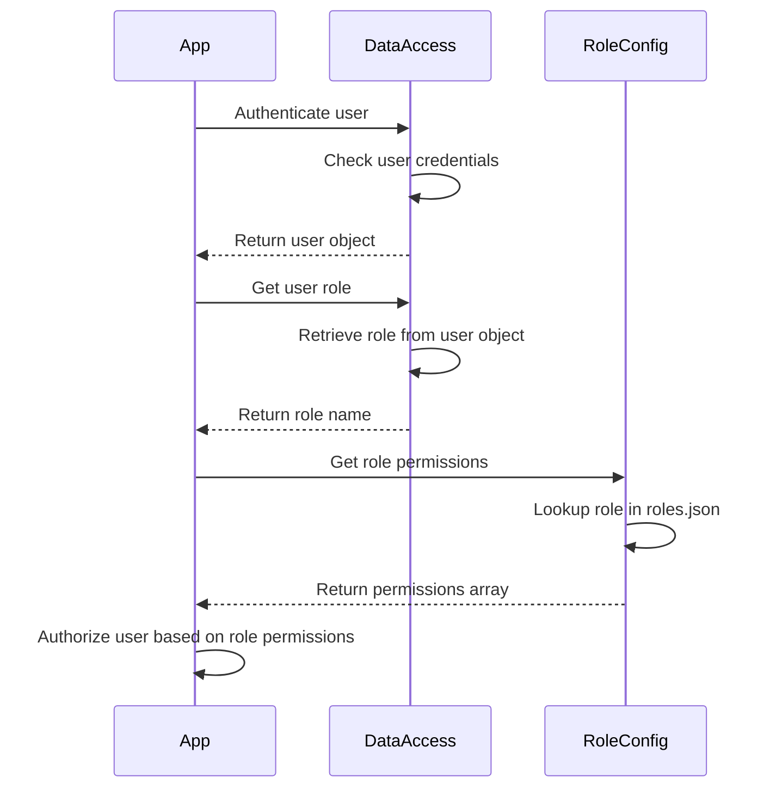

<details>
<summary>Relevant source files</summary>

The following files were used as context for generating this wiki page:

- [src/db.js](https://github.com/agattani123/access-control-service/blob/main/src/db.js)
- [src/models.js](https://github.com/agattani123/access-control-service/blob/main/src/models.js)
- [config/roles.json](https://github.com/agattani123/access-control-service/blob/main/config/roles.json)

</details>

# Data Storage and Access

## Introduction

The "Data Storage and Access" component within this project serves as a centralized module for managing user data and role-based access control. It provides a simple in-memory data store and defines the data models for users and roles. This component is likely used by other parts of the application to authenticate users, authorize access based on roles and permissions, and retrieve user-related information.

Sources: [src/db.js](), [src/models.js]()

## Data Models

### User Model

The `User` model defines the structure of user data stored in the application. It consists of the following fields:

| Field | Type    | Description                    |
|-------|---------|--------------------------------|
| email | string  | The user's email address       |
| role  | string  | The name of the user's role    |

Sources: [src/models.js:1-4]()

### Role Model

The `Role` model represents the different roles that users can have within the application. It includes the following fields:

| Field       | Type     | Description                                  |
|-------------|----------|----------------------------------------------|
| name        | string   | The name of the role                         |
| permissions | string[] | An array of permission strings for the role |

Sources: [src/models.js:6-9]()

## Data Storage

The application uses an in-memory data store implemented as a JavaScript object called `db`. This data store contains two main properties:

1. `users`: An object that maps user email addresses to their respective roles.
2. `roles`: An object that defines the available roles and their associated permissions.

```js
const db = {
  users: {
    'admin@internal.company': 'admin',
    'analyst@internal.company': 'analyst',
  },
  roles: roles
};
```

The `roles` object is imported from a JSON configuration file (`roles.json`). This allows for easy management and modification of role definitions without changing the application code.

Sources: [src/db.js:1-10]()

## Role Configuration

The `roles.json` file defines the available roles and their associated permissions. The structure of this file is an object where each key represents a role name, and the value is an array of permission strings.

```json
{
  "admin": ["read", "write", "delete"],
  "analyst": ["read"]
}
```

In the example above, the `admin` role has `read`, `write`, and `delete` permissions, while the `analyst` role only has `read` permission.

Sources: [config/roles.json]()

## Access Control Flow

The "Data Storage and Access" component likely serves as the foundation for an access control system within the application. Here's a potential sequence of how it might be used:



1. The application authenticates the user by checking their credentials against the `users` object in the data store.
2. Upon successful authentication, the user's role is retrieved from the `users` object.
3. The application fetches the permissions associated with the user's role from the `roles.json` configuration file.
4. Based on the user's role permissions, the application can authorize or deny access to certain features or resources.

Sources: [src/db.js](), [src/models.js](), [config/roles.json]()

## Limitations and Future Improvements

While the current implementation provides a basic data storage and access control mechanism, it has several limitations:

1. **In-Memory Storage**: The data store is an in-memory object, which means that user data and role definitions are lost when the application restarts. A persistent storage solution, such as a database or file-based storage, would be more suitable for production environments.

2. **Hardcoded Users**: The `users` object in the data store contains hardcoded user email addresses and roles. A more scalable approach would be to separate user management from the data store and provide mechanisms for adding, modifying, and removing users dynamically.

3. **Limited Role Management**: The role definitions are stored in a JSON file, which can be cumbersome to manage as the number of roles and permissions grows. A dedicated role management system or an admin interface for managing roles and permissions could be beneficial.

4. **Lack of Authentication and Authorization Logic**: The provided code does not include any implementation details for user authentication (e.g., password verification) or authorization logic based on roles and permissions. These crucial components would need to be implemented separately.

5. **Lack of Error Handling and Validation**: The code does not include any error handling or input validation mechanisms, which could lead to security vulnerabilities or unexpected behavior.

To address these limitations and improve the overall functionality and security of the "Data Storage and Access" component, the following enhancements could be considered:

- Integrate a persistent storage solution, such as a database or file-based storage, for user data and role definitions.
- Implement a user management system with functionality for creating, updating, and deleting users dynamically.
- Develop a dedicated role management system or an admin interface for managing roles and permissions more efficiently.
- Implement authentication logic, including password hashing, salt generation, and secure password storage.
- Implement authorization logic based on roles and permissions, potentially using a middleware or decorator pattern.
- Incorporate input validation and error handling mechanisms to ensure data integrity and security.
- Consider implementing additional security measures, such as rate limiting, brute-force protection, and secure communication channels (e.g., HTTPS).

By addressing these limitations and implementing the suggested improvements, the "Data Storage and Access" component can become more robust, scalable, and secure, better serving the needs of the application and its users.