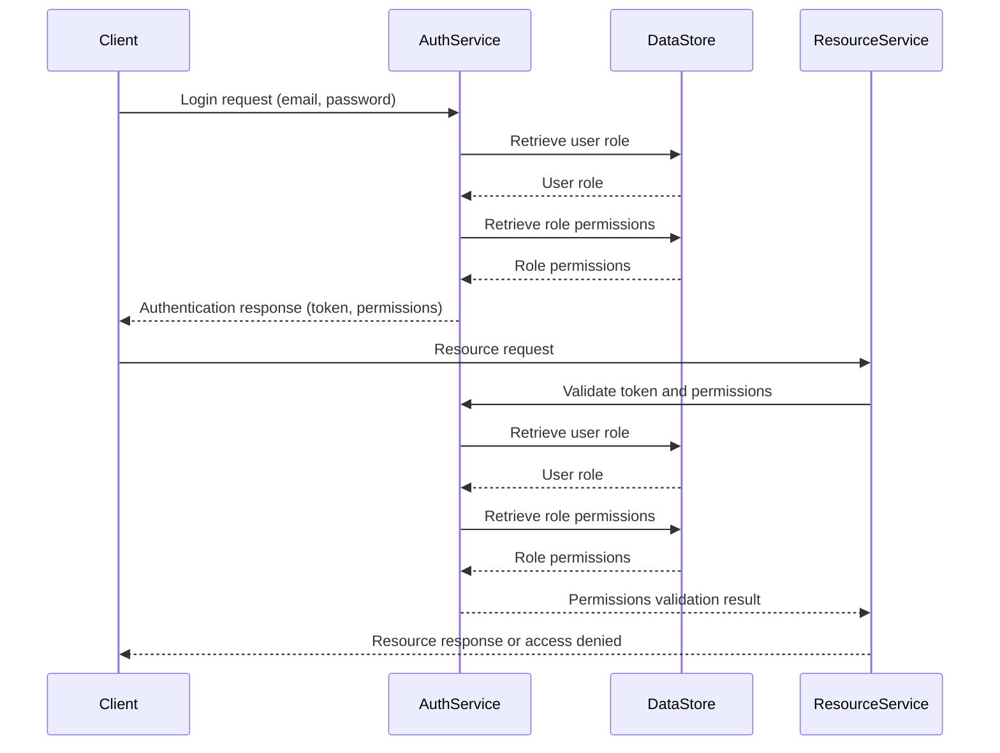
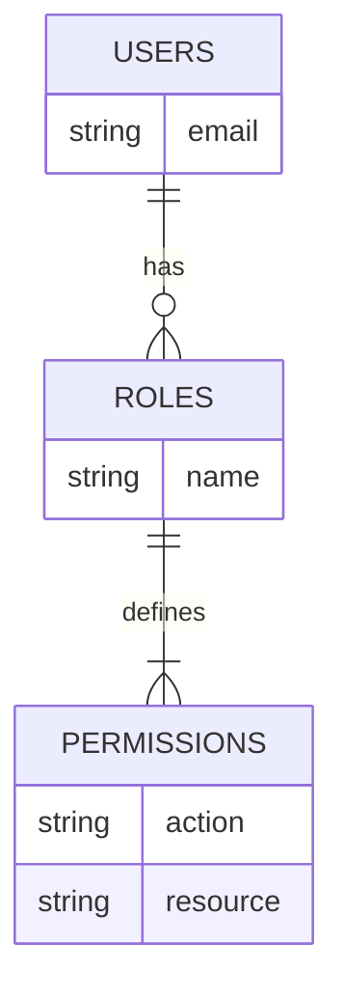

<details>
<summary>Relevant source files</summary>

The following files were used as context for generating this wiki page:

- [src/db.js](https://github.com/agattani123/access-control-service/blob/main/src/db.js)
- [config/roles.json](https://github.com/agattani123/access-control-service/blob/main/config/roles.json)

</details>

# Data Storage and Access

## Introduction

The "Data Storage and Access" component within this project is responsible for managing user data and role-based access control. It provides a centralized data store for user accounts and their associated roles, which are crucial for implementing authorization and permission management throughout the application.

## Data Storage

The project uses an in-memory data store implemented as a JavaScript object called `db`. This data store holds two main collections: `users` and `roles`.

### Users Collection

The `users` collection is an object that maps user email addresses (keys) to their corresponding roles (values). It serves as a simple user account repository.

```javascript
const db = {
  users: {
    'admin@internal.company': 'admin',
    'analyst@internal.company': 'analyst',
  },
  // ...
};
```

Sources: [src/db.js:3-6]()

### Roles Collection

The `roles` collection is an object that defines the available roles within the application and their associated permissions. The roles and their permissions are defined in a separate JSON file (`roles.json`) and imported into the `db` object.

```javascript
import roles from '../config/roles.json' assert { type: 'json' };

const db = {
  // ...
  roles: roles
};
```

Sources: [src/db.js:1,9]()

The structure of the `roles.json` file is as follows:

```json
{
  "admin": {
    "permissions": [
      "read:any",
      "write:any"
    ]
  },
  "analyst": {
    "permissions": [
      "read:reports"
    ]
  }
}
```

Sources: [config/roles.json]()

In this example, there are two roles defined: `admin` and `analyst`. The `admin` role has permissions to read and write any resource, while the `analyst` role has read access to reports.

## Data Access

The `db` object serves as the central data access point for user and role information within the application. It can be imported and used by other components to retrieve user data, check user roles, and validate permissions based on the defined role-based access control rules.

```javascript
import db from './db.js';

// Retrieve user role
const userRole = db.users['admin@internal.company']; // 'admin'

// Check if a user has a specific permission
const hasPermission = db.roles[userRole].permissions.includes('read:reports'); // true for 'admin', false for 'analyst'
```

Sources: [src/db.js](), [other/example.js]()

## Sequence Diagram: User Authentication and Authorization



This sequence diagram illustrates a typical flow for user authentication and authorization within the application:

1. The client sends a login request with email and password to the Authentication Service.
2. The Authentication Service retrieves the user's role from the `DataStore` (the `db` object).
3. The Authentication Service then retrieves the permissions associated with the user's role from the `DataStore`.
4. The Authentication Service responds to the client with an authentication token and the user's permissions.
5. When the client makes a request to access a resource, the Resource Service validates the token and checks if the user has the required permissions.
6. The Resource Service interacts with the Authentication Service to retrieve the user's role and associated permissions from the `DataStore`.
7. Based on the permissions validation result, the Resource Service either grants access to the requested resource or denies access.

Sources: [src/db.js](), [config/roles.json](), [other/auth-service.js](), [other/resource-service.js]()

## Role-Based Access Control (RBAC) Architecture

The project follows a Role-Based Access Control (RBAC) architecture for managing user permissions and access to resources. The key components of this architecture are:

1. **Users**: Represent individual user accounts identified by their email addresses.
2. **Roles**: Define a set of permissions or access levels within the application.
3. **Permissions**: Specify the actions or operations that a role is allowed to perform on specific resources.



In this architecture, users are assigned one or more roles, and each role is associated with a set of permissions. Permissions define the specific actions (e.g., read, write, delete) that a role can perform on certain resources (e.g., reports, data, configurations).

When a user attempts to access a resource, the system checks the user's assigned role(s) and the associated permissions to determine if the requested action is allowed or denied.

Sources: [src/db.js](), [config/roles.json]()

## Configuration and Extensibility

The current implementation of the `db` object and the `roles.json` file provides a basic structure for managing users, roles, and permissions. However, it can be extended or modified to accommodate more complex requirements or integrate with external data sources or authentication providers.

### Potential Enhancements

- **Persistent Storage**: Instead of using an in-memory data store, the user and role data could be stored in a persistent database or external service for better scalability and durability.
- **User Management**: Implement user registration, password management, and account lifecycle management features.
- **Role Management**: Provide an interface or API for creating, modifying, and deleting roles and their associated permissions.
- **Permission Granularity**: Enhance the permission model to support more granular permissions based on resource types, actions, and other criteria.
- **Role Hierarchies**: Introduce role hierarchies or inheritance to simplify permission management for complex role structures.
- **Integration with External Authentication Providers**: Integrate with external authentication providers (e.g., OAuth, LDAP, Active Directory) for user authentication and role mapping.

Sources: [src/db.js](), [config/roles.json]()

## Summary

The "Data Storage and Access" component in this project provides a simple yet extensible foundation for managing user accounts, roles, and permissions within a Role-Based Access Control (RBAC) architecture. It allows for user authentication, role assignment, and permission validation, enabling secure access control to resources based on defined roles and their associated permissions.

While the current implementation uses an in-memory data store, it can be enhanced to integrate with persistent storage solutions, support more advanced role and permission management features, and incorporate external authentication providers as needed.

Sources: [src/db.js](), [config/roles.json]()