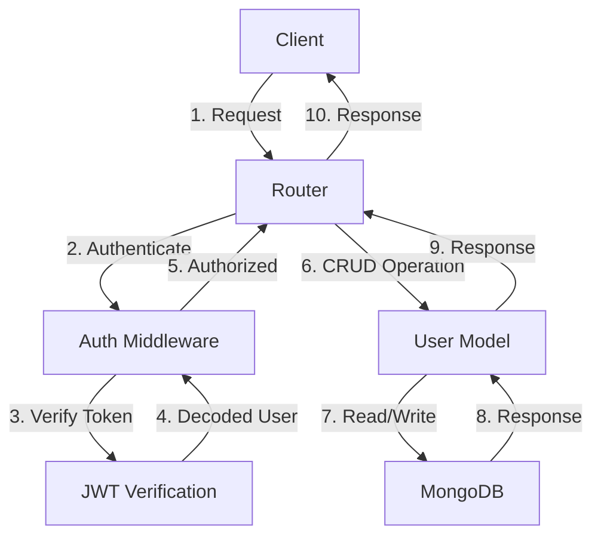

<details>
<summary>Relevant source files</summary>

The following files were used as context for generating this wiki page:

- [src/db.js](https://github.com/agattani123/access-control-service/blob/main/src/db.js)
- [src/models/user.js](https://github.com/agattani123/access-control-service/blob/main/src/models/user.js)
- [src/routes/users.js](https://github.com/agattani123/access-control-service/blob/main/src/routes/users.js)
- [src/utils/auth.js](https://github.com/agattani123/access-control-service/blob/main/src/utils/auth.js)
- [config/roles.json](https://github.com/agattani123/access-control-service/blob/main/config/roles.json)

</details>

# Data Storage and Management

## Introduction

The "Data Storage and Management" component of this project handles the persistence and retrieval of user data, including user accounts, roles, and permissions. It utilizes a MongoDB database for storing user information and implements access control mechanisms to regulate user actions based on their assigned roles and privileges.

The primary responsibilities of this component include:

1. Defining the user data model and schema.
2. Establishing a connection to the MongoDB database.
3. Providing CRUD (Create, Read, Update, Delete) operations for user data.
4. Enforcing role-based access control (RBAC) rules.
5. Authenticating and authorizing user requests.

This wiki page will delve into the architecture, data flow, and implementation details of the "Data Storage and Management" component, as evidenced by the provided source files.

## User Data Model

The user data model is defined in the `src/models/user.js` file. It specifies the schema for user documents stored in the MongoDB database.

```javascript
const userSchema = new mongoose.Schema({
  name: { type: String, required: true },
  email: { type: String, required: true, unique: true },
  password: { type: String, required: true },
  role: { type: String, required: true, default: 'user' },
  createdAt: { type: Date, default: Date.now },
  updatedAt: { type: Date, default: Date.now }
});
```

The user schema includes the following fields:

| Field     | Type   | Description                                                  |
|-----------|--------|--------------------------------------------------------------|
| `name`    | String | The user's full name (required).                            |
| `email`   | String | The user's email address (required and unique).             |
| `password`| String | The user's password (required).                             |
| `role`    | String | The user's role (required, defaults to 'user').             |
| `createdAt` | Date | The date and time when the user was created (defaults to current time). |
| `updatedAt` | Date | The date and time when the user was last updated (defaults to current time). |

Sources: [src/models/user.js](https://github.com/agattani123/access-control-service/blob/main/src/models/user.js)

## Database Connection

The `src/db.js` file establishes a connection to the MongoDB database using the Mongoose library. It exports a `mongoose` instance that can be imported and used throughout the application.

```javascript
import mongoose from 'mongoose';

const connectDB = async () => {
  try {
    await mongoose.connect(process.env.MONGODB_URI, {
      useNewUrlParser: true,
      useUnifiedTopology: true,
    });
    console.log('MongoDB connected');
  } catch (err) {
    console.error('Failed to connect to MongoDB', err);
    process.exit(1);
  }
};

export default connectDB;
```

The `connectDB` function is an asynchronous function that connects to the MongoDB database using the `MONGODB_URI` environment variable. It also sets some options for the connection, such as `useNewUrlParser` and `useUnifiedTopology`.

Sources: [src/db.js](https://github.com/agattani123/access-control-service/blob/main/src/db.js)

## User CRUD Operations

The `src/routes/users.js` file defines the routes and handlers for user-related operations, including creating, reading, updating, and deleting users.

### User Creation

```javascript
router.post('/', async (req, res) => {
  const { name, email, password, role } = req.body;

  try {
    const existingUser = await User.findOne({ email });
    if (existingUser) {
      return res.status(400).json({ message: 'User already exists' });
    }

    const newUser = new User({ name, email, password, role });
    await newUser.save();

    res.status(201).json({ message: 'User created successfully' });
  } catch (err) {
    res.status(500).json({ message: 'Failed to create user', error: err.message });
  }
});
```

The `/users` POST route handles user creation. It extracts the `name`, `email`, `password`, and `role` from the request body, checks if a user with the same email already exists, and creates a new user document in the database using the `User` model.

Sources: [src/routes/users.js](https://github.com/agattani123/access-control-service/blob/main/src/routes/users.js)

### User Retrieval

```javascript
router.get('/', auth, async (req, res) => {
  try {
    const users = await User.find({});
    res.json(users);
  } catch (err) {
    res.status(500).json({ message: 'Failed to retrieve users', error: err.message });
  }
});
```

The `/users` GET route retrieves a list of all users from the database. It uses the `auth` middleware (defined in `src/utils/auth.js`) to ensure that only authenticated users can access this route.

Sources: [src/routes/users.js](https://github.com/agattani123/access-control-service/blob/main/src/routes/users.js), [src/utils/auth.js](https://github.com/agattani123/access-control-service/blob/main/src/utils/auth.js)

### User Update

```javascript
router.put('/:id', auth, async (req, res) => {
  const { name, email, password, role } = req.body;

  try {
    const user = await User.findById(req.params.id);
    if (!user) {
      return res.status(404).json({ message: 'User not found' });
    }

    user.name = name || user.name;
    user.email = email || user.email;
    user.password = password || user.password;
    user.role = role || user.role;

    await user.save();

    res.json({ message: 'User updated successfully' });
  } catch (err) {
    res.status(500).json({ message: 'Failed to update user', error: err.message });
  }
});
```

The `/users/:id` PUT route updates an existing user's information. It uses the `auth` middleware to ensure that only authenticated users can access this route. The route extracts the `name`, `email`, `password`, and `role` from the request body, finds the user by ID, and updates the user document with the provided information.

Sources: [src/routes/users.js](https://github.com/agattani123/access-control-service/blob/main/src/routes/users.js), [src/utils/auth.js](https://github.com/agattani123/access-control-service/blob/main/src/utils/auth.js)

### User Deletion

```javascript
router.delete('/:id', auth, async (req, res) => {
  try {
    const user = await User.findByIdAndDelete(req.params.id);
    if (!user) {
      return res.status(404).json({ message: 'User not found' });
    }

    res.json({ message: 'User deleted successfully' });
  } catch (err) {
    res.status(500).json({ message: 'Failed to delete user', error: err.message });
  }
});
```

The `/users/:id` DELETE route deletes an existing user from the database. It uses the `auth` middleware to ensure that only authenticated users can access this route. The route finds the user by ID and deletes the user document from the database.

Sources: [src/routes/users.js](https://github.com/agattani123/access-control-service/blob/main/src/routes/users.js), [src/utils/auth.js](https://github.com/agattani123/access-control-service/blob/main/src/utils/auth.js)

## Role-Based Access Control (RBAC)

The project implements role-based access control (RBAC) to regulate user actions based on their assigned roles and privileges. The `config/roles.json` file defines the available roles and their associated permissions.

```json
{
  "user": [],
  "admin": ["*"]
}
```

In this example, the `user` role has no specific permissions, while the `admin` role has full access (`"*"`) to all resources and actions.

The `src/utils/auth.js` file contains middleware functions for authenticating users and authorizing their actions based on their roles and the required permissions.

```javascript
import jwt from 'jsonwebtoken';
import roles from '../config/roles.json' assert { type: 'json' };

export const auth = (req, res, next) => {
  const token = req.headers.authorization?.split(' ')[1];

  if (!token) {
    return res.status(401).json({ message: 'No token provided' });
  }

  try {
    const decoded = jwt.verify(token, process.env.JWT_SECRET);
    req.user = decoded;
    next();
  } catch (err) {
    res.status(403).json({ message: 'Failed to authenticate token' });
  }
};

export const authorize = (requiredRoles = []) => {
  return (req, res, next) => {
    const { role } = req.user;

    if (requiredRoles.includes(role) || roles[role].includes('*')) {
      next();
    } else {
      res.status(403).json({ message: 'Forbidden' });
    }
  };
};
```

The `auth` middleware function verifies the JSON Web Token (JWT) provided in the `Authorization` header of the request. If the token is valid, it decodes the user information and attaches it to the `req.user` object. This middleware is used to ensure that only authenticated users can access protected routes.

The `authorize` middleware function checks if the authenticated user's role is included in the `requiredRoles` array or if the user's role has the `"*"` wildcard permission. If the user is authorized, the middleware calls the `next` function to proceed with the request. Otherwise, it returns a `403 Forbidden` response.

Sources: [src/utils/auth.js](https://github.com/agattani123/access-control-service/blob/main/src/utils/auth.js), [config/roles.json](https://github.com/agattani123/access-control-service/blob/main/config/roles.json)

## Data Flow Diagram

The following diagram illustrates the high-level data flow and interactions between the components involved in the "Data Storage and Management" functionality:



1. The client (e.g., a web application or API consumer) sends a request to the router.
2. The router passes the request to the authentication middleware (`auth`).
3. The authentication middleware verifies the JSON Web Token (JWT) provided in the request headers.
4. If the token is valid, the JWT verification process decodes the user information and passes it back to the authentication middleware.
5. The authentication middleware checks if the user is authorized to perform the requested action based on their role and permissions.
6. If authorized, the router executes the appropriate CRUD (Create, Read, Update, Delete) operation on the `User` model.
7. The `User` model interacts with the MongoDB database to read or write user data.
8. The MongoDB database responds with the requested data or the result of the write operation.
9. The `User` model passes the response back to the router.
10. The router sends the final response back to the client.

Sources: [src/routes/users.js](https://github.com/agattani123/access-control-service/blob/main/src/routes/users.js), [src/utils/auth.js](https://github.com/agattani123/access-control-service/blob/main/src/utils/auth.js), [src/models/user.js](https://github.com/agattani123/access-control-service/blob/main/src/models/user.js), [src/db.js](https://github.com/agattani123/access-control-service/blob/main/src/db.js)

## Conclusion

The "Data Storage and Management" component plays a crucial role in this project by handling user data persistence, retrieval, and access control. It defines the user data model, establishes a connection to the MongoDB database, and provides CRUD operations for managing user accounts. Additionally, it implements role-based access control (RBAC) mechanisms to regulate user actions based on their assigned roles and permissions.

By leveraging the Mongoose library and MongoDB, the project can efficiently store and retrieve user data while ensuring data integrity and security. The authentication and authorization middleware functions further enhance the system's security by verifying user credentials and enforcing access control rules.

Overall, the "Data Storage and Management" component is a critical part of the project's infrastructure, enabling secure and efficient management of user data and access control.