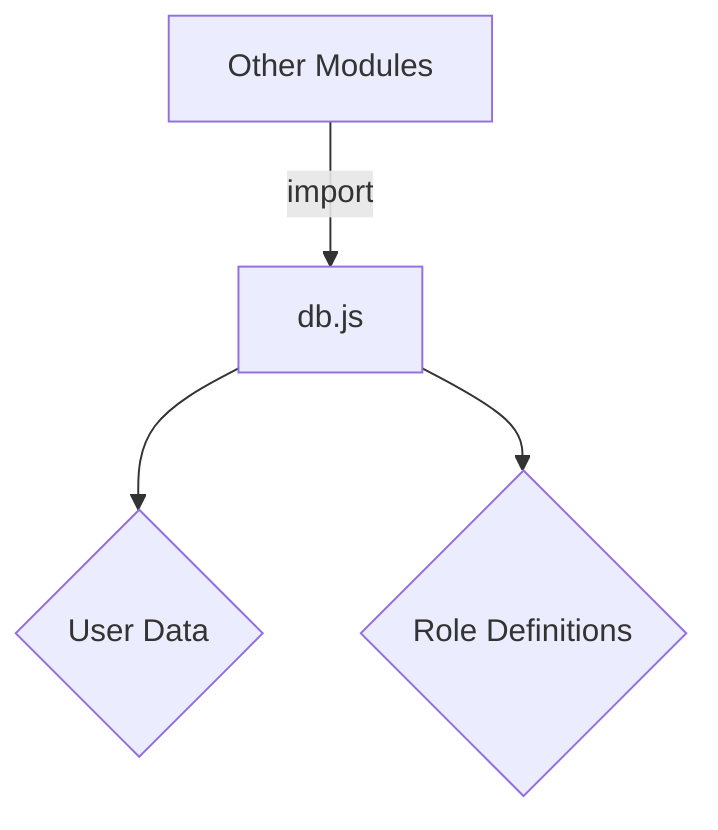

<details>
<summary>Relevant source files</summary>

The following files were used as context for generating this wiki page:

- [src/db.js](https://github.com/agattani123/access-control-service/blob/main/src/db.js)
- [config/roles.json](https://github.com/agattani123/access-control-service/blob/main/config/roles.json)

</details>

# Data Storage and Management

## Introduction

This wiki page covers the data storage and management aspects of the project. The project appears to use an in-memory data structure to store user information and role definitions. The `db.js` module serves as a central location for managing this data.

## Data Structures

### User Data

The user data is stored in an object `db.users`, where the keys represent user email addresses, and the values represent their respective roles.

```javascript
const db = {
  users: {
    'admin@internal.company': 'admin',
    'analyst@internal.company': 'analyst',
  },
  // ...
};
```

Sources: [src/db.js:3-6]()

### Role Definitions

The role definitions are imported from a separate JSON file (`roles.json`) and stored in the `db.roles` object.

```javascript
import roles from '../config/roles.json' assert { type: 'json' };

const db = {
  // ...
  roles: roles
};
```

Sources: [src/db.js:1,8]()

The structure and contents of the `roles.json` file are not provided in the given source files.

## Data Flow

The data flow for accessing and managing user data and role definitions is not explicitly shown in the provided source files. However, it can be inferred that other modules in the project would import the `db` object from the `db.js` module to access and potentially modify the user data and role definitions.



Sources: [src/db.js]()

## Potential Improvements

Based on the provided source files, the following potential improvements could be considered:

1. **Persistent Storage**: The current implementation uses an in-memory data structure, which means that any changes to user data or role definitions will be lost when the application restarts. Integrating a persistent storage solution, such as a database or file-based storage, would ensure data persistence across application restarts.

2. **Data Validation and Sanitization**: The current implementation does not include any data validation or sanitization mechanisms. Adding input validation and sanitization for user data and role definitions could improve data integrity and security.

3. **Role Management**: The provided source files do not include any functionality for managing roles (e.g., creating, updating, or deleting roles). Implementing role management capabilities could enhance the flexibility and maintainability of the access control system.

4. **User Management**: Similar to role management, the current implementation lacks functionality for managing users (e.g., creating, updating, or deleting users). Implementing user management capabilities could improve the overall user experience and administration of the access control system.

5. **Access Control Logic**: The provided source files do not include any logic for enforcing access control based on user roles and permissions. Implementing access control logic would be necessary to ensure proper authorization and security within the application.

Sources: [src/db.js]()

## Conclusion

The "Data Storage and Management" aspect of the project currently relies on an in-memory data structure to store user information and role definitions. While this approach provides a simple and straightforward implementation, it may not be suitable for production environments or applications with more complex data storage and management requirements. Integrating persistent storage, data validation, and user/role management capabilities could enhance the overall robustness and functionality of the access control system.