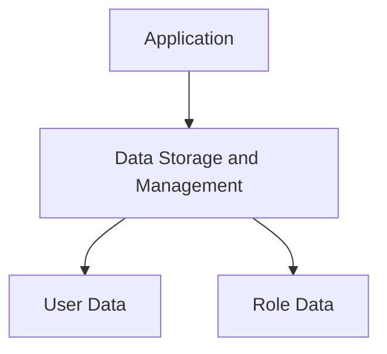
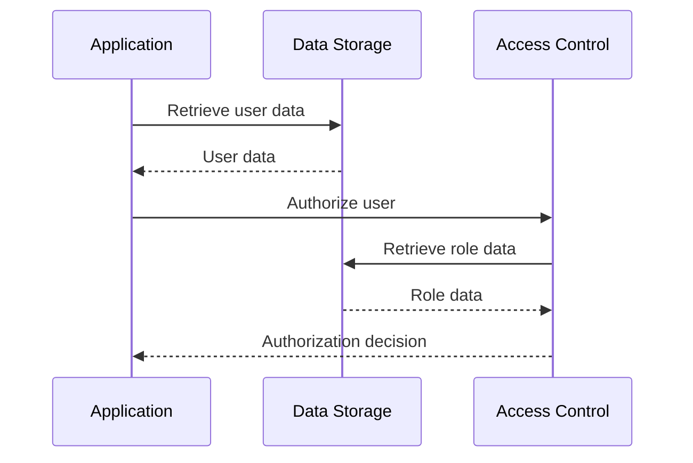

<details>
<summary>Relevant source files</summary>

The following files were used as context for generating this wiki page:

- [src/db.js](https://github.com/agattani123/access-control-service/blob/main/src/db.js)
- [config/roles.json](https://github.com/agattani123/access-control-service/blob/main/config/roles.json)

</details>

# Data Storage and Management

## Introduction

The "Data Storage and Management" component within this project is responsible for managing user data and role-based access control (RBAC) rules. It serves as a centralized data store for user accounts and their associated roles, which are used to control access to various resources or functionalities within the application. This component is crucial for ensuring proper authorization and maintaining data integrity.

## Data Storage

The project utilizes an in-memory data store implemented as a JavaScript object called `db`. This data store holds two main properties: `users` and `roles`.

### User Data

The `users` property is an object that stores user account information. Each key in the `users` object represents a user's email address, and the corresponding value is the user's role.

```javascript
const db = {
  users: {
    'admin@internal.company': 'admin',
    'analyst@internal.company': 'analyst',
  },
  // ...
};
```

Sources: [src/db.js:3-6]()

### Role Data

The `roles` property is an object that defines the available roles and their associated permissions or access levels. The roles and their corresponding permissions are loaded from an external JSON file (`roles.json`).

```javascript
import roles from '../config/roles.json' assert { type: 'json' };

const db = {
  // ...
  roles: roles
};
```

Sources: [src/db.js:1,9]()

The structure of the `roles.json` file is not provided in the given source files.

## Data Flow

The data flow within the "Data Storage and Management" component is relatively straightforward. The `db` object is imported and used throughout the application to manage user authentication, authorization, and access control.



Sources: [src/db.js]()

## Access Control and Authorization

The "Data Storage and Management" component plays a crucial role in access control and authorization within the application. By storing user accounts and their associated roles, it enables the application to enforce role-based access control (RBAC) rules.



Sources: [src/db.js]()

The application can retrieve user data and role information from the data store and use it to make authorization decisions based on the user's role and the required permissions for a particular resource or functionality.

## Limitations and Future Improvements

While the current implementation provides a basic data storage and management solution, it has several limitations:

1. **In-Memory Data Store**: The use of an in-memory data store may not be suitable for larger applications or scenarios where data persistence is required. Integrating with a more robust database solution (e.g., SQL or NoSQL databases) would be necessary for production environments.

2. **Hardcoded User Data**: The user data is currently hardcoded within the `db` object. A more scalable solution would involve implementing user registration, authentication, and management functionalities.

3. **Limited Role Management**: The current implementation lacks functionality for managing roles dynamically. Adding, modifying, or removing roles would require updating the `roles.json` file manually.

4. **Lack of Data Validation**: There is no validation or sanitization of user data or role information, which could lead to security vulnerabilities or data inconsistencies.

5. **Lack of Error Handling**: The provided source files do not include any error handling mechanisms, which could lead to unexpected behavior or crashes in case of errors or edge cases.

To address these limitations and improve the "Data Storage and Management" component, the following enhancements could be considered:

- Integrate with a persistent database solution (e.g., MySQL, PostgreSQL, MongoDB) for data storage and retrieval.
- Implement user registration, authentication, and management functionalities.
- Develop a role management system to allow dynamic creation, modification, and deletion of roles.
- Implement data validation and sanitization mechanisms to ensure data integrity and security.
- Incorporate proper error handling and logging mechanisms to improve reliability and maintainability.
- Implement caching mechanisms or performance optimizations, if necessary, based on the application's requirements.

By addressing these limitations and incorporating the suggested improvements, the "Data Storage and Management" component can become more robust, scalable, and secure, better aligning with industry best practices and production-ready requirements.