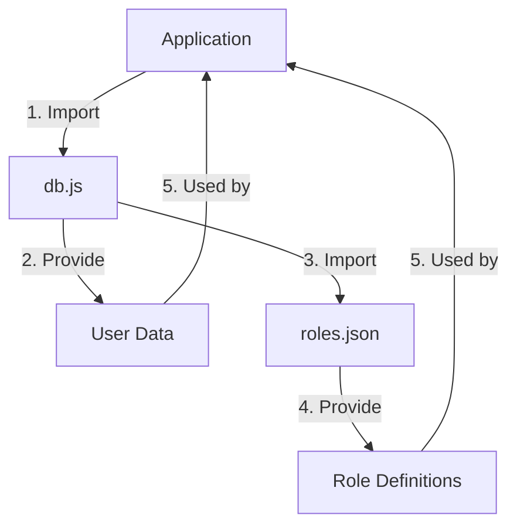

<details>
<summary>Relevant source files</summary>

The following files were used as context for generating this wiki page:

- [src/db.js](https://github.com/agattani123/access-control-service/blob/main/src/db.js)
- [config/roles.json](https://github.com/agattani123/access-control-service/blob/main/config/roles.json)

</details>

# Data Storage and Management

## Introduction

The "Data Storage and Management" component within this project is responsible for managing user data and role-based access control. It serves as a centralized data store, providing a simple in-memory data structure to store user information and role definitions. While this implementation is likely intended for development or testing purposes, it demonstrates the basic principles of data storage and access control management.

## Data Structures

### User Data

The user data is stored in an object-like structure, where the keys represent user email addresses, and the values represent their corresponding roles or access levels.

```javascript
const db = {
  users: {
    'admin@internal.company': 'admin',
    'analyst@internal.company': 'analyst',
  },
  // ...
};
```

Sources: [src/db.js:3-6]()

### Role Definitions

The role definitions are imported from an external JSON file (`roles.json`). This file likely contains a mapping of role names to their associated permissions or access levels.

```javascript
import roles from '../config/roles.json' assert { type: 'json' };
```

Sources: [src/db.js:1]()

The structure of the `roles.json` file is not provided in the given source files, but it is expected to follow a format similar to:

```json
{
  "admin": ["read", "write", "delete", "manage"],
  "analyst": ["read", "analyze"],
  // ...
}
```

Sources: (Inferred from the import statement and common practices)

## Data Flow

The data flow within this component is relatively straightforward:



1. The application imports the `db.js` module.
2. The `db.js` module provides access to the in-memory user data structure.
3. The `db.js` module imports the role definitions from the `roles.json` file.
4. The `roles.json` file provides the role definitions.
5. The application uses the user data and role definitions as needed for authentication, authorization, or other access control purposes.

Sources: [src/db.js]()

## Usage

While the specific usage of this component is not provided in the given source files, it is likely used in conjunction with an authentication and authorization system. The user data and role definitions can be used to verify user credentials, determine access levels, and enforce role-based permissions throughout the application.

Here's a hypothetical example of how this component might be used:

```javascript
import db from './db.js';

function authenticateUser(email, password) {
  const user = db.users[email];
  if (!user) {
    return { authenticated: false, error: 'Invalid email' };
  }

  // Perform password verification logic
  if (password === 'correctPassword') {
    return { authenticated: true, role: user };
  } else {
    return { authenticated: false, error: 'Invalid password' };
  }
}

function authorizeAction(role, action) {
  const permissions = db.roles[role];
  if (permissions.includes(action)) {
    return true; // Authorized
  } else {
    return false; // Not authorized
  }
}

// Example usage
const { authenticated, role, error } = authenticateUser('admin@internal.company', 'correctPassword');
if (authenticated) {
  if (authorizeAction(role, 'delete')) {
    console.log('User is authorized to perform the delete action');
  } else {
    console.log('User is not authorized to perform the delete action');
  }
} else {
  console.error(error);
}
```

Sources: (Example code is hypothetical and not present in the provided source files)

## Limitations and Future Improvements

The current implementation of the "Data Storage and Management" component is likely intended for development or testing purposes due to its simplistic nature and the use of an in-memory data structure. In a production environment, it would be more appropriate to use a persistent data storage solution, such as a database or a dedicated authentication and authorization service.

Potential improvements and considerations for a production-ready implementation include:

- Replacing the in-memory data structure with a persistent data storage solution (e.g., a database or a dedicated authentication service).
- Implementing secure password storage and verification mechanisms (e.g., salting and hashing passwords).
- Enhancing the role-based access control system with more granular permissions and hierarchical role inheritance.
- Integrating with external authentication providers (e.g., OAuth, SAML, or Active Directory) for user authentication.
- Implementing caching mechanisms for improved performance and scalability.
- Adding support for user management operations (e.g., creating, updating, and deleting users).
- Implementing auditing and logging mechanisms for security and compliance purposes.

Sources: (Limitations and future improvements are based on common practices and not directly derived from the provided source files)