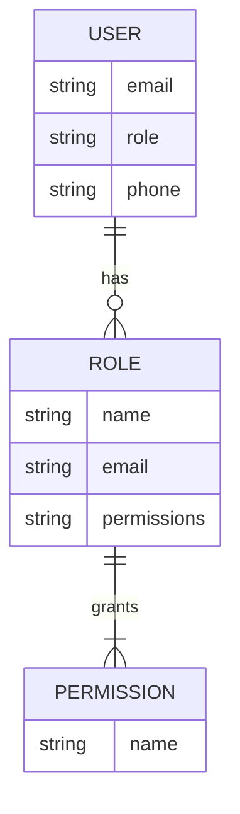

<details>
<summary>Relevant source files</summary>

The following files were used as context for generating this wiki page:

- [src/db.js](https://github.com/agattani123/access-control-service/blob/main/src/db.js)
- [src/models.js](https://github.com/agattani123/access-control-service/blob/main/src/models.js)
</details>

# Data Storage and Management

## Introduction

The "Data Storage and Management" component within this project is responsible for handling user data, roles, and permissions. It defines the data models and provides a simple in-memory database implementation. This wiki page covers the architecture, data structures, and key elements related to data storage and management.

## Data Models

The project defines two main data models: `User` and `Role`. These models are defined in the `src/models.js` file.

### User Model

The `User` model represents a user in the system and has the following properties:

```javascript
export const User = {
  email: 'string',
  role: 'string',
  phone: 'string'
};
```

- `email`: A string representing the user's email address.
- `role`: A string representing the user's role within the system.
- `phone`: A string representing the user's phone number.

Sources: [src/models.js:1-4]()

### Role Model

The `Role` model represents a role within the system and has the following properties:

```javascript
export const Role = {
  name: 'string',
  email: 'string',
  permissions: ['string']
};
```

- `name`: A string representing the name of the role.
- `email`: A string representing the email associated with the role.
- `permissions`: An array of strings representing the permissions granted to the role.

Sources: [src/models.js:6-9]()

## In-Memory Database

The project uses an in-memory database implementation defined in the `src/db.js` file. This implementation is likely intended for development or testing purposes and should be replaced with a more robust database solution in a production environment.

```javascript
import roles from '../config/roles.json' assert { type: 'json' };

const db = {
  users: {
    'admin@internal.company': 'admin',
    'analyst@internal.company': 'analyst',
  },
  roles: roles
};

export default db;
```

The `db` object contains two properties:

- `users`: An object that maps user emails to their respective roles.
- `roles`: An object imported from a JSON file (`roles.json`) that defines the roles and their associated permissions.

Sources: [src/db.js:1-11]()

## Role and Permission Management

The project appears to have a role-based access control system, where users are assigned roles, and roles are granted specific permissions. The `roles.json` file (not provided in the given source files) likely defines the available roles and their associated permissions.



The diagram above illustrates the relationships between the `User`, `Role`, and `Permission` entities based on the provided data models.

Sources: [src/models.js](), [src/db.js]()

## Conclusion

The "Data Storage and Management" component in this project defines the data models for users and roles, as well as an in-memory database implementation for storing user and role data. The role-based access control system allows users to be assigned roles, and roles to be granted specific permissions. However, the provided source files do not include the implementation details for managing roles, permissions, or user authentication and authorization.