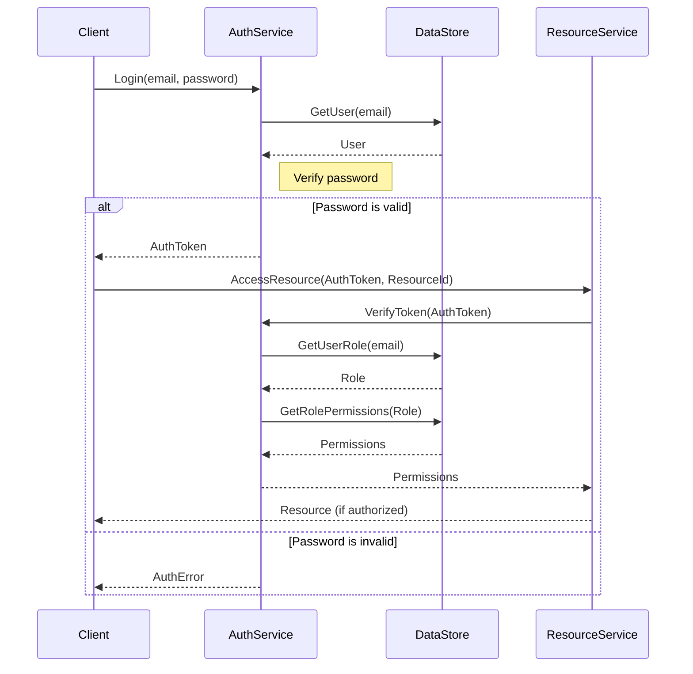

<details>
<summary>Relevant source files</summary>

The following files were used as context for generating this wiki page:

- [src/db.js](https://github.com/agattani123/access-control-service/blob/main/src/db.js)
- [config/roles.json](https://github.com/agattani123/access-control-service/blob/main/config/roles.json)

</details>

# Data Storage and Management

## Introduction

The "Data Storage and Management" component within this project is responsible for managing user data and role-based access control. It provides a centralized data store for user accounts and their associated roles, which are used to control access to various resources or functionalities within the application. This component serves as the foundation for implementing authentication and authorization mechanisms.

## Data Storage

The project uses an in-memory data store implemented as a JavaScript object called `db`. This data store contains two main properties:

1. `users`: An object that maps user email addresses (keys) to their corresponding roles (values).
2. `roles`: An object that defines the available roles and their associated permissions.

```javascript
const db = {
  users: {
    'admin@internal.company': 'admin',
    'analyst@internal.company': 'analyst',
  },
  roles: roles
};
```

The `roles` object is imported from a separate JSON file (`roles.json`) located in the `config` directory. This separation allows for easier management and configuration of roles and permissions.

Sources: [src/db.js:1-9](), [config/roles.json]()

## Role-based Access Control (RBAC)

The project implements a role-based access control (RBAC) system, where users are assigned specific roles, and each role is associated with a set of permissions. The `roles` object defines the available roles and their corresponding permissions.

Here's an example of how the `roles` object might be structured:

```json
{
  "admin": {
    "permissions": [
      "read:all",
      "write:all",
      "delete:all"
    ]
  },
  "analyst": {
    "permissions": [
      "read:reports",
      "write:reports"
    ]
  }
}
```

In this example, the `admin` role has permissions to read, write, and delete all resources, while the `analyst` role can only read and write reports.

Sources: [config/roles.json]()

## User Management

The `users` object in the `db` data store maps user email addresses to their respective roles. For example:

```javascript
users: {
  'admin@internal.company': 'admin',
  'analyst@internal.company': 'analyst',
}
```

This mapping allows the application to determine the role associated with a user based on their email address, which can then be used to grant or deny access to specific resources or functionalities based on the permissions defined for that role.

Sources: [src/db.js:3-6]()

## Sequence Diagram: User Authentication and Authorization

Here's a sequence diagram illustrating a potential flow for user authentication and authorization using the "Data Storage and Management" component:



1. The client initiates the login process by sending the user's email and password to the `AuthService`.
2. The `AuthService` retrieves the user's information from the `DataStore` based on the provided email.
3. The `AuthService` verifies the provided password against the user's stored credentials.
4. If the password is valid, the `AuthService` generates and returns an authentication token to the client.
5. The client then attempts to access a resource by sending the authentication token and the resource ID to the `ResourceService`.
6. The `ResourceService` verifies the authentication token with the `AuthService`.
7. The `AuthService` retrieves the user's role from the `DataStore` based on the email.
8. The `AuthService` then retrieves the permissions associated with the user's role from the `DataStore`.
9. The `AuthService` sends the permissions to the `ResourceService`.
10. The `ResourceService` evaluates the permissions and either grants or denies access to the requested resource.

This sequence diagram illustrates how the "Data Storage and Management" component is used to authenticate users, retrieve their roles, and determine their permissions for authorizing access to resources.

Sources: [src/db.js](), [config/roles.json]()

## Conclusion

The "Data Storage and Management" component in this project provides a centralized data store for managing user accounts, roles, and permissions. It serves as the foundation for implementing authentication and authorization mechanisms using a role-based access control (RBAC) system. By storing user information and role definitions, this component enables the application to control access to resources based on the permissions associated with each user's assigned role.