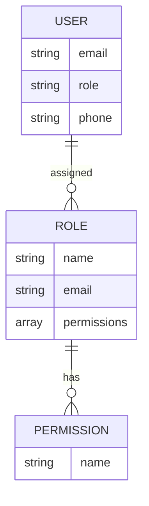

<details>
<summary>Relevant source files</summary>

The following files were used as context for generating this wiki page:

- [docs/permissions.md](https://github.com/agattani123/access-control-service/blob/main/docs/permissions.md)
- [src/models.js](https://github.com/agattani123/access-control-service/blob/main/src/models.js)

</details>

# Permission Management

## Introduction

The Permission Management system is a crucial component of the access-control-service project, responsible for enforcing role-based access control (RBAC) across various routes and services. It defines a set of predefined roles with associated permissions, allowing for granular control over user access to different parts of the system.

The system operates on a flat permission model, where each route requires a specific permission to be accessed. At runtime, the user's assigned role is checked against the required permission for the requested route, ensuring that only authorized users can access the protected resources.

## Role-Based Access Control (RBAC)

The RBAC model is the foundation of the Permission Management system. It defines a set of predefined roles, each with a specific set of permissions. Users are assigned one of these roles, which determines the actions they can perform within the system.

### Roles and Permissions

The following table summarizes the default roles and their associated permissions:

| Role     | Permissions                                |
|----------|---------------------------------------------|
| admin    | view_users, create_role, view_permissions |
| engineer | view_users, view_permissions              |
| analyst  | view_users                                |

Sources: [docs/permissions.md:7-14]()

The `admin` role has full system access, intended for platform and DevOps teams. The `engineer` role has read-only access to users and permissions, useful for observability and debugging purposes. The `analyst` role has basic read-only access to user data, designed for data analysis and reporting use cases.



Sources: [src/models.js](), [docs/permissions.md:7-14]()

The diagram above illustrates the relationships between the `User`, `Role`, and `Permission` entities in the system. A `User` is assigned a single `Role`, which in turn has multiple `Permissions` associated with it.

## Permission Enforcement

The Permission Management system enforces permissions at runtime, ensuring that only authorized users can access protected routes and resources.

```mermaid
sequenceDiagram
    participant Client
    participant AccessControlService
    participant ConsumingService
    Client->>AccessControlService: Request with x-user-email header
    AccessControlService->>AccessControlService: Validate user email
    AccessControlService->>AccessControlService: Retrieve user role
    AccessControlService->>AccessControlService: Check role permissions
    alt User has required permission
        AccessControlService-->>Client: Allowed
        Client->>ConsumingService: Request with valid permission
        ConsumingService-->>Client: Response
    else User lacks required permission
        AccessControlService--x>>Client: Denied
    end
```

Sources: [docs/permissions.md:3-8]()

The sequence diagram above illustrates the permission enforcement flow:

1. The client sends a request with the `x-user-email` header to the Access Control Service.
2. The Access Control Service validates the user email against the in-memory `db.users` map.
3. The user's assigned role is retrieved.
4. The required permission for the requested route is checked against the user's role permissions.
5. If the user has the required permission, the request is allowed to proceed to the consuming service.
6. If the user lacks the required permission, the request is denied.

## Adding a New Role

To add a new role to the system, follow these steps:

1. Edit the `config/roles.json` file to define the new role and its associated permissions:

```json
{
  "support": ["view_users"]
}
```

2. Assign the new role to a user using the provided CLI tool:

```bash
node cli/manage.js assign-role support@company.com support
```

3. Ensure that consuming services request the appropriate permissions for their protected routes.

Sources: [docs/permissions.md:17-26]()

## Notes and Future Enhancements

- The current system uses a flat permission model with no wildcarding or nesting support. (Source: [docs/permissions.md:29]())
- All user-role mappings are stored in-memory, and changes to the `roles.json` file require a service restart. (Source: [docs/permissions.md:30-31]())
- Planned future enhancements include scoped permissions, integration with single sign-on (SSO) group claims, and audit logging for role changes and access attempts. (Source: [docs/permissions.md:34-37]())

## Conclusion

The Permission Management system is a critical component of the access-control-service project, responsible for enforcing role-based access control across various routes and services. It defines a set of predefined roles with associated permissions, allowing for granular control over user access to different parts of the system. By following the RBAC model and enforcing permissions at runtime, the system ensures that only authorized users can access protected resources, enhancing the overall security and access control of the project.