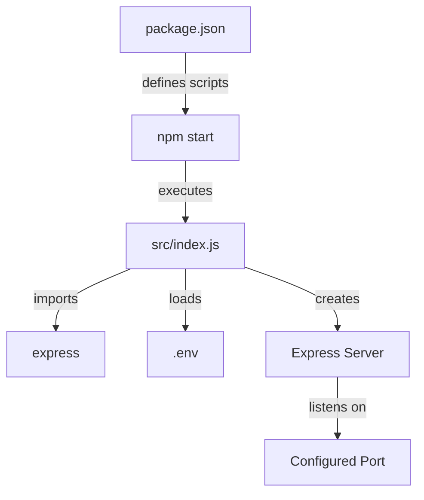

<details>
<summary>Relevant source files</summary>

The following files were used as context for generating this wiki page:

- [.env.example](https://github.com/agattani123/access-control-service/blob/main/.env.example)
- [package.json](https://github.com/agattani123/access-control-service/blob/main/package.json)
</details>

# Deployment Guide

## Introduction

The Access Control Service is a Node.js application that provides access control functionality for a larger system or project. This guide covers the deployment process for the service, including the required dependencies, configuration, and startup instructions. Sources: [package.json](), [.env.example]()

## Prerequisites

Before deploying the Access Control Service, ensure that you have the following prerequisites installed on your system:

- Node.js (version specified in [package.json](https://github.com/agattani123/access-control-service/blob/main/package.json))

## Dependencies

The Access Control Service relies on the following dependencies, which are listed in the [package.json](https://github.com/agattani123/access-control-service/blob/main/package.json) file:

| Dependency | Description                                                  |
|------------|--------------------------------------------------------------|
| dotenv     | Loads environment variables from a `.env` file.              |
| express    | Fast, unopinionated, minimalist web application framework for Node.js. |

Sources: [package.json](https://github.com/agattani123/access-control-service/blob/main/package.json)

## Configuration

The Access Control Service can be configured using environment variables. The [.env.example](https://github.com/agattani123/access-control-service/blob/main/.env.example) file provides an example of the available configuration options:

| Variable | Description                                                    | Default Value |
|----------|----------------------------------------------------------------|---------------|
| PORT     | The port on which the service will listen for incoming requests. | 8080          |

Sources: [.env.example](https://github.com/agattani123/access-control-service/blob/main/.env.example)

## Deployment Steps

Follow these steps to deploy the Access Control Service:

1. Clone the repository or download the source code.
2. Navigate to the project directory.
3. Install the required dependencies by running the following command:

```bash
npm install
```

Sources: [package.json](https://github.com/agattani123/access-control-service/blob/main/package.json)

4. Create a `.env` file in the project root directory and configure the desired environment variables based on the [.env.example](https://github.com/agattani123/access-control-service/blob/main/.env.example) file.

5. Start the service by running the following command:

```bash
npm start
```

This command will start the service and listen for incoming requests on the configured port.

Sources: [package.json](https://github.com/agattani123/access-control-service/blob/main/package.json)

## Deployment Architecture

The deployment architecture for the Access Control Service is relatively straightforward, as it is a standalone Node.js application. The service is started by executing the `index.js` file in the `src` directory, which sets up the Express.js server and listens for incoming requests on the configured port.



Sources: [package.json](https://github.com/agattani123/access-control-service/blob/main/package.json), [.env.example](https://github.com/agattani123/access-control-service/blob/main/.env.example)

## Conclusion

This guide provided an overview of the deployment process for the Access Control Service, including the required dependencies, configuration options, and step-by-step instructions for deploying the service. By following these steps, you should be able to successfully deploy and run the Access Control Service in your environment.