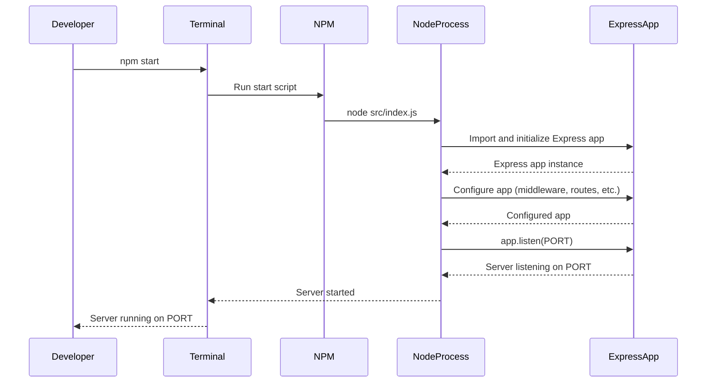

<details>
<summary>Relevant source files</summary>

The following files were used as context for generating this wiki page:

- [.env.example](https://github.com/agattani123/access-control-service/blob/main/.env.example)
- [package.json](https://github.com/agattani123/access-control-service/blob/main/package.json)
</details>

# Deployment and Infrastructure

## Introduction

The "Deployment and Infrastructure" aspect of this project revolves around the setup and configuration required to run the Access Control Service application. The service is built using Node.js and the Express.js framework, and it relies on environment variables for configuration. This section will provide an overview of the deployment process, infrastructure components, and relevant configurations.
Sources: [package.json](), [.env.example]()

## Application Configuration

### Environment Variables

The application utilizes environment variables for configuration purposes. The `.env.example` file serves as a template for setting these variables.

```
PORT=8080
```

This file defines a single environment variable, `PORT`, which specifies the port number on which the application should listen for incoming requests. The default value is set to `8080`.
Sources: [.env.example]()

## Application Dependencies

The application relies on two main dependencies, which are listed in the `package.json` file:

```json
"dependencies": {
  "dotenv": "^16.0.3",
  "express": "^4.18.2"
}
```

1. **dotenv**: This package is used for loading environment variables from a `.env` file into the `process.env` object.
2. **express**: Express.js is a popular web application framework for Node.js, which provides a robust set of features for building web servers and APIs.

Sources: [package.json]()

## Application Startup

The `package.json` file also defines a `start` script, which is used to launch the application:

```json
"scripts": {
  "start": "node src/index.js"
}
```

This script runs the `index.js` file located in the `src` directory, which is likely the entry point of the application.
Sources: [package.json]()

## Deployment Process

Based on the provided information, the deployment process for this application would typically involve the following steps:

1. **Install Dependencies**: Run `npm install` to install the required dependencies listed in the `package.json` file.
2. **Set Environment Variables**: Create a `.env` file based on the `.env.example` template and set the appropriate values for the environment variables, such as the desired `PORT` number.
3. **Start the Application**: Run `npm start` to start the application, which will launch the server on the specified `PORT`.

## Infrastructure Components

The provided source files do not contain explicit information about the infrastructure components used for deployment. However, based on the application's dependencies and configuration, the following infrastructure components might be involved:

1. **Node.js Runtime**: The application requires a Node.js runtime environment to be installed on the target deployment server or infrastructure.
2. **Web Server**: Since the application is built using Express.js, it likely serves as a web server or API server, handling incoming HTTP requests and responses.
3. **Environment Configuration**: The deployment environment should be configured with the appropriate environment variables, such as the `PORT` number, to ensure the application runs correctly.

## Sequence Diagram: Application Startup



This sequence diagram illustrates the typical flow of starting the Access Control Service application using the `npm start` command:

1. The developer runs `npm start` in the terminal.
2. The NPM package manager executes the `start` script defined in `package.json`, which runs `node src/index.js`.
3. The Node.js process imports and initializes the Express.js application.
4. The Express app is configured with middleware, routes, and other settings.
5. The Express app starts listening on the specified `PORT` for incoming requests.
6. The Node.js process logs a message indicating that the server is running and listening on the specified `PORT`.

Sources: [package.json]()

## Summary

This wiki page covered the "Deployment and Infrastructure" aspects of the Access Control Service project, including application configuration, dependencies, startup process, and a high-level overview of the potential infrastructure components involved. While the provided source files did not contain detailed information about the application's implementation or deployment environment, the covered topics provide a foundation for understanding the deployment and infrastructure requirements of this Node.js and Express.js-based service.