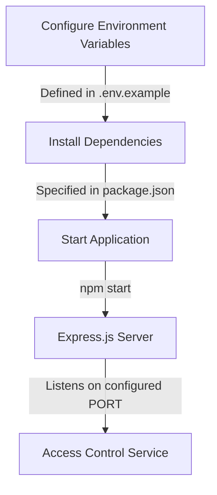

<details>
<summary>Relevant source files</summary>

The following files were used as context for generating this wiki page:

- [.env.example](https://github.com/agattani123/access-control-service/blob/main/.env.example)
- [package.json](https://github.com/agattani123/access-control-service/blob/main/package.json)
</details>

# Deployment and Infrastructure

## Introduction

The "Deployment and Infrastructure" aspect of this project focuses on the configuration and setup required to run the Access Control Service application. It covers the application's runtime environment, dependencies, and the process of starting the service. This section aims to provide an overview of the deployment and infrastructure components necessary for running the application successfully.

Sources: [.env.example](), [package.json]()

## Application Configuration

### Environment Variables

The application utilizes environment variables for configuring various settings. The `.env.example` file serves as a template for defining these variables.

```
PORT=8080
```

This file specifies a single environment variable, `PORT`, which determines the port on which the application will listen for incoming requests. In the provided example, the default port is set to `8080`.

Sources: [.env.example:1]()

## Application Dependencies

The project's dependencies are managed using the Node.js package manager (npm) and are defined in the `package.json` file.

```json
{
  "dependencies": {
    "dotenv": "^16.0.3",
    "express": "^4.18.2"
  }
}
```

The application relies on the following dependencies:

- **dotenv**: A module that loads environment variables from a `.env` file into `process.env`.
- **express**: A fast and minimalist web application framework for Node.js.

Sources: [package.json:7-10]()

## Application Startup

The `package.json` file also defines a script for starting the application:

```json
{
  "scripts": {
    "start": "node src/index.js"
  }
}
```

To start the application, you can run the following command:

```
npm start
```

This command will execute the `node src/index.js` script, which likely initializes and runs the Express.js server on the configured port.

Sources: [package.json:5-6]()

## Deployment and Infrastructure Flow

The deployment and infrastructure flow for this application can be summarized as follows:



1. Configure the application's environment variables by creating a `.env` file based on the `.env.example` template. This file specifies the port on which the application will listen for incoming requests.
2. Install the required dependencies specified in the `package.json` file, which include `dotenv` for loading environment variables and `express` for the web application framework.
3. Start the application by running the `npm start` command, which executes the `node src/index.js` script.
4. The script likely initializes an Express.js server and configures it to listen on the port specified by the `PORT` environment variable.
5. The Access Control Service is now running and ready to handle incoming requests on the configured port.

Sources: [.env.example](), [package.json]()

## Conclusion

The "Deployment and Infrastructure" aspect of this project focuses on setting up the runtime environment, managing dependencies, and starting the Access Control Service application. By following the steps outlined in this document, developers can configure the application's environment variables, install the required dependencies, and start the Express.js server to run the service on the specified port.