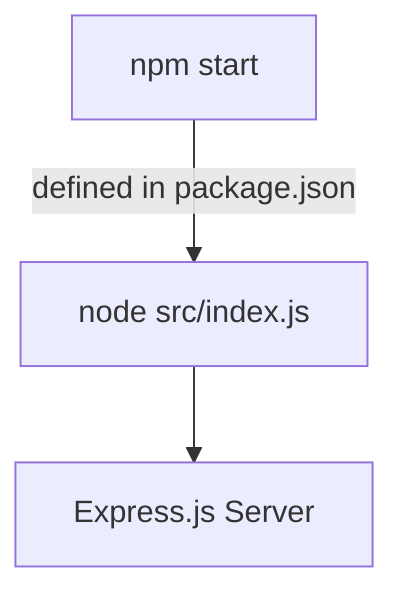

<details>
<summary>Relevant source files</summary>

The following files were used as context for generating this wiki page:

- [.env.example](https://github.com/agattani123/access-control-service/blob/main/.env.example)
- [package.json](https://github.com/agattani123/access-control-service/blob/main/package.json)
</details>

# Deployment and Infrastructure

## Introduction

The "Deployment and Infrastructure" aspect of this project focuses on the configuration and setup required to run the Access Control Service application. It covers the runtime environment, dependencies, and the process of starting the service. Based on the provided source files, this service appears to be a Node.js application built with Express.js framework. Sources: [package.json](https://github.com/agattani123/access-control-service/blob/main/package.json)

## Runtime Environment

The application is designed to run in a Node.js runtime environment. The specific version of Node.js is not explicitly specified in the provided files, but it is recommended to use the latest LTS (Long-Term Support) version for stability and security updates. Sources: [package.json](https://github.com/agattani123/access-control-service/blob/main/package.json)

## Dependencies

The project relies on the following external dependencies:

| Dependency | Version | Description |
| --- | --- | --- |
| dotenv | ^16.0.3 | Loads environment variables from a `.env` file. |
| express | ^4.18.2 | Fast, unopinionated, minimalist web application framework for Node.js. |

Sources: [package.json](https://github.com/agattani123/access-control-service/blob/main/package.json)

## Environment Configuration

The application uses the `dotenv` library to load environment variables from a `.env` file. The `.env.example` file provides a template for the required environment variables.

```
PORT=8080
```

This configuration specifies the port on which the application should listen for incoming requests. The default value is `8080`. Sources: [.env.example](https://github.com/agattani123/access-control-service/blob/main/.env.example)

## Application Startup

The application can be started by running the following command:

```
npm start
```

This command is defined in the `scripts` section of the `package.json` file and executes the `node src/index.js` command, which likely starts the Express.js server. Sources: [package.json](https://github.com/agattani123/access-control-service/blob/main/package.json)



## Summary

The "Deployment and Infrastructure" aspect of this project involves setting up a Node.js runtime environment, installing the required dependencies (`dotenv` and `express`), configuring the environment variables (primarily the port number), and starting the Express.js server by running the `npm start` command. The provided source files do not contain additional details about deployment strategies, infrastructure provisioning, or other operational aspects of the application.