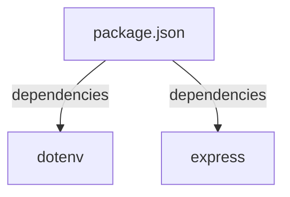
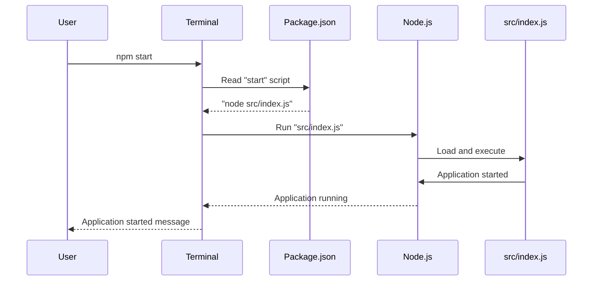

<details>
<summary>Relevant source files</summary>

The following files were used as context for generating this wiki page:

- [.env.example](https://github.com/agattani123/access-control-service/blob/main/.env.example)
- [package.json](https://github.com/agattani123/access-control-service/blob/main/package.json)
</details>

# Deployment and Infrastructure

## Introduction

The "Deployment and Infrastructure" aspect of this project focuses on the configuration and setup required to run the Access Control Service application. It covers the application's runtime environment, dependencies, and the process of starting the service. Based on the provided source files, this service appears to be a Node.js Express application. Sources: [package.json](https://github.com/agattani123/access-control-service/blob/main/package.json), [.env.example](https://github.com/agattani123/access-control-service/blob/main/.env.example)

## Application Configuration

### Environment Variables

The application uses environment variables for configuration purposes. The `.env.example` file provides an example of the environment variables that need to be set. Sources: [.env.example](https://github.com/agattani123/access-control-service/blob/main/.env.example)

#### PORT

```
PORT=8080
```

This environment variable specifies the port on which the application should listen for incoming requests. The default value is `8080`. Sources: [.env.example:1](https://github.com/agattani123/access-control-service/blob/main/.env.example#L1)

## Application Dependencies

The application's dependencies are listed in the `package.json` file, which is a standard file used by Node.js projects to manage dependencies and scripts. Sources: [package.json](https://github.com/agattani123/access-control-service/blob/main/package.json)



### dotenv

The `dotenv` package is used for loading environment variables from a `.env` file into the `process.env` object. This allows the application to access and use environment variables during runtime. Sources: [package.json:8](https://github.com/agattani123/access-control-service/blob/main/package.json#L8)

### express

The `express` package is a popular web application framework for Node.js. It is used for building web servers and APIs. In this project, it is likely used to create the Access Control Service API. Sources: [package.json:9](https://github.com/agattani123/access-control-service/blob/main/package.json#L9)

## Application Startup

The `package.json` file also defines a `start` script that is used to start the application. Sources: [package.json:5-7](https://github.com/agattani123/access-control-service/blob/main/package.json#L5-L7)



The `start` script runs the command `node src/index.js`, which likely starts the Express application defined in the `src/index.js` file. Sources: [package.json:6](https://github.com/agattani123/access-control-service/blob/main/package.json#L6)

Note: The `src/index.js` file is not provided in the given source files, so its specific implementation details are unknown.

## Summary

In summary, the "Deployment and Infrastructure" aspect of this project involves setting up the runtime environment, installing dependencies, and starting the Node.js Express application that serves as the Access Control Service. The application uses environment variables for configuration, and its dependencies are managed through the `package.json` file. The `start` script in the `package.json` file is used to start the application by executing the `src/index.js` file, which likely contains the Express application setup and configuration.