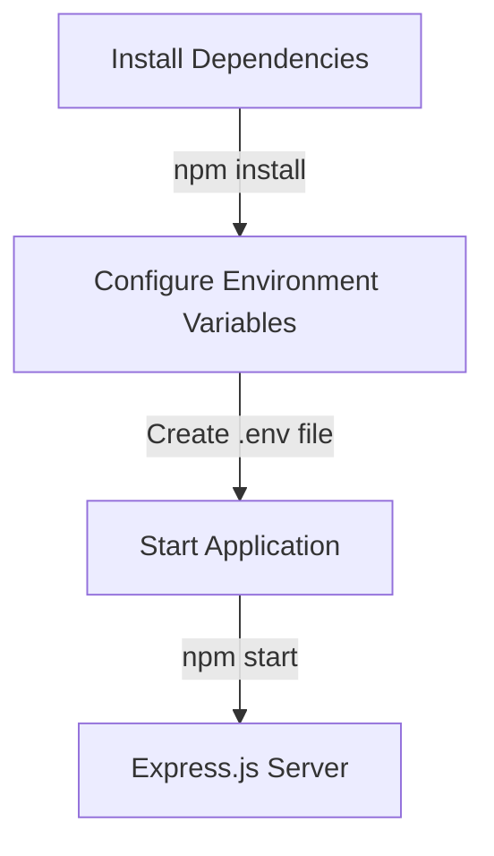

<details>
<summary>Relevant source files</summary>

The following files were used as context for generating this wiki page:

- [package.json](https://github.com/agattani123/access-control-service/blob/main/package.json)
- [.env.example](https://github.com/agattani123/access-control-service/blob/main/.env.example)
</details>

# Deployment and Infrastructure

## Introduction

The Access Control Service is a Node.js application that provides access control functionality. This wiki page focuses on the deployment and infrastructure aspects of the project, covering how the application is set up, configured, and run in different environments.

Based on the provided source files, the application appears to be a lightweight Express.js server that can be deployed and run locally or on a server. The deployment process involves setting up the required dependencies and configuring the application's environment variables.

## Application Setup

The application's dependencies are defined in the `package.json` file, which lists the required packages and their versions. The two main dependencies are:

- `dotenv`: A module that loads environment variables from a `.env` file into `process.env`.
- `express`: A fast and minimalist web application framework for Node.js.

To set up the application, you need to install these dependencies by running the following command:

```bash
npm install
```

This command reads the `package.json` file and installs the listed dependencies in the `node_modules` directory.

Sources: [package.json](https://github.com/agattani123/access-control-service/blob/main/package.json)

## Environment Configuration

The application's configuration is managed through environment variables, which are typically stored in a `.env` file. The `.env.example` file in the project provides an example of the required environment variables:

```
PORT=8080
```

This file defines a single environment variable, `PORT`, which specifies the port number on which the application should listen for incoming requests.

To configure the application for a specific environment, you need to create a `.env` file based on the `.env.example` file and set the appropriate values for the environment variables.

Sources: [.env.example](https://github.com/agattani123/access-control-service/blob/main/.env.example)

## Application Deployment

The deployment process for the Access Control Service involves the following steps:

1. **Install Dependencies**: Run `npm install` to install the required dependencies listed in the `package.json` file.
2. **Configure Environment Variables**: Create a `.env` file based on the `.env.example` file and set the appropriate values for the environment variables.
3. **Start the Application**: Run `npm start` to start the application. This command executes the `node src/index.js` script, which starts the Express.js server and listens on the configured port.



The application is now running and ready to handle incoming requests on the configured port.

Sources: [package.json](https://github.com/agattani123/access-control-service/blob/main/package.json), [.env.example](https://github.com/agattani123/access-control-service/blob/main/.env.example)

## Deployment Environments

The Access Control Service can be deployed in different environments, such as local development, staging, or production. The deployment process remains the same across environments, but the values of the environment variables may differ.

For example, in a production environment, you might want to set the `PORT` variable to a different value or add additional environment variables for database connections, API keys, or other configuration settings.

It's important to keep the `.env` file out of version control and treat it as an environment-specific configuration file. The `.env.example` file serves as a template for creating environment-specific `.env` files.

Sources: [.env.example](https://github.com/agattani123/access-control-service/blob/main/.env.example)

## Summary

In summary, the deployment and infrastructure of the Access Control Service involve setting up the required dependencies, configuring environment variables, and running the Express.js server. The application can be deployed in different environments by creating environment-specific `.env` files and adjusting the values of the environment variables accordingly.

While the provided source files do not cover the application's functionality or implementation details, they provide a basic understanding of the deployment and infrastructure setup for this Node.js Express.js application.