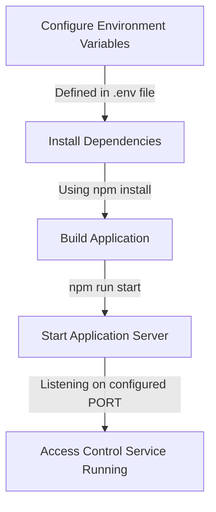

<details>
<summary>Relevant source files</summary>

The following files were used as context for generating this wiki page:

- [.env.example](https://github.com/agattani123/access-control-service/blob/main/.env.example)
- [package.json](https://github.com/agattani123/access-control-service/blob/main/package.json)

</details>

# Deployment and Infrastructure

## Introduction

The "Deployment and Infrastructure" aspect of this project revolves around the configuration and setup required to run the Access Control Service application. It covers the environment variables, dependencies, and scripts necessary for deploying and managing the service. The service is built using Node.js and the Express.js framework, which provides a lightweight and flexible web application server.

Sources: [package.json](https://github.com/agattani123/access-control-service/blob/main/package.json)

## Environment Configuration

The application utilizes environment variables to manage configuration settings. The `.env.example` file serves as a template for defining these variables.

### Port Configuration

The `PORT` environment variable specifies the port on which the application will listen for incoming requests.

```
PORT=8080
```

This configuration allows the application to run on port 8080 by default. However, this value can be overridden by setting the `PORT` environment variable to a different value during deployment or runtime.

Sources: [.env.example](https://github.com/agattani123/access-control-service/blob/main/.env.example)

## Application Dependencies

The project's dependencies are managed using the Node.js package manager (npm) and are defined in the `package.json` file.

```json
"dependencies": {
  "dotenv": "^16.0.3",
  "express": "^4.18.2"
}
```

### dotenv

The `dotenv` package is used for loading environment variables from a `.env` file into the `process.env` object in Node.js. This allows the application to access and use the configured environment variables during runtime.

Sources: [package.json](https://github.com/agattani123/access-control-service/blob/main/package.json)

### express

The `express` package is a popular web application framework for Node.js. It provides a robust set of features for building web servers and APIs, including routing, middleware, and request handling.

Sources: [package.json](https://github.com/agattani123/access-control-service/blob/main/package.json)

## Application Scripts

The `package.json` file also defines scripts for running the application.

```json
"scripts": {
  "start": "node src/index.js"
}
```

### Start Script

The `start` script is used to launch the application. It executes the `index.js` file located in the `src` directory, which is likely the entry point of the application.

```bash
npm run start
```

Running this script will start the Access Control Service and make it available for handling incoming requests on the configured port.

Sources: [package.json](https://github.com/agattani123/access-control-service/blob/main/package.json)

## Deployment and Infrastructure Flow

The deployment and infrastructure setup for the Access Control Service can be summarized as follows:



1. Configure the required environment variables, such as the `PORT`, in the `.env` file or by setting them directly in the deployment environment.
2. Install the project dependencies specified in the `package.json` file using `npm install`.
3. Build the application, if necessary, based on the project's build process.
4. Start the application server by running the `npm run start` script, which executes the entry point file (`src/index.js`).
5. The application server starts listening for incoming requests on the configured `PORT`.

At this point, the Access Control Service is up and running, ready to handle requests and perform its intended functionality.

Sources: [.env.example](https://github.com/agattani123/access-control-service/blob/main/.env.example), [package.json](https://github.com/agattani123/access-control-service/blob/main/package.json)

## Summary

The "Deployment and Infrastructure" aspect of this project focuses on configuring the environment variables, managing dependencies, and running the Access Control Service application. It provides a straightforward setup process using Node.js and the Express.js framework, allowing developers to easily deploy and run the service on the desired port. By following the documented steps and configurations, the application can be successfully deployed and made available for handling incoming requests.