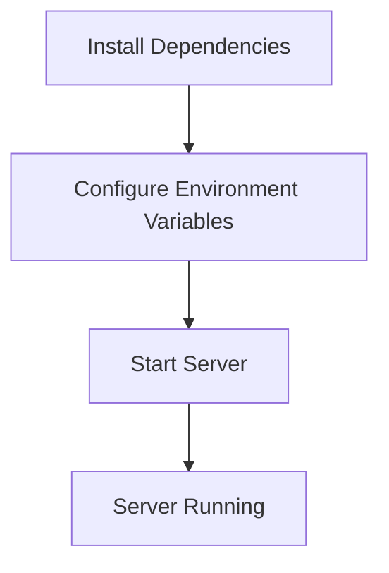

<details>
<summary>Relevant source files</summary>

The following files were used as context for generating this wiki page:

- [.env.example](https://github.com/agattani123/access-control-service/blob/main/.env.example)
- [package.json](https://github.com/agattani123/access-control-service/blob/main/package.json)
</details>

# Deployment and Infrastructure

## Introduction

The "Deployment and Infrastructure" aspect of this project revolves around the setup and configuration required to run the Access Control Service application. This service is built using Node.js and the Express.js framework, and it is designed to be deployed as a standalone server application.
Sources: [package.json](https://github.com/agattani123/access-control-service/blob/main/package.json)

## Application Server

The Access Control Service is a Node.js application that uses the Express.js framework to handle HTTP requests and responses. The entry point of the application is specified in the `package.json` file, where the `start` script is defined as `node src/index.js`.
Sources: [package.json:5](https://github.com/agattani123/access-control-service/blob/main/package.json#L5)

### Server Configuration

The server configuration is handled through environment variables. The `.env.example` file provides an example of the environment variables that can be used to configure the server.

```env
PORT=8080
```

This configuration sets the port on which the server will listen for incoming requests. The default port is set to `8080`.
Sources: [.env.example](https://github.com/agattani123/access-control-service/blob/main/.env.example)

## Dependencies

The project's dependencies are listed in the `package.json` file, under the `dependencies` section.

```json
"dependencies": {
  "dotenv": "^16.0.3",
  "express": "^4.18.2"
}
```

- **dotenv**: This library is used to load environment variables from a `.env` file into the `process.env` object.
- **express**: This is the core framework used for building the web server and handling HTTP requests and responses.

Sources: [package.json:8-11](https://github.com/agattani123/access-control-service/blob/main/package.json#L8-L11)

## Deployment

To deploy the Access Control Service, follow these steps:

1. Install the required dependencies by running `npm install` in the project directory.
2. Create a `.env` file in the project root directory and configure the desired environment variables (e.g., `PORT`).
3. Start the server by running `npm start`.

The server will start listening on the configured port (default is `8080`).



Sources: [package.json:5](https://github.com/agattani123/access-control-service/blob/main/package.json#L5), [.env.example](https://github.com/agattani123/access-control-service/blob/main/.env.example)

## Summary

The "Deployment and Infrastructure" aspect of this project focuses on setting up and configuring the Access Control Service application for deployment. It covers the application server configuration, dependencies, and the steps required to deploy the service. The service is designed to run as a standalone Node.js server application, with the ability to configure the server port through environment variables.