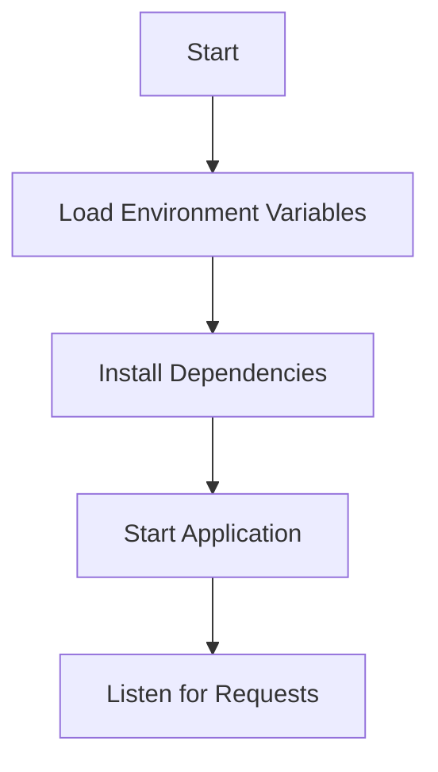

<details>
<summary>Relevant source files</summary>

The following files were used as context for generating this wiki page:

- [.env.example](https://github.com/agattani123/access-control-service/blob/main/.env.example)
- [package.json](https://github.com/agattani123/access-control-service/blob/main/package.json)
</details>

# Deployment and Infrastructure

## Introduction

The "Deployment and Infrastructure" aspect of this project focuses on the configuration and setup required to run the Access Control Service application. It covers the application's runtime environment, dependencies, and the process of starting the service. Based on the provided source files, this service appears to be a Node.js application built with Express.js. Sources: [package.json](https://github.com/agattani123/access-control-service/blob/main/package.json)

## Application Configuration

### Environment Variables

The application uses environment variables for configuration purposes. The `.env.example` file serves as a template for setting these variables.

```
PORT=8080
```

This file defines a single environment variable, `PORT`, which specifies the port number on which the application should listen for incoming requests. The default value is set to `8080`. Sources: [.env.example](https://github.com/agattani123/access-control-service/blob/main/.env.example)

## Application Dependencies

The project's dependencies are listed in the `package.json` file, which is a standard file used by Node.js projects to manage dependencies and scripts.

```json
"dependencies": {
  "dotenv": "^16.0.3",
  "express": "^4.18.2"
}
```

The application has two main dependencies:

1. **dotenv**: A module that loads environment variables from a `.env` file into `process.env`.
2. **express**: A popular web application framework for Node.js, used for building APIs and handling HTTP requests.

Sources: [package.json](https://github.com/agattani123/access-control-service/blob/main/package.json)

## Application Startup

The `package.json` file also defines a script for starting the application:

```json
"scripts": {
  "start": "node src/index.js"
}
```

The `start` script runs the `index.js` file located in the `src` directory, which is likely the entry point of the application. Sources: [package.json](https://github.com/agattani123/access-control-service/blob/main/package.json)

## Deployment and Infrastructure Flow

The deployment and infrastructure flow for this application can be summarized as follows:



1. Load environment variables from the `.env` file using the `dotenv` module.
2. Install the required dependencies (`express` and `dotenv`) using a package manager like `npm` or `yarn`.
3. Start the application by running the `index.js` file, which likely sets up the Express.js server.
4. The application listens for incoming requests on the configured `PORT`.

Sources: [.env.example](https://github.com/agattani123/access-control-service/blob/main/.env.example), [package.json](https://github.com/agattani123/access-control-service/blob/main/package.json)

## Conclusion

The "Deployment and Infrastructure" aspect of this project focuses on configuring the runtime environment, managing dependencies, and starting the Node.js application built with Express.js. The application uses environment variables for configuration and relies on the `dotenv` and `express` dependencies. The startup process involves loading environment variables, installing dependencies, and running the `index.js` file, which sets up the Express.js server to listen for incoming requests on the specified port.