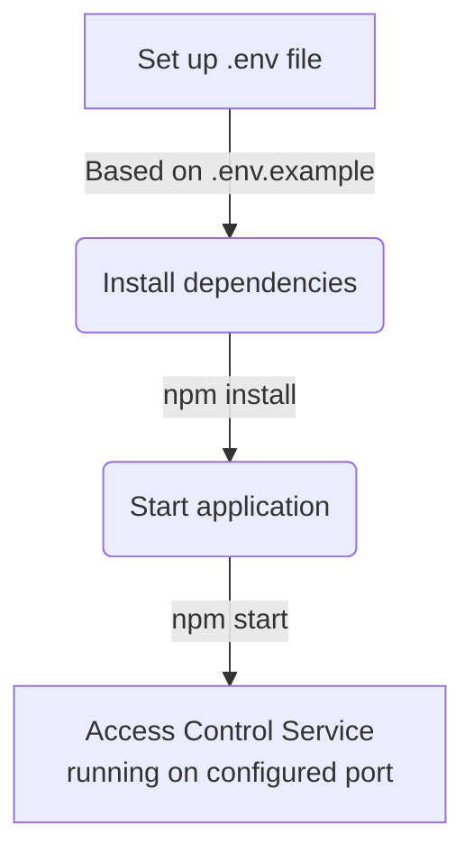

<details>
<summary>Relevant source files</summary>

The following files were used as context for generating this wiki page:

- [.env.example](https://github.com/agattani123/access-control-service/blob/main/.env.example)
- [package.json](https://github.com/agattani123/access-control-service/blob/main/package.json)
</details>

# Deployment and Infrastructure

## Introduction

The "Deployment and Infrastructure" aspect of this project focuses on the configuration and setup required to run the Access Control Service application. This service is built using Node.js and the Express.js framework, and it is designed to be deployed as a standalone server application. The deployment process involves setting up the runtime environment, installing dependencies, and configuring the application to run on a specific port.

Sources: [package.json](https://github.com/agattani123/access-control-service/blob/main/package.json), [.env.example](https://github.com/agattani123/access-control-service/blob/main/.env.example)

## Environment Configuration

The application relies on environment variables for configuration. The `.env.example` file provides a template for setting up the required environment variables.

```
PORT=8080
```

This file defines a single environment variable, `PORT`, which specifies the port number on which the application should listen for incoming requests. The default value is set to `8080`.

Sources: [.env.example](https://github.com/agattani123/access-control-service/blob/main/.env.example)

## Application Dependencies

The project's dependencies are listed in the `package.json` file, which is used by the Node.js package manager (npm) to install and manage the required packages.

```json
{
  "dependencies": {
    "dotenv": "^16.0.3",
    "express": "^4.18.2"
  }
}
```

The application has two main dependencies:

1. **dotenv**: This package is used to load environment variables from a `.env` file into the Node.js process.
2. **express**: This is a popular web application framework for Node.js, which provides a robust set of features for building web servers and APIs.

Sources: [package.json](https://github.com/agattani123/access-control-service/blob/main/package.json)

## Application Startup

The `package.json` file also defines a script for starting the application:

```json
{
  "scripts": {
    "start": "node src/index.js"
  }
}
```

The `start` script runs the `index.js` file located in the `src` directory, which is likely the entry point of the application.

Sources: [package.json](https://github.com/agattani123/access-control-service/blob/main/package.json)

## Deployment Process

Based on the provided source files, the deployment process for the Access Control Service can be summarized as follows:

1. **Environment Setup**: Create a `.env` file based on the `.env.example` template and set the desired value for the `PORT` environment variable.
2. **Install Dependencies**: Run `npm install` to install the required dependencies listed in the `package.json` file.
3. **Start the Application**: Run `npm start` to start the application, which will launch the server on the configured port.



Sources: [.env.example](https://github.com/agattani123/access-control-service/blob/main/.env.example), [package.json](https://github.com/agattani123/access-control-service/blob/main/package.json)

## Conclusion

The "Deployment and Infrastructure" aspect of this project focuses on setting up the runtime environment, installing dependencies, and configuring the application to run on a specific port. The provided source files contain the necessary information for configuring the environment variables, managing dependencies, and starting the application. By following the deployment process outlined above, developers can successfully deploy and run the Access Control Service application.