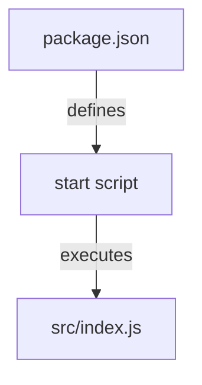
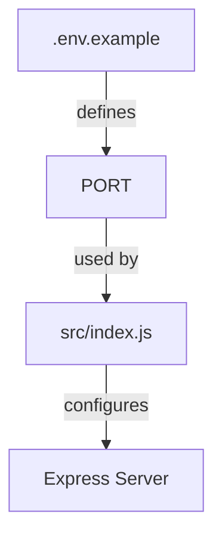
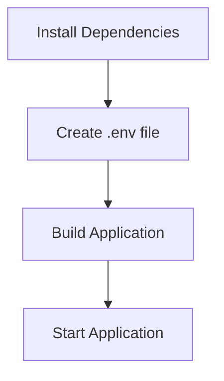

Relevant source files

The following files were used as context for generating this wiki page:

- [.env.example](https://github.com/agattani123/access-control-service/blob/main/.env.example)
- [package.json](https://github.com/agattani123/access-control-service/blob/main/package.json)

# Deployment and Infrastructure

## Introduction

The "Deployment and Infrastructure" aspect of this project focuses on the configuration and setup required to run the Access Control Service application. It covers the application's runtime environment, dependencies, and the process of starting the service. This wiki page aims to provide a comprehensive overview of the deployment and infrastructure components based on the available source files.

## Application Environment

The application is designed to run in a Node.js environment, as indicated by the dependencies specified in the `package.json` file. The project uses the `dotenv` package to load environment variables from a `.env` file, allowing for configuration management during deployment.

Sources: [package.json](https://github.com/agattani123/access-control-service/blob/main/package.json), [.env.example](https://github.com/agattani123/access-control-service/blob/main/.env.example)

## Application Entry Point

The application's entry point is defined in the `package.json` file under the `scripts` section. The `start` script is responsible for launching the application by executing the `src/index.js` file using the `node` command.

Sources: [package.json:5](https://github.com/agattani123/access-control-service/blob/main/package.json#L5)

## Server Configuration

The application is built using the Express.js framework, as indicated by the `express` dependency in the `package.json` file. The server configuration, including the port on which the application listens, is likely defined in the `src/index.js` file, which is not provided in the given source files.

However, the `.env.example` file suggests that the application expects a `PORT` environment variable to be set, which may be used to configure the server's listening port during deployment.

Sources: [.env.example](https://github.com/agattani123/access-control-service/blob/main/.env.example), [package.json](https://github.com/agattani123/access-control-service/blob/main/package.json)

## Deployment Process

Based on the provided source files, the deployment process for the Access Control Service application involves the following steps:

1. Install the required dependencies by running `npm install` in the project directory.
2. Create a `.env` file in the project root directory and set the `PORT` environment variable to the desired value for the server to listen on.
3. Build the application (if necessary, based on the project structure and build process, which is not specified in the provided files).
4. Start the application by running `npm start`, which executes the `src/index.js` file using the `node` command.

Sources: [package.json](https://github.com/agattani123/access-control-service/blob/main/package.json), [.env.example](https://github.com/agattani123/access-control-service/blob/main/.env.example)

## Conclusion

The "Deployment and Infrastructure" aspect of the Access Control Service project primarily focuses on configuring the runtime environment, setting up the required dependencies, and starting the application server. The provided source files give insights into the application's entry point, server configuration, and the deployment process. However, more detailed information about the application's architecture, components, and functionality is not available in the given files.