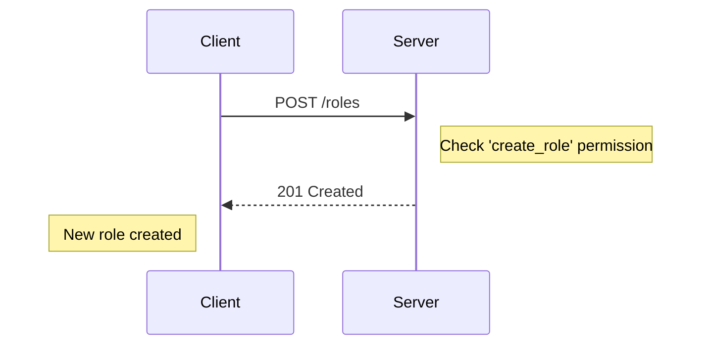
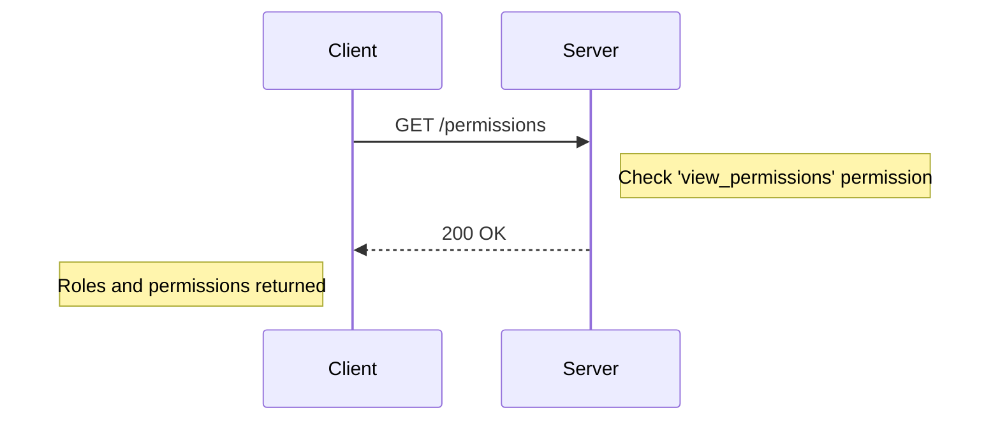
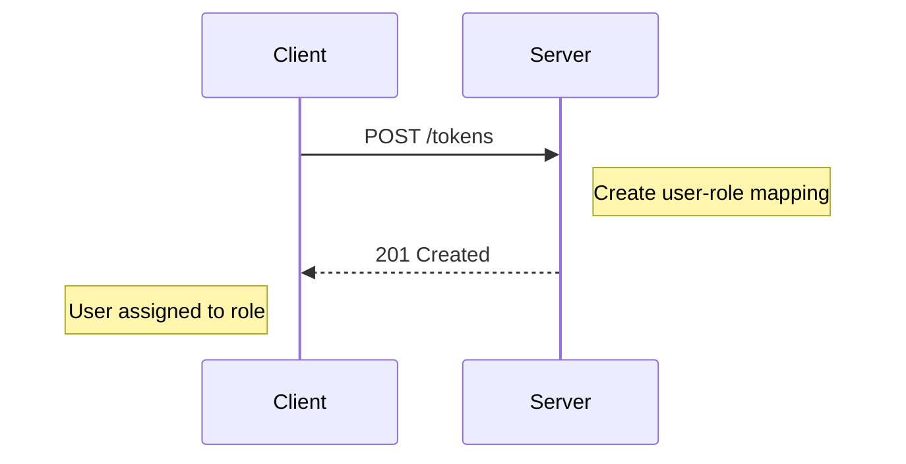
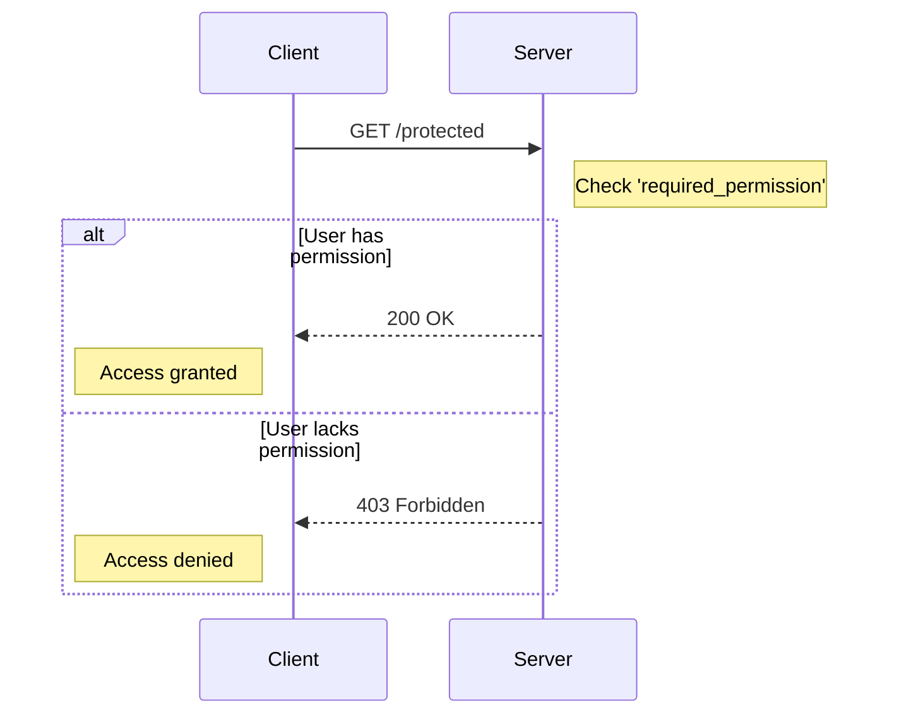

<details>
<summary>Relevant source files</summary>

The following files were used as context for generating this wiki page:

- [src/authMiddleware.js](https://github.com/agattani123/access-control-service/blob/main/src/authMiddleware.js)
- [src/routes.js](https://github.com/agattani123/access-control-service/blob/main/src/routes.js)
- [src/db.js](https://github.com/agattani123/access-control-service/blob/main/src/db.js) (inferred from context)

</details>

# Extending and Customizing

## Introduction

This wiki page covers the "Extending and Customizing" aspect of the access control service, which provides a flexible and extensible role-based access control (RBAC) system. The service allows managing users, roles, and permissions, enabling fine-grained control over access to resources or functionalities within the application.

The key components involved in extending and customizing the access control system are:

- **Users**: Entities (e.g., user accounts) that require access to resources or functionalities.
- **Roles**: Groups or categories that define a set of permissions.
- **Permissions**: Granular access privileges that can be assigned to roles.

By customizing roles and their associated permissions, you can tailor the access control system to meet the specific needs of your application or organization.

Sources: [src/routes.js](), [src/authMiddleware.js]()

## Role Management

The access control service provides an API endpoint (`/roles`) to create and manage roles. Each role is defined by a unique name and a set of associated permissions.

### Creating a New Role

To create a new role, send a `POST` request to the `/roles` endpoint with the following request body:

```json
{
  "name": "role_name",
  "permissions": ["permission1", "permission2", ...]
}
```

The `name` field specifies the unique identifier for the role, and the `permissions` field is an array of strings representing the permissions granted to that role.



Only users with the `create_role` permission can create new roles.

Sources: [src/routes.js:10-17]()

### Viewing Roles and Permissions

The `/permissions` endpoint allows retrieving a list of all defined roles and their associated permissions.



To access this endpoint, the user must have the `view_permissions` permission.

Sources: [src/routes.js:18-21]()

## User Management

The access control service manages user accounts and their associated roles through the `/tokens` endpoint.

### Assigning a Role to a User

To assign a role to a user, send a `POST` request to the `/tokens` endpoint with the following request body:

```json
{
  "user": "user_email",
  "role": "role_name"
}
```

The `user` field should be the email or identifier of the user account, and the `role` field should be the name of an existing role.



This endpoint does not require any specific permissions and can be accessed by any authenticated user.

Sources: [src/routes.js:22-28]()

## Access Control Middleware

The `authMiddleware.js` file provides a middleware function `checkPermission` that can be used to protect routes or functionalities based on the user's assigned role and permissions.

### Checking Permissions

The `checkPermission` middleware function takes a `requiredPermission` string as an argument and returns a middleware function that can be used in an Express.js route handler.

```javascript
import { checkPermission } from './authMiddleware.js';

router.get('/protected', checkPermission('required_permission'), (req, res) => {
  // Route handler code
});
```

The middleware function checks if the user making the request has the required permission based on their assigned role. If the user does not have the required permission, the middleware will respond with a `403 Forbidden` error.



The middleware retrieves the user's email from the `x-user-email` header of the request and looks up the user's role in the `db.users` object. It then checks if the user's role grants the required permission by looking up the role's permissions in the `db.roles` object.

Sources: [src/authMiddleware.js](), [src/routes.js:6,9,18]()

## Data Structures

The access control service uses the following data structures to store user, role, and permission information:

| Data Structure | Description |
| --- | --- |
| `db.users` | An object mapping user emails to their assigned role names. |
| `db.roles` | An object mapping role names to arrays of permitted permissions. |

These data structures are likely stored in memory or a simple data store for demonstration purposes. In a production environment, a more robust and persistent data storage solution would be required.

Sources: [src/authMiddleware.js:4-5,9](), [src/routes.js:3]()

## Extending and Customizing

To extend and customize the access control system, you can:

1. **Define new permissions**: Add new permission strings to the `permissions` array when creating or updating roles via the `/roles` endpoint.
2. **Create new roles**: Use the `/roles` endpoint to define new roles with specific sets of permissions tailored to your application's needs.
3. **Assign roles to users**: Utilize the `/tokens` endpoint to associate user accounts with appropriate roles based on their access requirements.
4. **Protect routes and functionalities**: Use the `checkPermission` middleware in your route handlers to enforce access control based on the required permissions.

By following these steps, you can tailor the access control system to meet the specific requirements of your application, ensuring that users have the appropriate level of access based on their assigned roles and permissions.

Sources: [src/routes.js](), [src/authMiddleware.js]()

## Conclusion

The access control service provides a flexible and extensible role-based access control (RBAC) system that allows managing users, roles, and permissions. By customizing roles and their associated permissions, you can tailor the access control system to meet the specific needs of your application or organization. The service also includes middleware for enforcing access control based on the user's assigned role and required permissions.