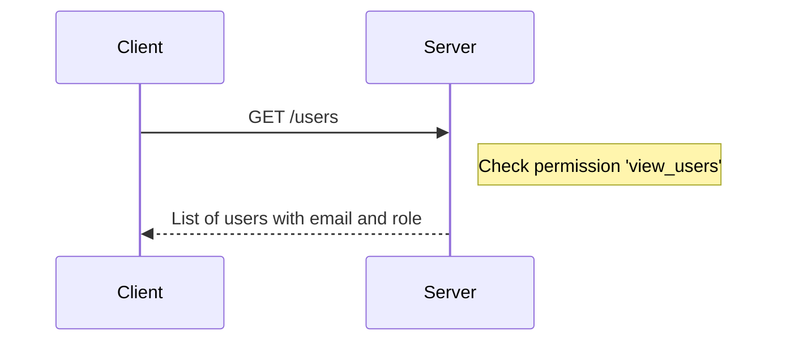
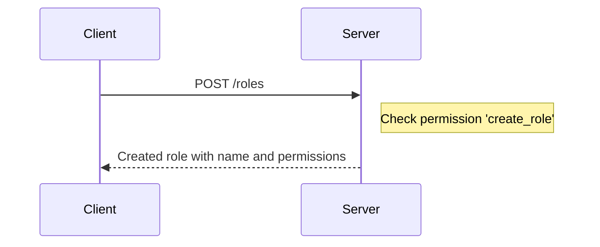
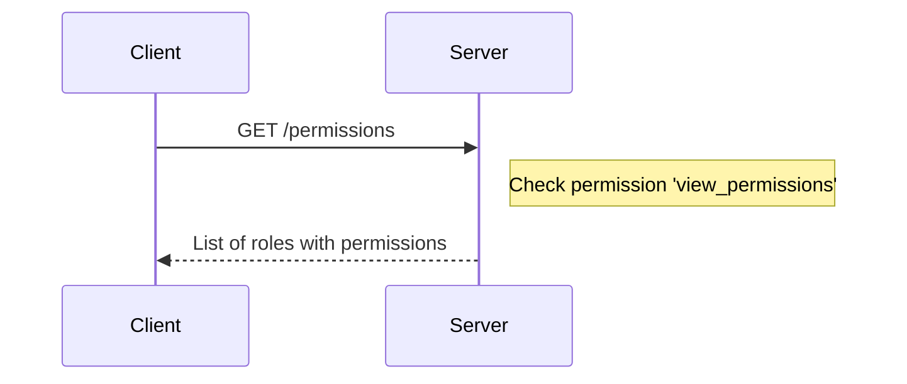
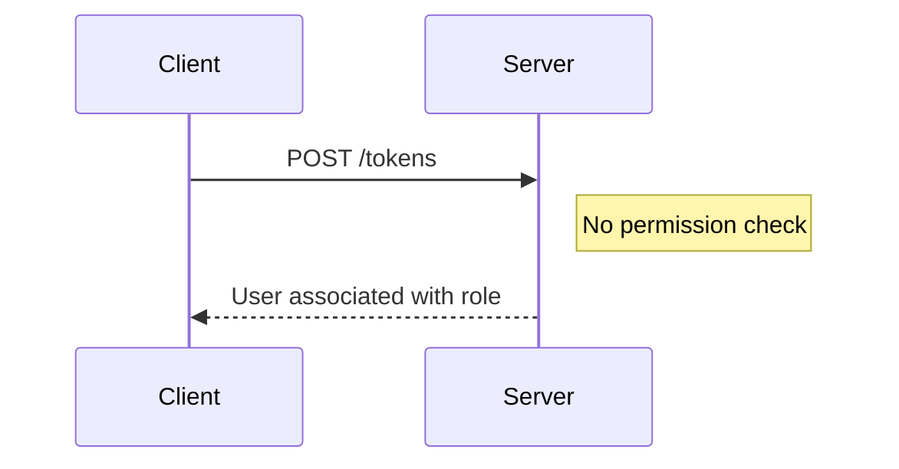

<details>
<summary>Relevant source files</summary>

The following files were used as context for generating this wiki page:

- [src/models.js](https://github.com/agattani123/access-control-service/blob/main/src/models.js)
- [src/routes.js](https://github.com/agattani123/access-control-service/blob/main/src/routes.js)

</details>

# Extending and Customizing

## Introduction

This wiki page covers the process of extending and customizing the access control system within the project. The access control system manages user roles, permissions, and authentication tokens. It provides a set of API endpoints for retrieving user information, managing roles and permissions, and generating authentication tokens.

## User and Role Models

The project defines two main data models: `User` and `Role`. These models are defined in the `src/models.js` file.

### User Model

The `User` model represents a user in the system and has the following properties:

```javascript
export const User = {
  email: 'string',
  role: 'string',
  phone: 'string'
};
```

- `email`: A string representing the user's email address.
- `role`: A string representing the user's assigned role.
- `phone`: A string representing the user's phone number.

Sources: [src/models.js:1-4]()

### Role Model

The `Role` model represents a role in the system and has the following properties:

```javascript
export const Role = {
  name: 'string',
  email: 'string',
  permissions: ['string']
};
```

- `name`: A string representing the name of the role.
- `email`: A string representing the email associated with the role (purpose unclear from the provided files).
- `permissions`: An array of strings representing the permissions granted to the role.

Sources: [src/models.js:7-10]()

## API Endpoints

The project exposes several API endpoints for managing users, roles, permissions, and authentication tokens. These endpoints are defined in the `src/routes.js` file.

### User Management

#### Get Users

```
GET /users
```

This endpoint retrieves a list of all users in the system, including their email addresses and assigned roles.



To access this endpoint, the client must have the `view_users` permission.

Sources: [src/routes.js:6-8]()

### Role Management

#### Create Role

```
POST /roles
```

This endpoint creates a new role in the system. The request body should contain the `name` of the role and an array of `permissions`.



To access this endpoint, the client must have the `create_role` permission.

Sources: [src/routes.js:11-17]()

#### Get Permissions

```
GET /permissions
```

This endpoint retrieves a list of all roles and their associated permissions.



To access this endpoint, the client must have the `view_permissions` permission.

Sources: [src/routes.js:19-21]()

### Authentication

#### Generate Token

```
POST /tokens
```

This endpoint generates an authentication token for a user by associating the user with a role.



There is no permission check for this endpoint.

Sources: [src/routes.js:23-28]()

## Extending and Customizing

To extend or customize the access control system, developers can modify the existing code or add new functionality based on their requirements. Here are some potential areas for extension and customization:

### Adding New Permissions

To add a new permission, developers can modify the `Role` model in `src/models.js` and update the `permissions` array with the new permission string.

```javascript
export const Role = {
  name: 'string',
  email: 'string',
  permissions: ['string', 'new_permission']
};
```

Sources: [src/models.js:7-10]()

### Adding New Roles

To add a new role, developers can use the `POST /roles` endpoint and provide the new role name and associated permissions in the request body.

```javascript
fetch('/roles', {
  method: 'POST',
  headers: {
    'Content-Type': 'application/json'
  },
  body: JSON.stringify({
    name: 'new_role',
    permissions: ['permission1', 'permission2']
  })
})
  .then(response => response.json())
  .then(data => console.log(data))
  .catch(error => console.error(error));
```

Sources: [src/routes.js:11-17]()

### Adding New API Endpoints

To add a new API endpoint, developers can modify the `src/routes.js` file and define a new route with the desired functionality. They should also implement the necessary permission checks and data handling logic.

```javascript
router.get('/new-endpoint', checkPermission('new_permission'), (req, res) => {
  // Endpoint logic
});
```

Sources: [src/routes.js]()

### Customizing Authentication

The project currently uses a simple approach for authentication by associating users with roles. Developers can extend or replace this approach with a more robust authentication mechanism, such as JSON Web Tokens (JWT) or integration with an external authentication provider.

### Integrating with a Database

The current implementation uses an in-memory data store (`db.js`). To persist data and scale the application, developers can integrate the access control system with a database management system (DBMS) like MySQL, PostgreSQL, or MongoDB.

### Improving Error Handling

The current implementation has basic error handling. Developers can enhance the error handling mechanisms by providing more detailed error messages, logging errors, and implementing appropriate error responses for different scenarios.

### Adding Validation and Sanitization

The current implementation lacks input validation and sanitization. Developers should implement input validation and sanitization mechanisms to prevent security vulnerabilities and ensure data integrity.

## Conclusion

This wiki page covered the key components and functionality of the access control system within the project. It explained the user and role models, API endpoints for managing users, roles, permissions, and authentication tokens, and provided insights into potential areas for extending and customizing the system. Developers can use this information as a starting point for understanding and modifying the access control system to meet their specific requirements.