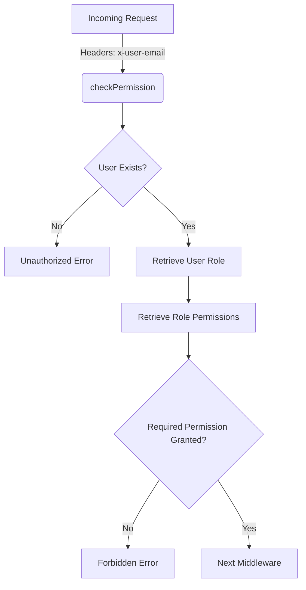

<details>
<summary>Relevant source files</summary>

The following files were used as context for generating this wiki page:

- [src/authMiddleware.js](https://github.com/agattani123/access-control-service/blob/main/src/authMiddleware.js)
- [src/models.js](https://github.com/agattani123/access-control-service/blob/main/src/models.js)

</details>

# Extending and Customizing

## Introduction

The "Extending and Customizing" feature in this project refers to the ability to define and manage user roles, permissions, and access control mechanisms. This functionality is crucial for ensuring proper authorization and resource access within the application. It allows administrators to grant or restrict access to specific features or operations based on a user's assigned role and associated permissions.

The implementation of this feature is primarily contained within the `src/authMiddleware.js` and `src/models.js` files. The `authMiddleware.js` file provides a middleware function `checkPermission` that can be used to protect routes or endpoints by verifying the user's permissions. The `models.js` file defines the data structures for `User` and `Role` objects, which are likely used to store and manage user and role information.

## Role and Permission Management

### Role Model

The `Role` model defines the structure for representing roles within the application. It consists of the following fields:

```javascript
export const Role = {
  name: 'string',
  permissions: ['string']
};
```

- `name` (string): The unique identifier or name of the role.
- `permissions` (array of strings): An array of permission strings associated with the role.

Sources: [src/models.js:4-7]()

### User Model

The `User` model defines the structure for representing user accounts. It includes the following fields:

```javascript
export const User = {
  email: 'string',
  role: 'string'
};
```

- `email` (string): The unique email address of the user, likely used as the primary identifier.
- `role` (string): The role assigned to the user, which corresponds to a `Role` object.

Sources: [src/models.js:1-3]()

### Role-Based Access Control (RBAC)

The project implements a role-based access control (RBAC) mechanism, where user permissions are determined by their assigned role. The `checkPermission` middleware function in `authMiddleware.js` is responsible for enforcing this access control.



The `checkPermission` middleware function follows this flow:

1. It extracts the `x-user-email` header from the incoming request to identify the user.
2. If the user does not exist or the header is missing, it returns an "Unauthorized" error.
3. It retrieves the user's assigned role from the `db.users` object.
4. It retrieves the permissions associated with the user's role from the `db.roles` object.
5. If the user's role does not have the required permission, it returns a "Forbidden" error.
6. If the user has the required permission, it proceeds to the next middleware or route handler.

Sources: [src/authMiddleware.js:3-20]()

## Extending and Customizing Roles and Permissions

To extend or customize the roles and permissions in the application, you would need to modify the data structures or storage mechanisms used for managing `User` and `Role` objects. The provided code does not include details on how these objects are stored or retrieved (e.g., database, in-memory data store, external service).

However, based on the code snippets, you could potentially extend the functionality by:

1. **Adding or modifying roles**: Update the `db.roles` object with new role definitions or modify existing ones. Each role should have a unique `name` and an associated array of `permissions`.

2. **Assigning roles to users**: Update the `db.users` object to assign roles to users. The `role` property of a user should match the `name` of an existing role in `db.roles`.

3. **Defining new permissions**: Add new permission strings to the `permissions` array of relevant roles in `db.roles`. These permissions can then be checked using the `checkPermission` middleware.

4. **Modifying the access control logic**: Customize the `checkPermission` middleware function to implement more complex access control rules or integrate with external authorization services, if needed.

It's important to note that the provided code snippets do not include details on how the `db` object is initialized or managed. Additional implementation details may be required to persist and retrieve user and role data from a persistent storage mechanism.

## Conclusion

The "Extending and Customizing" feature in this project revolves around the management of user roles and permissions through a role-based access control (RBAC) mechanism. The `authMiddleware.js` file provides a reusable middleware function `checkPermission` to enforce access control based on a user's assigned role and the required permissions. The `models.js` file defines the data structures for `User` and `Role` objects, which are likely used to store and manage user and role information.

To extend or customize this feature, developers can modify the `db.users` and `db.roles` objects to define new roles, assign roles to users, and manage permissions. Additionally, the `checkPermission` middleware function can be customized to implement more complex access control rules or integrate with external authorization services.