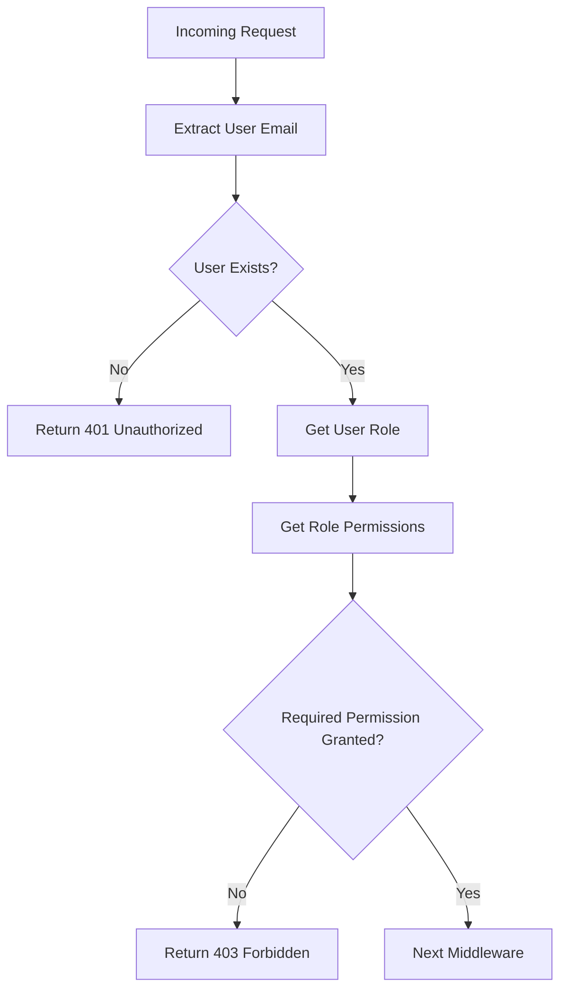

<details>
<summary>Relevant source files</summary>

The following files were used as context for generating this wiki page:

- [src/models.js](https://github.com/agattani123/access-control-service/blob/main/src/models.js)
- [src/authMiddleware.js](https://github.com/agattani123/access-control-service/blob/main/src/authMiddleware.js)
</details>

# Extending and Customizing

## Introduction

This wiki page covers the process of extending and customizing the access control system within the project. The access control system is responsible for managing user roles, permissions, and enforcing authorization rules based on the user's role and the required permissions for specific actions or resources.

The system consists of two main components: a `User` model and a `Role` model, which are defined in the `src/models.js` file. The `src/authMiddleware.js` file contains the `checkPermission` middleware function, which is used to verify if a user has the required permission to access a particular resource or perform a specific action.

## Data Models

### User Model

The `User` model represents a user in the system and has the following properties:

```js
export const User = {
  email: 'string',
  role: 'string',
  phone: 'string'
};
```

- `email`: A string representing the user's email address, which serves as a unique identifier for the user.
- `role`: A string representing the user's role, which determines the permissions granted to the user.
- `phone`: A string representing the user's phone number.

Sources: [src/models.js:1-4]()

### Role Model

The `Role` model represents a role in the system and has the following properties:

```js
export const Role = {
  name: 'string',
  email: 'string',
  permissions: ['string']
};
```

- `name`: A string representing the name of the role.
- `email`: A string representing the email associated with the role (not clear from the provided files).
- `permissions`: An array of strings representing the permissions granted to the role.

Sources: [src/models.js:7-10]()

## Authorization Middleware

The `checkPermission` function in the `src/authMiddleware.js` file is a middleware function that checks if a user has the required permission to access a particular resource or perform a specific action.



1. The middleware function first extracts the user's email from the `x-user-email` header of the incoming request.
2. If the user's email is not present or the user does not exist in the system, the middleware returns a 401 Unauthorized response.
3. If the user exists, the middleware retrieves the user's role from the `db.users` object.
4. The middleware then retrieves the permissions associated with the user's role from the `db.roles` object.
5. If the required permission is not included in the user's role permissions, the middleware returns a 403 Forbidden response.
6. If the user has the required permission, the middleware calls the next middleware function in the chain.

Sources: [src/authMiddleware.js:3-20]()

### Middleware Usage

The `checkPermission` middleware function can be used in an Express.js application to protect routes or resources that require specific permissions. Here's an example of how it can be used:

```js
import express from 'express';
import { checkPermission } from './authMiddleware.js';

const app = express();

app.get('/protected-resource', checkPermission('read:resource'), (req, res) => {
  // Access to this route is only granted if the user has the 'read:resource' permission
  res.json({ message: 'Protected resource accessed successfully' });
});
```

In this example, the `checkPermission` middleware is applied to the `/protected-resource` route, and it checks if the user has the `'read:resource'` permission. If the user has the required permission, the route handler function is executed; otherwise, a 403 Forbidden response is returned.

## Extending and Customizing

The access control system can be extended and customized in several ways:

### Adding New Roles

To add a new role, you can modify the `db.roles` object in the `src/authMiddleware.js` file or create a separate data store for roles. The new role should have a unique name and a list of associated permissions.

### Modifying Existing Roles

To modify an existing role, you can update the permissions associated with the role in the `db.roles` object or the data store where roles are stored.

### Adding New Permissions

To add a new permission, you can include the new permission string in the `permissions` array of the appropriate roles in the `db.roles` object or the data store where roles are stored.

### Customizing the Authorization Logic

If the existing authorization logic in the `checkPermission` middleware function does not meet your requirements, you can modify the function or create a new middleware function with custom authorization logic. For example, you might want to implement role-based access control (RBAC) or attribute-based access control (ABAC) based on your specific needs.

### Integrating with a Database or External Service

Currently, the user and role data are stored in-memory in the `db.users` and `db.roles` objects, respectively. To integrate with a database or external service for storing and retrieving user and role data, you would need to modify the `checkPermission` middleware function to interact with the appropriate data store.

## Conclusion

The access control system in this project provides a basic implementation for managing user roles, permissions, and enforcing authorization rules. By understanding the data models and the authorization middleware, you can extend and customize the system to meet your specific requirements, such as adding new roles, modifying existing roles, adding new permissions, customizing the authorization logic, or integrating with a database or external service.