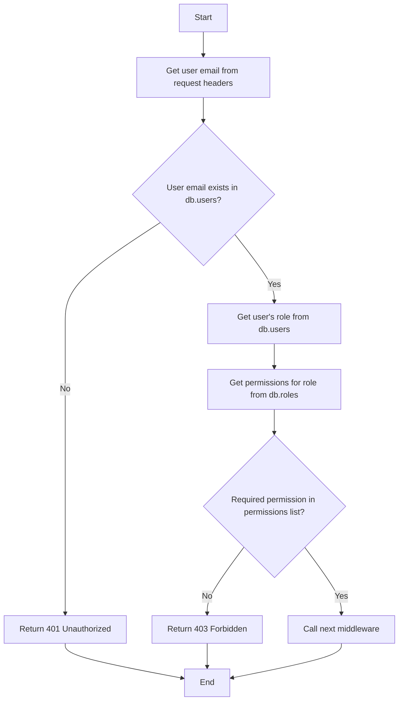

<details>
<summary>Relevant source files</summary>

The following files were used as context for generating this wiki page:

- [src/models.js](https://github.com/agattani123/access-control-service/blob/main/src/models.js)
- [src/authMiddleware.js](https://github.com/agattani123/access-control-service/blob/main/src/authMiddleware.js)
</details>

# Extending and Customizing

## Introduction

The provided source files outline a basic access control system for managing user roles and permissions within an application. The `src/models.js` file defines the data models for `User` and `Role` objects, while `src/authMiddleware.js` contains a middleware function `checkPermission` that validates user permissions based on their assigned role.

This wiki page aims to explain how this access control system can be extended and customized to meet the specific requirements of the project. It covers the core components, data flow, and potential areas for customization and enhancement.

## Data Models

The `src/models.js` file defines the structure of the `User` and `Role` data models.

### User Model

```javascript
export const User = {
  email: 'string',
  role: 'string',
  phone: 'string'
};
```

The `User` model represents a user in the system and consists of the following fields:

- `email` (string): The user's email address, likely used as a unique identifier.
- `role` (string): The name of the role assigned to the user, which determines their permissions.
- `phone` (string): The user's phone number.

Sources: [src/models.js:1-4]()

### Role Model

```javascript
export const Role = {
  name: 'string',
  email: 'string',
  permissions: ['string']
};
```

The `Role` model defines the structure of a role in the system, which includes:

- `name` (string): The name of the role.
- `email` (string): The email associated with the role (purpose unclear from provided files).
- `permissions` (array of strings): A list of permissions granted to users with this role.

Sources: [src/models.js:7-10]()

## Access Control Middleware

The `src/authMiddleware.js` file contains a middleware function `checkPermission` that validates user permissions based on their assigned role.

```javascript
import db from './db.js';

export function checkPermission(requiredPermission) {
  return function (req, res, next) {
    const userEmail = req.headers['x-user-email'];
    if (!userEmail || !db.users[userEmail]) {
      return res.status(401).json({ error: 'Unauthorized: no user context' });
    }

    const role = db.users[userEmail];
    const permissions = db.roles[role] || [];

    if (!permissions.includes(requiredPermission)) {
      return res.status(403).json({ error: 'Forbidden: insufficient permissions' });
    }

    next();
  };
}
```

Sources: [src/authMiddleware.js:1-20]()

The `checkPermission` function takes a `requiredPermission` string as an argument and returns a middleware function that can be used in an Express.js application or similar frameworks.

### Middleware Function Flow

The middleware function follows this flow:



1. The function retrieves the user's email from the `x-user-email` header in the request object.
2. It checks if the user email exists in the `db.users` object (likely an in-memory database or data store).
3. If the user email is not found, it returns a 401 Unauthorized response.
4. If the user email is found, it retrieves the user's role from `db.users`.
5. It then retrieves the list of permissions associated with the user's role from `db.roles`.
6. If the required permission is not included in the user's permissions list, it returns a 403 Forbidden response.
7. If the user has the required permission, it calls the `next` middleware function.

Sources: [src/authMiddleware.js:3-19]()

### Potential Customizations

While the provided code offers a basic access control system, there are several areas where it can be extended and customized:

1. **Data Storage**: The code assumes the existence of `db.users` and `db.roles` objects, likely representing an in-memory data store. In a production environment, these data structures should be replaced with a persistent database or other storage solutions, such as a relational database (e.g., PostgreSQL, MySQL) or a NoSQL database (e.g., MongoDB, Cassandra).

2. **User Authentication**: The current implementation assumes that the user's email is already authenticated and available in the request headers. In a real-world scenario, an authentication mechanism (e.g., JSON Web Tokens, sessions) should be implemented to securely identify and authenticate users before checking their permissions.

3. **Role Management**: The code does not provide any functionality for managing roles or assigning permissions to roles. This could be added by implementing APIs or user interfaces for creating, updating, and deleting roles, as well as associating permissions with roles.

4. **Permission Granularity**: The current implementation treats permissions as simple strings. However, permissions could be structured hierarchically or categorized into different domains or scopes for finer-grained access control.

5. **Caching**: Depending on the size and complexity of the application, caching mechanisms could be implemented to improve the performance of permission checks, especially for frequently accessed resources or roles.

6. **Auditing and Logging**: Logging and auditing capabilities could be added to track user actions, permission changes, and other security-related events for monitoring and compliance purposes.

7. **Error Handling and Messaging**: The current implementation returns simple error messages. In a production environment, more detailed and user-friendly error messages could be provided, along with proper error handling and logging mechanisms.

8. **Integration with External Systems**: If the application needs to integrate with other systems or services, the access control system may need to be extended to support authentication and authorization mechanisms required by those external systems.

These are just a few examples of how the provided access control system could be extended and customized to meet the specific requirements of the project. The actual customizations will depend on the project's needs, security requirements, and architectural decisions.

Sources: [src/authMiddleware.js:1-20](), [src/models.js:1-10]()

## Conclusion

The provided source files outline a basic access control system for managing user roles and permissions within an application. While functional, this system can be extended and customized in various ways to meet the specific requirements of the project, such as integrating with persistent data storage, implementing user authentication, adding role management capabilities, and enhancing permission granularity and caching mechanisms.

By understanding the core components and data flow of the existing system, developers can make informed decisions about the necessary customizations and enhancements to ensure a secure and scalable access control solution tailored to the project's needs.