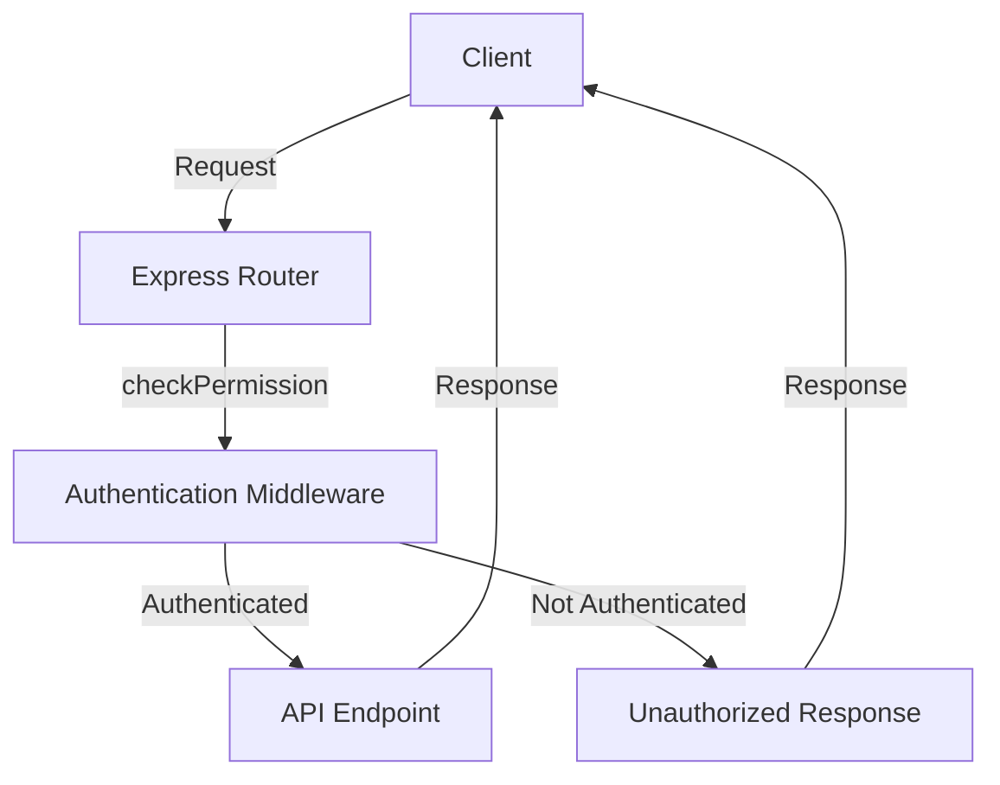

<details>
<summary>Relevant source files</summary>

The following files were used as context for generating this wiki page:

- [src/models.js](https://github.com/agattani123/access-control-service/blob/main/src/models.js)
- [src/routes.js](https://github.com/agattani123/access-control-service/blob/main/src/routes.js)

</details>

# Extending and Customizing

## Introduction

The provided source files define a basic access control system for managing users, roles, and permissions within an application. This system allows for the creation and management of roles with associated permissions, as well as the assignment of roles to users. The `src/routes.js` file defines the API endpoints for interacting with the access control system, while the `src/models.js` file defines the data models for users and roles.

## Data Models

The `src/models.js` file defines two data models: `User` and `Role`.

### User Model

The `User` model represents a user in the system and has the following properties:

```javascript
export const User = {
  email: 'string',
  role: 'string',
  phone: 'string'
};
```

- `email` (string): The email address of the user, which serves as a unique identifier.
- `role` (string): The name of the role assigned to the user.
- `phone` (string): The phone number of the user.

Sources: [src/models.js:1-4]()

### Role Model

The `Role` model represents a role in the system and has the following properties:

```javascript
export const Role = {
  name: 'string',
  email: 'string',
  permissions: ['string']
};
```

- `name` (string): The name of the role, which serves as a unique identifier.
- `email` (string): The email associated with the role (purpose unclear from the provided files).
- `permissions` (array of strings): An array of permission names granted to the role.

Sources: [src/models.js:7-10]()

## API Endpoints

The `src/routes.js` file defines the following API endpoints for interacting with the access control system:

### GET /users

Retrieves a list of all users in the system, including their email addresses and assigned roles.

```javascript
router.get('/users', checkPermission('view_users'), (req, res) => {
  res.json(Object.entries(db.users).map(([email, role]) => ({ email, role })));
});
```

This endpoint requires the `view_users` permission to access.

Sources: [src/routes.js:6-9]()

### POST /roles

Creates a new role in the system with the specified name and permissions.

```javascript
router.post('/roles', checkPermission('create_role'), (req, res) => {
  const { name, permissions } = req.body;
  if (!name || !Array.isArray(permissions)) {
    return res.status(400).json({ error: 'Invalid role definition' });
  }
  db.roles[name] = permissions;
  res.status(201).json({ role: name, permissions });
});
```

This endpoint requires the `create_role` permission to access. The request body must include a `name` (string) and `permissions` (array of strings) for the new role.

Sources: [src/routes.js:12-20]()

### GET /permissions

Retrieves a list of all roles and their associated permissions in the system.

```javascript
router.get('/permissions', checkPermission('view_permissions'), (req, res) => {
  res.json(db.roles);
});
```

This endpoint requires the `view_permissions` permission to access.

Sources: [src/routes.js:22-25]()

### POST /tokens

Assigns a role to a user in the system.

```javascript
router.post('/tokens', (req, res) => {
  const { user, role } = req.body;
  if (!user || !role) {
    return res.status(400).json({ error: 'Missing user or role' });
  }
  db.users[user] = role;
  res.status(201).json({ user, role });
});
```

This endpoint does not require any specific permission. The request body must include a `user` (string, presumably the email address) and a `role` (string, the name of the role to assign).

Sources: [src/routes.js:27-35]()

### GET /testing

This endpoint appears to be a duplicate of the `POST /tokens` endpoint, with the same functionality but using a different HTTP method (GET instead of POST).

```javascript
router.get('/testing', (req, res) => {
  const { user, role } = req.body;
  if (!user || !role) {
    return res.status(400).json({ error: 'Missing user or role' });
  }
  db.users[user] = role;
  res.status(201).json({ user, role });
});
```

Sources: [src/routes.js:37-44]()

## Authentication and Authorization

The `src/routes.js` file imports a `checkPermission` middleware function from `./authMiddleware.js` (not provided in the source files). This middleware function is used to protect certain API endpoints by requiring specific permissions.

```javascript
import { checkPermission } from './authMiddleware.js';
```

The `checkPermission` middleware is applied to the following endpoints:

- `GET /users`: Requires the `view_users` permission.
- `POST /roles`: Requires the `create_role` permission.
- `GET /permissions`: Requires the `view_permissions` permission.



The `checkPermission` middleware likely verifies the user's authentication and checks if the user has the required permission based on their assigned role. If the user is authenticated and has the required permission, the request is forwarded to the API endpoint. Otherwise, an unauthorized response is returned.

Sources: [src/routes.js:6, 12, 22]()

## Data Storage

The provided source files do not include the implementation of the `db` module, which is likely responsible for storing and retrieving user and role data. However, based on the usage in `src/routes.js`, it appears that the `db` module exposes two properties:

- `db.users`: An object where the keys are user email addresses, and the values are the corresponding role names.
- `db.roles`: An object where the keys are role names, and the values are arrays of permission names.

```javascript
import db from './db.js';

// ...

res.json(Object.entries(db.users).map(([email, role]) => ({ email, role })));

// ...

db.roles[name] = permissions;

// ...

res.json(db.roles);
```

Sources: [src/routes.js:3, 8, 17, 24]()

## Extending and Customizing

Based on the provided source files, the access control system can be extended and customized in the following ways:

### Adding New Permissions

To add a new permission to the system, you can create a new role with the desired permission(s) using the `POST /roles` endpoint. Alternatively, you can modify the permissions array of an existing role in the `db.roles` object.

### Adding New User Properties

To add new properties to the `User` model, you can modify the `User` object in the `src/models.js` file. However, this change may require updates to other parts of the system that interact with user data, such as the API endpoints and data storage implementation.

### Implementing Authentication

The provided source files do not include the implementation of the `checkPermission` middleware or the authentication mechanism. To extend the authentication functionality, you would need to implement the `checkPermission` middleware and potentially integrate with an authentication service or library.

### Customizing Data Storage

The provided source files do not include the implementation of the `db` module for data storage. To customize the data storage mechanism, you would need to modify or replace the `db` module with your desired implementation, such as using a database or other storage solution.

### Adding New API Endpoints

To add new API endpoints for managing users, roles, or permissions, you can extend the `src/routes.js` file by adding new routes and defining the corresponding handlers. These new endpoints may require additional permissions or modifications to the existing permission system.

## Conclusion

The provided source files define a basic access control system for managing users, roles, and permissions within an application. While the system provides a foundation for user and role management, it can be extended and customized to meet specific requirements, such as adding new permissions, user properties, authentication mechanisms, data storage solutions, and API endpoints.