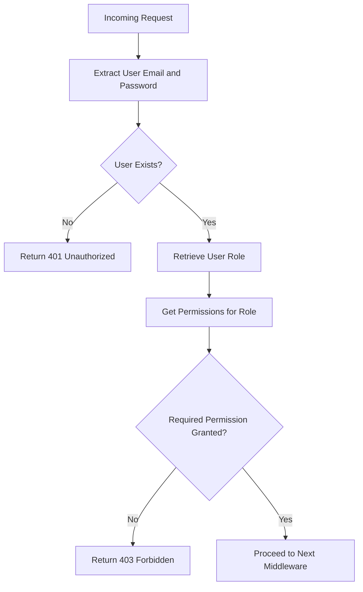
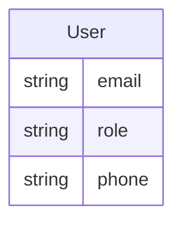
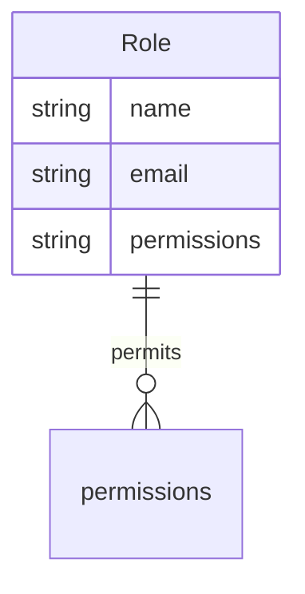
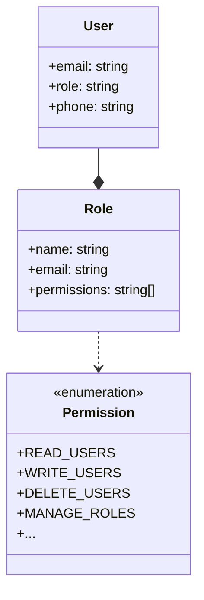

Relevant source files

The following files were used as context for generating this wiki page:

- [src/authMiddleware.js](https://github.com/agattani123/access-control-service/blob/main/src/authMiddleware.js)
- [src/models.js](https://github.com/agattani123/access-control-service/blob/main/src/models.js)

# Extending and Customizing

## Introduction

The "Extending and Customizing" feature within this project provides a mechanism for implementing access control and authorization based on user roles and permissions. It allows developers to define roles with specific permissions and ensure that users with the appropriate roles can access protected resources or perform certain actions.

The core components involved in this feature are the `checkPermission` middleware function and the data models for `User` and `Role`. The `checkPermission` middleware acts as a gatekeeper, verifying the user's role and associated permissions before allowing access to a protected route or resource.

## Access Control Middleware

The `checkPermission` function is an Express.js middleware that checks if a user has the required permission to access a specific route or resource. It is designed to be used as a middleware function in an Express.js application.

### Middleware Flow

Sources: [src/authMiddleware.js:3-19]()

1. The middleware extracts the user's email and password from the request headers (`x-user-email` and `x-user-password`).
2. It checks if the user exists in the `db.users` object.
   - If the user does not exist, it returns a 401 Unauthorized response.
3. If the user exists, it retrieves the user's role from the `db.users` object.
4. It then retrieves the permissions associated with the user's role from the `db.roles` object.
5. The middleware checks if the required permission is included in the user's permissions.
   - If the permission is not granted, it returns a 403 Forbidden response.
6. If the user has the required permission, the middleware proceeds to the next middleware function.

### Key Functions

- `checkPermission(requiredPermission)`: This function returns a middleware function that checks if the user has the specified `requiredPermission`. It is designed to be used as a route-level middleware in an Express.js application.

Sources: [src/authMiddleware.js:3]()

## Data Models

The project defines two data models: `User` and `Role`. These models are used to represent user and role information in the application.

### User Model

The `User` model has the following fields:

| Field  | Type    | Description |
|--------|---------|-------------|
| email  | string  | The user's email address. |
| role   | string  | The name of the role assigned to the user. |
| phone  | string  | The user's phone number. |

Sources: [src/models.js:2-5]()

### Role Model

The `Role` model has the following fields:

| Field       | Type     | Description |
|-------------|----------|-------------|
| name        | string   | The name of the role. |
| email       | string   | The email associated with the role (optional). |
| permissions | string[] | An array of permission strings granted to the role. |

Sources: [src/models.js:7-10]()

## Role-Based Access Control (RBAC)

This project implements a Role-Based Access Control (RBAC) system, where users are assigned roles, and roles are granted specific permissions. The `checkPermission` middleware enforces this RBAC system by verifying that a user has the required permission before allowing access to a protected resource or route.

In this RBAC system:

- Users are assigned a specific role (e.g., `admin`, `editor`, `viewer`).
- Roles are defined with a set of permissions (e.g., `READ_USERS`, `WRITE_USERS`, `DELETE_USERS`, `MANAGE_ROLES`).
- The `checkPermission` middleware checks if the user's role has the required permission before allowing access to a protected resource or route.

Sources: [src/authMiddleware.js](), [src/models.js]()

## Extending and Customizing

To extend or customize the access control system, developers can modify the following components:

### Adding or Modifying Roles

Developers can add new roles or modify existing roles by updating the `db.roles` object in the application's data store. Each role should be defined with a unique name and an array of permissions.

### Adding or Modifying Permissions

Developers can add new permissions or modify existing permissions by updating the `db.roles` object in the application's data store. Each role should have an array of permission strings that grant access to specific resources or actions.

### Modifying the User Model

Developers can modify the `User` model by adding or removing fields as needed. However, it is recommended to keep the `email` and `role` fields to maintain compatibility with the existing access control system.

### Modifying the Role Model

Developers can modify the `Role` model by adding or removing fields as needed. However, it is recommended to keep the `name` and `permissions` fields to maintain compatibility with the existing access control system.

### Customizing the `checkPermission` Middleware

Developers can customize the `checkPermission` middleware by modifying the logic for checking user permissions. For example, they can implement more complex permission rules or integrate with external authentication and authorization systems.

## Conclusion

The "Extending and Customizing" feature in this project provides a flexible and extensible access control system based on user roles and permissions. By leveraging the `checkPermission` middleware and the `User` and `Role` data models, developers can easily define and enforce access control rules for their application. Additionally, the modular design of the system allows for easy customization and extension to meet specific project requirements.