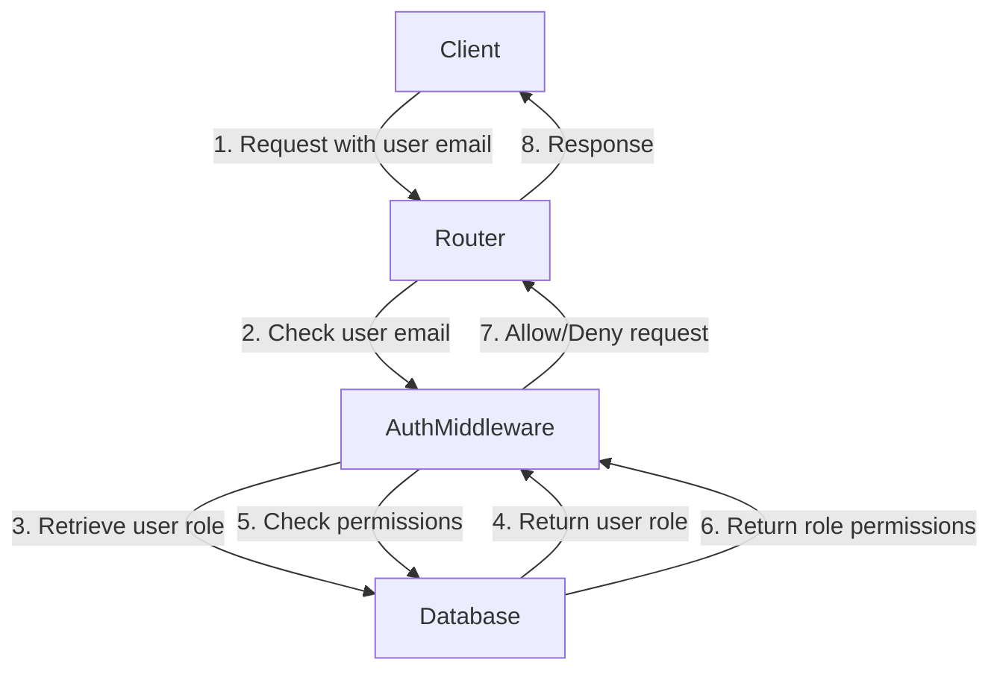
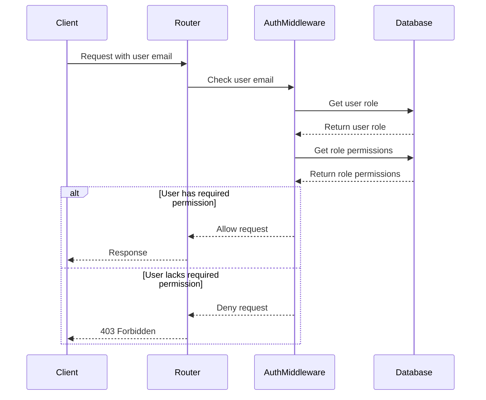

<details>
<summary>Relevant source files</summary>

The following files were used as context for generating this wiki page:

- [src/routes.js](https://github.com/agattani123/access-control-service/blob/main/src/routes.js)
- [src/authMiddleware.js](https://github.com/agattani123/access-control-service/blob/main/src/authMiddleware.js)
</details>

# Extending and Customizing

## Introduction

The "Extending and Customizing" feature within this project refers to the ability to define and manage roles, permissions, and user-role assignments. This functionality is crucial for implementing access control and authorization mechanisms, ensuring that users have appropriate permissions to perform specific actions within the application.

The primary components involved in this feature are the `routes.js` file, which defines the API endpoints for managing roles, permissions, and user-role assignments, and the `authMiddleware.js` file, which contains the `checkPermission` middleware function responsible for verifying user permissions before allowing access to certain routes.

## Role Management

### Creating Roles

The `/roles` endpoint (POST method) allows for the creation of new roles. It expects a request body containing the `name` of the role and an array of `permissions` associated with that role.

```javascript
router.post('/roles', checkPermission('create_role'), (req, res) => {
  const { name, permissions } = req.body;
  if (!name || !Array.isArray(permissions)) {
    return res.status(400).json({ error: 'Invalid role definition' });
  }
  db.roles[name] = permissions;
  res.status(201).json({ role: name, permissions });
});
```

Sources: [src/routes.js:9-16]()

### Viewing Roles and Permissions

The `/permissions` and `/permission` endpoints (GET methods) allow for retrieving the defined roles and their associated permissions.

```javascript
router.get('/permissions', checkPermission('view_permissions'), (req, res) => {
  res.json(db.roles);
});

router.get('/permission', checkPermission('view_permissions'), (req, res) => {
  res.json(db.roles);
});
```

Sources: [src/routes.js:18-22]()

## User-Role Assignment

The `/tokens` endpoint (POST method) allows for assigning a role to a user.

```javascript
router.post('/tokens', (req, res) => {
  const { user, role } = req.body;
  if (!user || !role) {
    return res.status(400).json({ error: 'Missing user or role' });
  }
  db.users[user] = role;
  res.status(201).json({ user, role });
});
```

Sources: [src/routes.js:24-31]()

## Permission Verification

The `checkPermission` middleware function in `authMiddleware.js` is responsible for verifying if a user has the required permission to access a specific route.

```javascript
export function checkPermission(requiredPermission) {
  return function (req, res, next) {
    const userEmail = req.headers['x-user-email'];
    if (!userEmail || !db.users[userEmail]) {
      return res.status(401).json({ error: 'Unauthorized: no user context' });
    }

    const role = db.users[userEmail];
    const permissions = db.roles[role] || [];

    if (!permissions.includes(requiredPermission)) {
      return res.status(403).json({ error: 'Forbidden: insufficient permissions' });
    }

    next();
  };
}
```

Sources: [src/authMiddleware.js:2-18]()

The middleware function works as follows:

1. It retrieves the user's email from the `x-user-email` header.
2. It checks if the user exists in the `db.users` object.
3. If the user exists, it retrieves the user's role from `db.users`.
4. It retrieves the permissions associated with the user's role from `db.roles`.
5. If the required permission is not included in the user's permissions, it returns a 403 Forbidden response.
6. If the user has the required permission, it calls the `next` middleware function to proceed with the request.

## Data Flow Diagram

The following diagram illustrates the data flow and interactions between the components involved in the "Extending and Customizing" feature:



Sources: [src/routes.js](), [src/authMiddleware.js]()

## Sequence Diagram

The following sequence diagram illustrates the interactions between the components when a client requests a protected route:



Sources: [src/routes.js](), [src/authMiddleware.js]()

## Key Components

| Component | Description |
| --- | --- |
| `routes.js` | Defines the API endpoints for managing roles, permissions, and user-role assignments. |
| `authMiddleware.js` | Contains the `checkPermission` middleware function for verifying user permissions. |
| `db.js` (not provided) | Likely contains the in-memory data store for roles, permissions, and user-role assignments. |

Sources: [src/routes.js](), [src/authMiddleware.js]()

## Conclusion

The "Extending and Customizing" feature in this project provides a flexible and extensible way to manage roles, permissions, and user-role assignments. It allows for the creation of new roles, assignment of permissions to roles, and association of users with specific roles. The `checkPermission` middleware function ensures that users have the required permissions to access protected routes, enabling fine-grained access control within the application.