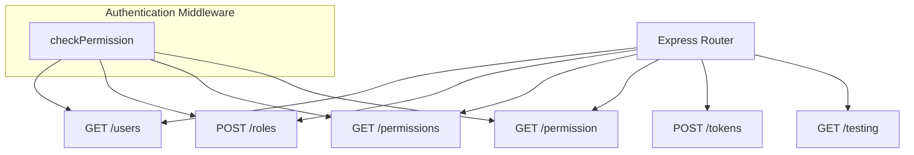
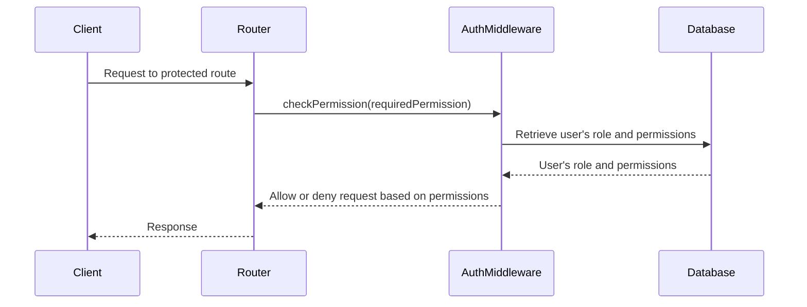

<details>
<summary>Relevant source files</summary>

The following files were used as context for generating this wiki page:

- [src/models.js](https://github.com/agattani123/access-control-service/blob/main/src/models.js)
- [src/routes.js](https://github.com/agattani123/access-control-service/blob/main/src/routes.js)

</details>

# Extending and Customizing

## Introduction

This wiki page covers the process of extending and customizing the access control system within the project. The access control system manages user roles, permissions, and authentication tokens. It provides a set of APIs for retrieving user information, creating roles, assigning permissions to roles, and generating authentication tokens for users.

The key components involved in extending and customizing the access control system are:

- User and Role models: Defining the structure of user and role data.
- API routes: Handling various operations related to users, roles, permissions, and authentication tokens.
- Authentication middleware: Enforcing permission checks for certain API routes.

## User and Role Models

The `src/models.js` file defines the structure of the `User` and `Role` objects used throughout the system.

### User Model

```javascript
export const User = {
  email: 'string',
  role: 'string',
  phone: 'string'
};
```

The `User` object has the following properties:

| Property | Type     | Description                  |
|----------|----------|------------------------------|
| email    | string   | The user's email address     |
| role     | string   | The name of the user's role  |
| phone    | string   | The user's phone number      |

Sources: [src/models.js:1-4]()

### Role Model

```javascript
export const Role = {
  name: 'string',
  email: 'string',
  permissions: ['string']
};
```

The `Role` object has the following properties:

| Property    | Type     | Description                                  |
|-------------|----------|----------------------------------------------|
| name        | string   | The name of the role                         |
| email       | string   | The email associated with the role           |
| permissions | string[] | An array of permission names for the role    |

Sources: [src/models.js:7-10]()

To extend or modify these models, you can update the corresponding objects in the `src/models.js` file.

## API Routes

The `src/routes.js` file defines the API routes for various operations related to users, roles, permissions, and authentication tokens.



Sources: [src/routes.js:5-42]()

### GET /users

This route retrieves a list of all users and their roles.

```javascript
router.get('/users', checkPermission('view_users'), (req, res) => {
  res.json(Object.entries(db.users).map(([email, role]) => ({ email, role })));
});
```

- It requires the `view_users` permission, enforced by the `checkPermission` middleware.
- It retrieves the `users` object from the `db` and maps each user's email and role to a new object.
- The resulting array of user objects is sent as the response.

Sources: [src/routes.js:7-9]()

### POST /roles

This route creates a new role with the specified permissions.

```javascript
router.post('/roles', checkPermission('create_role'), (req, res) => {
  const { name, permissions } = req.body;
  if (!name || !Array.isArray(permissions)) {
    return res.status(400).json({ error: 'Invalid role definition' });
  }
  db.roles[name] = permissions;
  res.status(201).json({ role: name, permissions });
});
```

- It requires the `create_role` permission, enforced by the `checkPermission` middleware.
- It expects a `name` and `permissions` array in the request body.
- If the `name` or `permissions` is missing or invalid, it returns a 400 Bad Request error.
- It adds the new role and its permissions to the `roles` object in the `db`.
- It returns a 201 Created status with the new role and its permissions.

Sources: [src/routes.js:12-19]()

### GET /permissions

This route retrieves a list of all roles and their associated permissions.

```javascript
router.get('/permissions', checkPermission('view_permissions'), (req, res) => {
  res.json(db.roles);
});
```

- It requires the `view_permissions` permission, enforced by the `checkPermission` middleware.
- It retrieves the `roles` object from the `db` and sends it as the response.

Sources: [src/routes.js:21-23]()

### GET /permission

This route is a duplicate of the `/permissions` route and serves the same purpose.

```javascript
router.get('/permission', checkPermission('view_permissions'), (req, res) => {
  res.json(db.roles);
});
```

Sources: [src/routes.js:25-27]()

### POST /tokens

This route generates an authentication token for a user by assigning them a role.

```javascript
router.post('/tokens', (req, res) => {
  const { user, role } = req.body;
  if (!user || !role) {
    return res.status(400).json({ error: 'Missing user or role' });
  }
  db.users[user] = role;
  res.status(201).json({ user, role });
});
```

- It expects a `user` and `role` in the request body.
- If the `user` or `role` is missing, it returns a 400 Bad Request error.
- It assigns the specified `role` to the `user` in the `users` object in the `db`.
- It returns a 201 Created status with the `user` and `role`.

Sources: [src/routes.js:29-35]()

### GET /testing

This route appears to be a duplicate of the `/tokens` route, but it's unclear why it exists or what its purpose is.

```javascript
router.get('/testing', (req, res) => {
  const { user, role } = req.body;
  if (!user || !role) {
    return res.status(400).json({ error: 'Missing user or role' });
  }
  db.users[user] = role;
  res.status(201).json({ user, role });
});
```

Sources: [src/routes.js:37-43]()

To extend or modify the API routes, you can update the corresponding route definitions in the `src/routes.js` file.

## Authentication Middleware

The `src/routes.js` file imports an `authMiddleware.js` module, which likely contains the implementation of the `checkPermission` middleware function used to enforce permission checks for certain routes.



Sources: [src/routes.js:3]()

The `checkPermission` middleware function likely performs the following steps:

1. Extract the user's identity from the request (e.g., from an authentication token or session).
2. Retrieve the user's role and associated permissions from the database or in-memory storage.
3. Check if the user's permissions include the required permission for the requested route.
4. Allow the request to proceed if the user has the required permission, or deny the request otherwise.

To extend or modify the authentication middleware, you would need to update the `checkPermission` function implementation in the `authMiddleware.js` file.

## Extending and Customizing

To extend or customize the access control system, you can follow these general steps:

1. **Modify User and Role Models**: Update the `User` and `Role` objects in the `src/models.js` file to include additional properties or modify existing ones based on your requirements.

2. **Add or Modify API Routes**: In the `src/routes.js` file, you can add new routes for additional functionality or modify existing routes to change their behavior or permissions.

3. **Update Authentication Middleware**: Modify the `checkPermission` function in the `authMiddleware.js` file to implement custom permission checking logic or integrate with a different authentication system.

4. **Integrate with External Services**: If needed, you can integrate the access control system with external services or databases for user management, authentication, or authorization.

5. **Implement Additional Features**: Depending on your requirements, you may need to implement additional features such as user registration, password management, role inheritance, or permission hierarchies.

6. **Enhance Error Handling and Logging**: Improve error handling and logging mechanisms to better handle and report errors and exceptional cases.

7. **Implement Testing and Monitoring**: Develop comprehensive test suites and implement monitoring and logging mechanisms to ensure the system's reliability and maintainability.

## Conclusion

This wiki page covered the key components and processes involved in extending and customizing the access control system within the project. It provided an overview of the user and role models, API routes, and authentication middleware, as well as guidance on how to modify or extend these components based on specific requirements.

By following the steps outlined in this document and leveraging the provided source code, developers can enhance the access control system to meet their project's needs, ensuring secure and controlled access to resources and functionality.