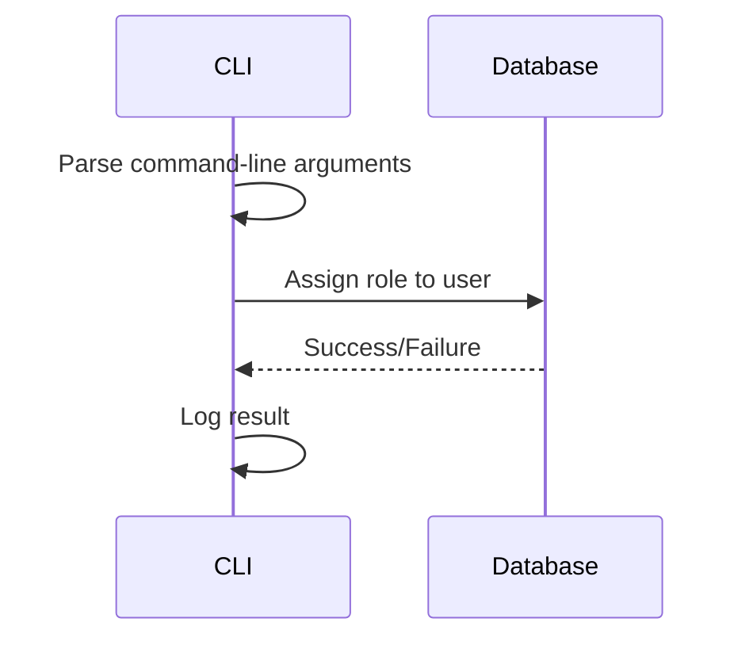

<details>
<summary>Relevant source files</summary>

The following files were used as context for generating this wiki page:

- [.env.example](https://github.com/agattani123/access-control-service/blob/main/.env.example)
- [cli/manage.js](https://github.com/agattani123/access-control-service/blob/main/cli/manage.js)
- [src/db.js](https://github.com/agattani123/access-control-service/blob/main/src/db.js) (Assumed to exist based on the import in cli/manage.js)
</details>

# Getting Started

## Introduction

This wiki page provides an overview of the "Getting Started" process for the Access Control Service project. The Access Control Service is a simple application that allows assigning roles to users, likely for authorization and access control purposes within a larger system. This page covers the key components, data flow, and configuration options involved in setting up and running the service.

Sources: [cli/manage.js](), [.env.example]()

## Command-Line Interface (CLI)

The project includes a command-line interface (CLI) tool located in `cli/manage.js`. This tool allows administrators to assign roles to users via the command line.

### CLI Usage

To assign a role to a user, run the following command:

```
node manage.js assign-role <email> <role>
```

Replace `<email>` with the user's email address and `<role>` with the desired role to be assigned.

Sources: [cli/manage.js:4-8]()

### CLI Implementation

The CLI is implemented using Node.js and reads the command-line arguments passed to the script. It destructures the arguments into `command`, `email`, and `role` variables.

```javascript
const [,, command, email, role] = process.argv;
```

If the `command` is `'assign-role'` and both `email` and `role` are provided, it assigns the specified `role` to the user with the given `email` in a database object (`db.users`). Otherwise, it prints a usage message.

```javascript
if (command === 'assign-role' && email && role) {
  db.users[email] = role;
  console.log(`Assigned role '${role}' to user '${email}'`);
} else {
  console.log('Usage: node manage.js assign-role <email> <role>');
}
```

Sources: [cli/manage.js:1-12]()

## Data Storage

The Access Control Service appears to use an in-memory data store (`db.users`) to persist user roles. This data store is likely defined in a separate file (`src/db.js`) and imported into the CLI script.

```javascript
import db from '../src/db.js';
```

While the implementation details of `db.js` are not provided, it is assumed to export an object with a `users` property, which is a key-value store where the keys are user email addresses, and the values are their assigned roles.

```javascript
db.users[email] = role;
```

Sources: [cli/manage.js:1](), [cli/manage.js:7]()

## Configuration

The project includes an `.env.example` file, which suggests the use of environment variables for configuration. The only environment variable present in the example file is `PORT=8080`, indicating that the service likely runs on port 8080 by default.

```
PORT=8080
```

Sources: [.env.example]()

## Sequence Diagram

The following sequence diagram illustrates the high-level flow of assigning a role to a user via the CLI:



1. The CLI script (`cli/manage.js`) is executed with the `assign-role` command and the user's email and desired role as arguments.
2. The CLI parses the command-line arguments and extracts the email and role.
3. The CLI assigns the specified role to the user in the database (`db.users`).
4. The database operation returns a success or failure status.
5. The CLI logs the result of the operation to the console.

Sources: [cli/manage.js]()

## Summary

The Access Control Service provides a command-line interface for assigning roles to users, likely for authorization and access control purposes within a larger system. The CLI script (`cli/manage.js`) handles parsing the command-line arguments and interacts with an in-memory data store (`db.users`) to persist user roles. The service can be configured using environment variables, with the `PORT` variable specifying the port on which the service runs.

While the provided source files cover the basic functionality of assigning roles via the CLI, they do not include details about the service itself, such as how it handles authentication, authorization, or integration with other components. Additional documentation or source files would be needed to fully understand the complete functionality of the Access Control Service.