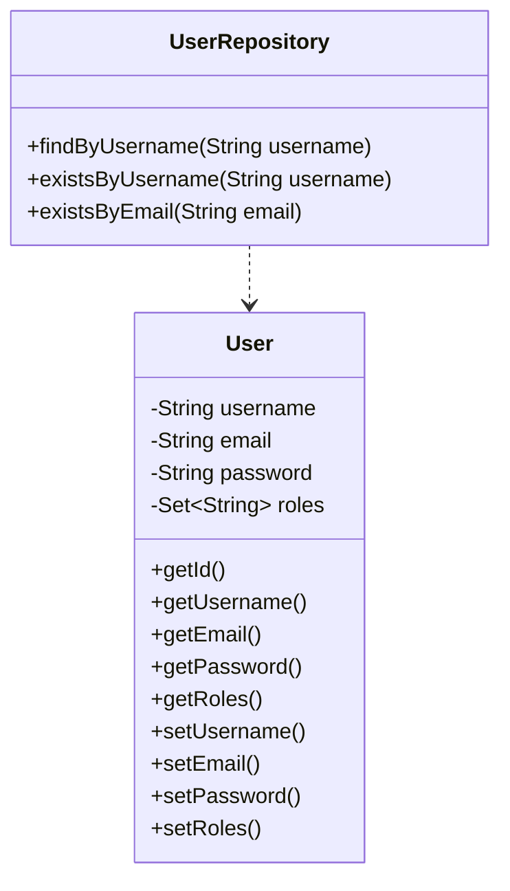
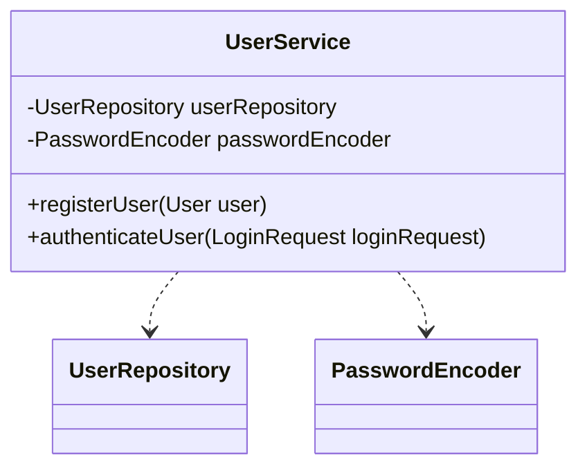
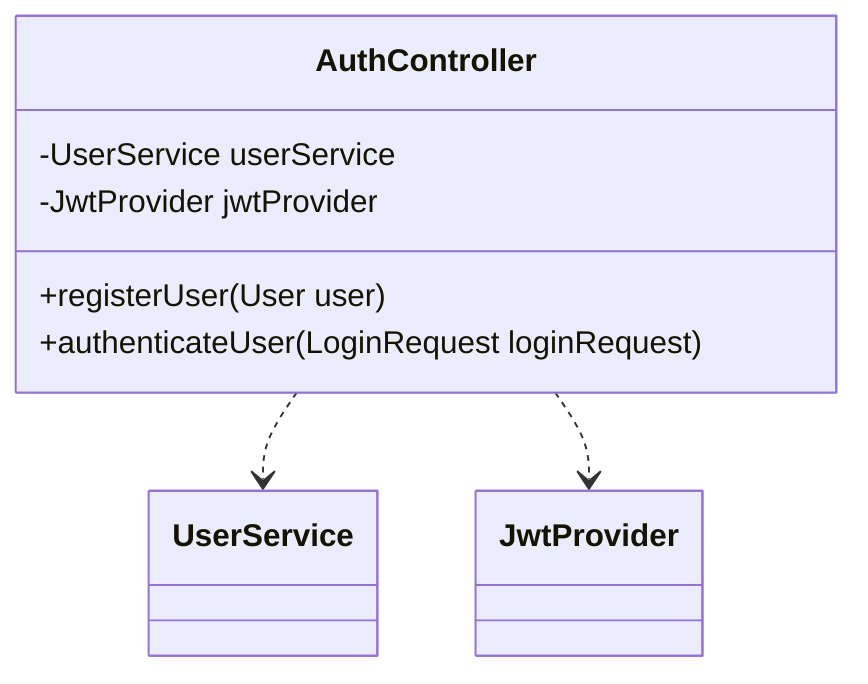
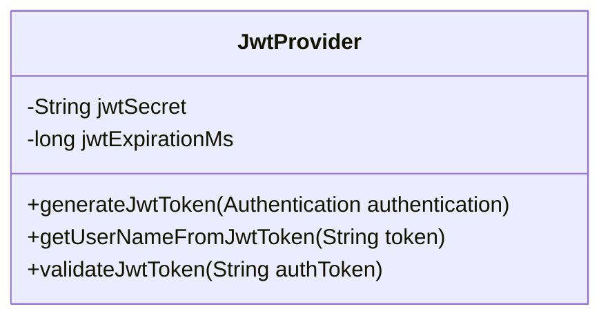
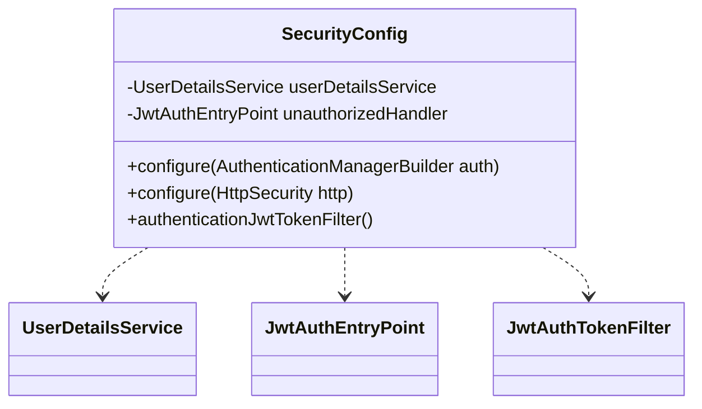
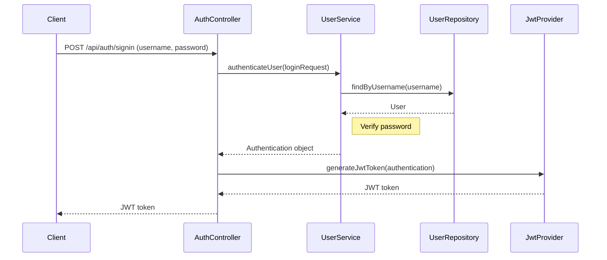
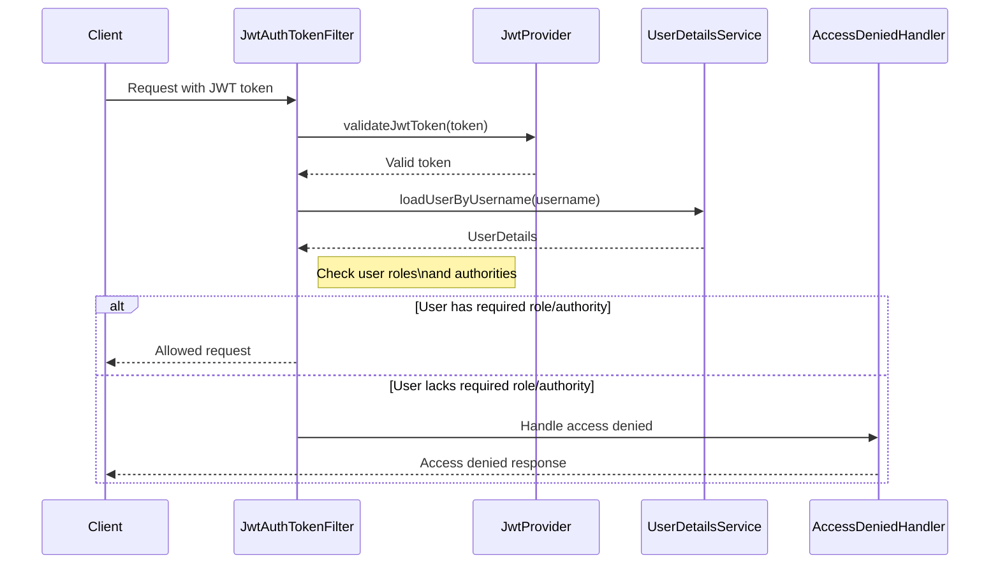

Relevant source files

The following files were used as context for generating this wiki page:

- [README.md](https://github.com/agattani123/access-control-service/blob/main/README.md)
- [src/main/java/com/accesscontrol/AccessControlApplication.java](https://github.com/agattani123/access-control-service/blob/main/src/main/java/com/accesscontrol/AccessControlApplication.java)
- [src/main/java/com/accesscontrol/config/SecurityConfig.java](https://github.com/agattani123/access-control-service/blob/main/src/main/java/com/accesscontrol/config/SecurityConfig.java)
- [src/main/java/com/accesscontrol/controller/AuthController.java](https://github.com/agattani123/access-control-service/blob/main/src/main/java/com/accesscontrol/controller/AuthController.java)
- [src/main/java/com/accesscontrol/model/User.java](https://github.com/agattani123/access-control-service/blob/main/src/main/java/com/accesscontrol/model/User.java)
- [src/main/java/com/accesscontrol/repository/UserRepository.java](https://github.com/agattani123/access-control-service/blob/main/src/main/java/com/accesscontrol/repository/UserRepository.java)
- [src/main/java/com/accesscontrol/security/JwtProvider.java](https://github.com/agattani123/access-control-service/blob/main/src/main/java/com/accesscontrol/security/JwtProvider.java)
- [src/main/java/com/accesscontrol/service/UserService.java](https://github.com/agattani123/access-control-service/blob/main/src/main/java/com/accesscontrol/service/UserService.java)

# Introduction

The Access Control Service is a Spring Boot application that provides user authentication and authorization functionality for a larger system or application. It handles user registration, login, and JSON Web Token (JWT) generation for authenticated users. The service also includes role-based access control (RBAC) mechanisms to restrict access to certain resources or functionalities based on the user's assigned roles.

The core components of the Access Control Service include a User model, a UserRepository for data persistence, a UserService for business logic, an AuthController for handling authentication requests, a JwtProvider for JWT generation and validation, and a SecurityConfig class for configuring security-related aspects such as authentication and authorization filters.

## User Management

The User model represents a user entity with fields like username, email, password, and roles. The UserRepository is a Spring Data JPA repository interface that extends the JpaRepository, providing CRUD operations and custom query methods for the User entity.

Sources: [src/main/java/com/accesscontrol/model/User.java](https://github.com/agattani123/access-control-service/blob/main/src/main/java/com/accesscontrol/model/User.java), [src/main/java/com/accesscontrol/repository/UserRepository.java](https://github.com/agattani123/access-control-service/blob/main/src/main/java/com/accesscontrol/repository/UserRepository.java)

The UserService class handles user-related business logic, such as user registration and authentication. It interacts with the UserRepository to perform CRUD operations on the User entity.

Sources: [src/main/java/com/accesscontrol/service/UserService.java](https://github.com/agattani123/access-control-service/blob/main/src/main/java/com/accesscontrol/service/UserService.java)

## Authentication and Authorization

The AuthController class handles incoming authentication requests, such as user registration and login. It interacts with the UserService to perform the necessary operations and returns appropriate responses.

Sources: [src/main/java/com/accesscontrol/controller/AuthController.java](https://github.com/agattani123/access-control-service/blob/main/src/main/java/com/accesscontrol/controller/AuthController.java)

The JwtProvider class is responsible for generating and validating JSON Web Tokens (JWTs). It uses a secret key and various claims (e.g., subject, issuer, expiration) to create and verify JWTs.

Sources: [src/main/java/com/accesscontrol/security/JwtProvider.java](https://github.com/agattani123/access-control-service/blob/main/src/main/java/com/accesscontrol/security/JwtProvider.java)

The SecurityConfig class configures various security-related aspects of the application, such as authentication and authorization filters, CORS settings, and password encoding.

Sources: [src/main/java/com/accesscontrol/config/SecurityConfig.java](https://github.com/agattani123/access-control-service/blob/main/src/main/java/com/accesscontrol/config/SecurityConfig.java)

## Authentication Flow

The authentication flow in the Access Control Service follows these steps:

Sources: [src/main/java/com/accesscontrol/controller/AuthController.java](https://github.com/agattani123/access-control-service/blob/main/src/main/java/com/accesscontrol/controller/AuthController.java), [src/main/java/com/accesscontrol/service/UserService.java](https://github.com/agattani123/access-control-service/blob/main/src/main/java/com/accesscontrol/service/UserService.java), [src/main/java/com/accesscontrol/security/JwtProvider.java](https://github.com/agattani123/access-control-service/blob/main/src/main/java/com/accesscontrol/security/JwtProvider.java)

## Role-Based Access Control (RBAC)

The Access Control Service implements role-based access control (RBAC) to restrict access to certain resources or functionalities based on the user's assigned roles. The User model includes a set of roles, and the SecurityConfig class configures the necessary filters and handlers to enforce RBAC.

Sources: [src/main/java/com/accesscontrol/config/SecurityConfig.java](https://github.com/agattani123/access-control-service/blob/main/src/main/java/com/accesscontrol/config/SecurityConfig.java), [src/main/java/com/accesscontrol/security/JwtProvider.java](https://github.com/agattani123/access-control-service/blob/main/src/main/java/com/accesscontrol/security/JwtProvider.java)

## Conclusion

The Access Control Service provides a secure and scalable solution for user authentication and authorization within a larger application or system. It leverages Spring Security and JSON Web Tokens (JWTs) to handle user registration, login, and role-based access control. The service follows best practices for security and separation of concerns, making it easy to integrate and maintain within a broader software ecosystem.