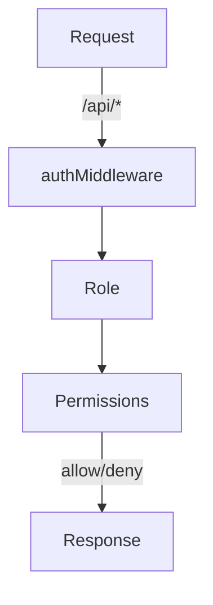

<details>
<summary>Relevant source files</summary>

The following files were used as context for generating this wiki page:

- [README.md](https://github.com/agattani123/access-control-service/blob/main/README.md)
- [docs/one-pager.md](https://github.com/agattani123/access-control-service/blob/main/docs/one-pager.md)

</details>

# Introduction

The Access Control Service is an internal Role-Based Access Control (RBAC) microservice that provides centralized permission enforcement for internal tools, APIs, and services within an organization. Its primary purpose is to manage user-role assignments, role-permission mappings, and enforce access controls at runtime, ensuring consistent and auditable permission enforcement across various systems.

By centralizing access control decisions, this service eliminates the need for hardcoded permission logic within individual applications, promoting code decoupling and maintainability. It serves as a single source of truth for role-based access control, enabling consistent and auditable permission enforcement across the organization's internal systems.

## Features

The Access Control Service offers the following key features:

- **Flat RBAC Model**: The service implements a flat Role-Based Access Control (RBAC) model, without support for hierarchies or scopes.
- **Declarative Role-Permission Mappings**: Role-to-permission mappings are defined declaratively using a JSON configuration file, allowing for easy management and updates.
- **Middleware-based Permission Enforcement**: The service provides middleware components that can be integrated into internal applications to enforce access controls at runtime.
- **CLI Tools**: Command-line interface (CLI) tools are available for bootstrapping the service and assigning roles to users.
- **REST API**: A RESTful API is provided for managing roles, users, and permissions.

Sources: [docs/one-pager.md](https://github.com/agattani123/access-control-service/blob/main/docs/one-pager.md)

## Architecture Overview

The Access Control Service follows a simple architecture for enforcing permissions:



1. Incoming requests to the `/api/*` routes are intercepted by the `authMiddleware`.
2. The user's identity is extracted from the `x-user-email` HTTP header.
3. The user's assigned role is resolved by looking up the user in the `db.users` map.
4. The permissions associated with the user's role are loaded from the `config/roles.json` configuration file.
5. The requested route is checked against the user's permissions, and access is either allowed or denied.

Sources: [docs/one-pager.md](https://github.com/agattani123/access-control-service/blob/main/docs/one-pager.md)

## Role Management

The Access Control Service provides a CLI tool and a REST API for managing roles and user-role assignments.

### CLI Tool

The CLI tool, `cli/manage.js`, allows administrators to assign roles to users. For example:

```bash
node cli/manage.js assign-role alice@company.com engineer
```

This command assigns the `engineer` role to the user with the email `alice@company.com`.

Sources: [docs/one-pager.md](https://github.com/agattani123/access-control-service/blob/main/docs/one-pager.md)

### REST API

The service exposes a RESTful API for managing users, roles, and permissions. The following table summarizes the available API endpoints:

| Method | Endpoint         | Description                   | Required Permission |
|--------|------------------|-------------------------------|----------------------|
| GET    | /api/users       | List all users and roles      | `view_users`        |
| POST   | /api/roles       | Create a new role             | `create_role`       |
| GET    | /api/permissions | View all role definitions     | `view_permissions`  |
| POST   | /api/tokens      | Assign user to a role         | *None (bootstrap)*  |

All API requests must include the `x-user-email` HTTP header to identify the authenticated user.

Sources: [docs/one-pager.md](https://github.com/agattani123/access-control-service/blob/main/docs/one-pager.md)

## Deployment and Integration

The Access Control Service is designed to be stateless and suitable for internal-only usage behind an API gateway. By default, it does not persist data to a database; instead, the configuration is stored in memory.

For persistent storage, the service can be integrated with an external configuration store, such as etcd or Consul.

To integrate the Access Control Service with an internal application, the application needs to include the provided middleware components and annotate routes with the required permissions. The middleware will then enforce access controls based on the user's role and the configured permissions.

Sources: [docs/one-pager.md](https://github.com/agattani123/access-control-service/blob/main/docs/one-pager.md)

## Related Documentation

- [`docs/permissions.md`](docs/permissions.md): Detailed documentation on the structure and definitions of roles and permissions.
- [`docs/api.md`](docs/api.md): Complete API contract and specification for the Access Control Service.

Sources: [docs/one-pager.md](https://github.com/agattani123/access-control-service/blob/main/docs/one-pager.md)